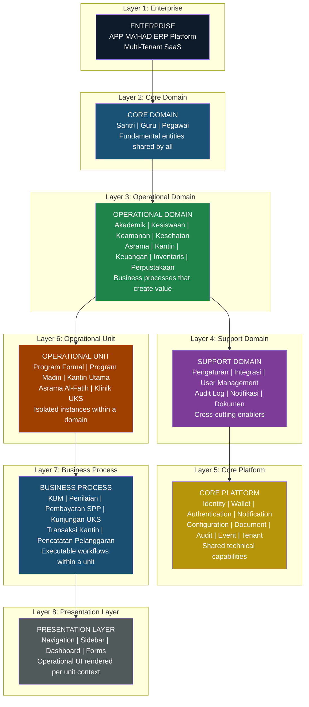
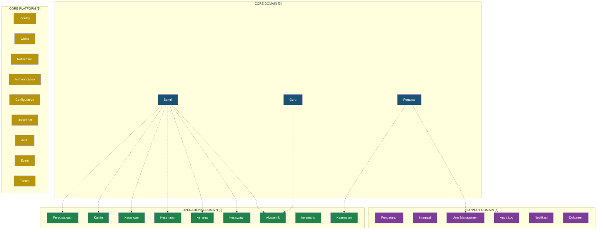
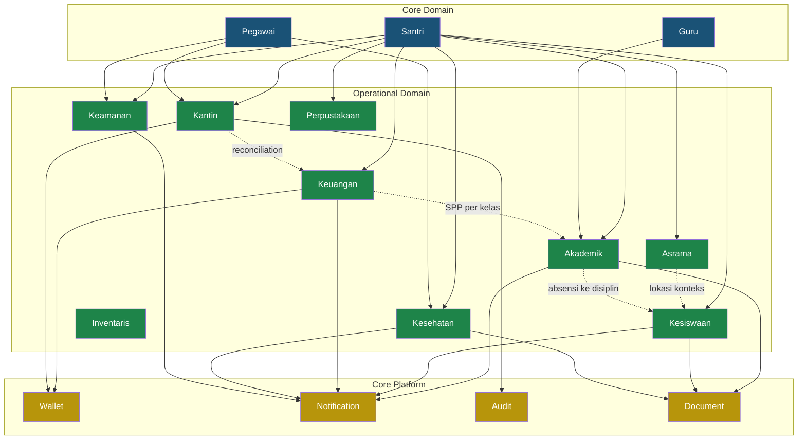

# EARS — Part 1: Enterprise Foundation

**APP MA'HAD Enterprise ERP**

| Metadata | Value |
|----------|-------|
| **Document** | Enterprise Architecture Refinement Specification (EARS) |
| **Part** | 1 — Enterprise Foundation |
| **Version** | 1.1 (Refined) |
| **Status** | Architecture Constitution |
| **Classification** | Enterprise Architecture — CRITICAL |
| **Author** | Principal Enterprise Architect |
| **Date** | 2026-08-05 |
| **Review Cycle** | Architecture Review Board — Refinement Pass |
| **Revision** | R1–R10 applied from Architecture Workshop |

---

## Table of Contents

1. [Enterprise Vision](#1-enterprise-vision)
2. [Enterprise Philosophy](#2-enterprise-philosophy)
3. [Enterprise Identity Architecture](#3-enterprise-identity-architecture)
4. [Enterprise Design Principles](#4-enterprise-design-principles)
5. [Enterprise Layer Architecture](#5-enterprise-layer-architecture)
6. [Enterprise Vocabulary](#6-enterprise-vocabulary)
7. [Enterprise Domain Registry](#7-enterprise-domain-registry)
8. [Domain Ownership](#8-domain-ownership)
9. [Core Domain Analysis](#9-core-domain-analysis)
10. [Operational Domain Analysis](#10-operational-domain-analysis)
11. [Support Domain Analysis](#11-support-domain-analysis)
12. [Core Platform](#12-core-platform)
13. [Data Ownership](#13-data-ownership)
14. [Domain Relationship](#14-domain-relationship)
15. [Operational Unit Architecture](#15-operational-unit-architecture)
16. [Future Scalability](#16-future-scalability)
17. [Risk Analysis](#17-risk-analysis)
18. [Architecture Consistency Checklist](#18-architecture-consistency-checklist)
19. [Recommendations](#19-recommendations)
20. [Preparation for Part 2](#20-preparation-for-part-2)
21. [Quality Gate](#21-quality-gate)

---

## 1. Enterprise Vision

### 1.1 What is APP MA'HAD?

APP MA'HAD is a **Multi-Tenant Enterprise Resource Planning (ERP) platform** purpose-built for **Pondok Pesantren** (Islamic Boarding Schools) in Indonesia. It is designed to unify every operational dimension of a pesantren — academic, residential, disciplinary, financial, health, security, and administrative — into a single, integrated platform that serves 100+ tenant pesantren over a 10+ year horizon.

APP MA'HAD is **not** a generic school management system. It is a domain-specific ERP that understands the unique organizational structure, terminology, workflows, and cultural context of pesantren operations.

### 1.2 Transformation Journey

```
┌──────────────────────────────────────────────────────────────────────┐
│                                                                      │
│  PHASE 1                        PHASE 2                              │
│  Academic Management System     Integrated Boarding School Mgmt      │
│  ─────────────────────────      ──────────────────────────────       │
│  • Kurikulum & Kelas            • + Kesiswaan & Kedisiplinan         │
│  • Mata Pelajaran               • + Asrama & Kamar                   │
│  • Penilaian                    • + Kesehatan (UKS)                  │
│  • Raport                       • + Keamanan (Gate RFID)             │
│  • Guru                         • + Governance Case Engine           │
│  • Santri                       • + Wallet & Kantin Cashless         │
│                                 • + Multi-Tenant SaaS                │
│          │                                │                          │
│          ▼                                ▼                          │
│                                                                      │
│                        PHASE 3 (CURRENT)                             │
│                Enterprise ERP Pondok Pesantren                       │
│                ───────────────────────────────                       │
│                • Multi-Operational-Unit Architecture                  │
│                • Enterprise RBAC (Multi-Role + Assignment)           │
│                • Domain-Driven Architecture                          │
│                • 9 Operational Domains                               │
│                • 9 Official Core Platform Services                   │
│                • Modular Domain Extension                            │
│                • Enterprise Information Architecture                 │
│                • SaaS Revenue Engine (Billing, PPOB)                 │
│                                                                      │
└──────────────────────────────────────────────────────────────────────┘
```

### 1.3 What Differentiates APP MA'HAD from Generic Academic Systems

| Dimension | Generic Academic System | APP MA'HAD Enterprise ERP |
|-----------|------------------------|--------------------------|
| **Scope** | Classroom and grades | Entire boarding school lifecycle |
| **Residency** | Not applicable | Asrama, Kamar, Musyrif management |
| **Discipline** | Basic conduct notes | Full governance engine: Case, Review, Violation, Punishment, Quest redemption |
| **Finance** | Tuition billing | SPP + Wallet + Cashless Canteen + PPOB + Payment Gateway |
| **Canteen** | Not applicable | Multi-unit POS, item catalog, wallet deduction, cashier management |
| **Security** | Not applicable | RFID gate checkpoint, movement tracking |
| **Health** | Not applicable | UKS visits, medical permits, hospital referrals |
| **Terminology** | Teacher, Student, Class | Guru, Santri, Madrasah, Jenjang, Tingkat, Musyrif, Wali |
| **Multi-tenancy** | Single school | 100+ Pesantren SaaS |
| **Operational Unit** | Not applicable | Multi-unit per domain, context-switching navigation |
| **Identity** | One role per user | Multi-role per user + operational unit assignment |

### 1.4 Enterprise Vision Statement

> *APP MA'HAD bertujuan menjadi platform ERP Enterprise terpadu untuk Pondok Pesantren di Indonesia, yang mengintegrasikan seluruh aspek operasional pesantren — dari akademik hingga keuangan, dari kedisiplinan hingga kesehatan, dari kantin hingga perpustakaan — dalam satu ekosistem digital yang scalable, modular, dan domain-aware, melayani ratusan pesantren dalam jangka panjang.*

---

## 2. Enterprise Philosophy

APP MA'HAD dibangun di atas delapan filosofi enterprise:

### 2.1 One Identity — واحد الهوية

| Aspect | Description |
|--------|-------------|
| **Prinsip** | Satu orang = satu akun, berapa pun tugasnya |
| **Alasan** | Dalam pesantren, satu ustadz sering merangkap guru, pembina asrama, dan petugas keamanan. Membuat banyak akun untuk satu orang menciptakan duplikasi data, fragmentasi audit trail, dan kebingungan operasional |
| **Implementasi** | Multi-role per user. Ahmad memiliki satu akun dengan roles: `guru` + `musyrif` + `staff` |
| **Manfaat** | Audit trail terpusat, single sign-on, unified notification, simpler user management |

### 2.2 One Data — واحد البيانات

| Aspect | Description |
|--------|-------------|
| **Prinsip** | Setiap entitas data hanya memiliki satu pemilik (Single Source of Truth) |
| **Alasan** | Ketika data santri diduplikasi di modul akademik, kesiswaan, dan asrama, perubahan di satu tempat tidak tercermin di tempat lain. Ini menciptakan data inconsistency yang berbahaya untuk keputusan bisnis |
| **Implementasi** | Data Santri dimiliki oleh Core Domain Santri. Modul lain mengakses via reference (foreign key), bukan salinan |
| **Manfaat** | Data consistency, reduced storage, single update point, reliable reporting |

### 2.3 One Platform — واحد المنصة

| Aspect | Description |
|--------|-------------|
| **Prinsip** | Seluruh operasional pesantren terintegrasi dalam satu platform |
| **Alasan** | Pesantren yang menggunakan 5 sistem terpisah (akademik, keuangan, asrama, kesehatan, absensi) menghabiskan waktu untuk data entry berulang dan reconciliation manual |
| **Implementasi** | Unified platform dengan domain-driven architecture. Setiap domain memiliki operational unit sendiri tetapi berbagi core platform services |
| **Manfaat** | Zero redundancy, cross-domain visibility, unified dashboard, operational efficiency |

### 2.4 Modular Domain — النظام المعياري

| Aspect | Description |
|--------|-------------|
| **Prinsip** | Setiap domain operasional bersifat modular — dapat diaktifkan, dinonaktifkan, atau di-extend secara independen |
| **Alasan** | Tidak semua pesantren membutuhkan semua fitur pada hari pertama. Pesantren kecil mungkin hanya butuh Akademik dan Kesiswaan. Pesantren besar butuh seluruh 9 domain |
| **Implementasi** | Feature flags per tenant, modular activation, independent domain lifecycle |
| **Manfaat** | Flexible onboarding, tiered pricing, reduced complexity for smaller tenants |

### 2.5 Shared Core Services — الخدمات المشتركة الأساسية

| Aspect | Description |
|--------|-------------|
| **Prinsip** | Kapabilitas yang dibutuhkan oleh banyak domain disediakan sebagai shared platform service, bukan diimplementasikan ulang per domain |
| **Alasan** | Notifikasi dibutuhkan oleh Akademik, Kesiswaan, Keuangan, Kesehatan. Jika setiap domain membuat engine notifikasi sendiri, hasilnya fragmentasi dan maintenance nightmare |
| **Implementasi** | Core Platform layer: Identity, Notification, Wallet, Audit, Storage, Configuration |
| **Manfaat** | DRY principle, consistent behavior, centralized maintenance, cross-domain capability |

### 2.6 Domain Independence — استقلال المجالات

| Aspect | Description |
|--------|-------------|
| **Prinsip** | Setiap domain operasional harus dapat beroperasi secara mandiri tanpa hard dependency ke domain lain |
| **Alasan** | Jika modul Keuangan crash, modul Akademik harus tetap bisa berjalan. Domain coupling menciptakan cascading failures |
| **Implementasi** | Domain berkomunikasi melalui shared core platform, bukan direct coupling. Cross-domain data diakses via reference, bukan embedding |
| **Manfaat** | Fault isolation, independent deployment, cleaner architecture |

### 2.7 Operational Simplicity — بساطة العمليات

| Aspect | Description |
|--------|-------------|
| **Prinsip** | Kompleksitas arsitektur tidak boleh menghasilkan kompleksitas operasional bagi pengguna |
| **Alasan** | End user di pesantren adalah guru, musyrif, dan admin — bukan engineer. UI/UX harus sederhana meskipun arsitektur di belakangnya enterprise-grade |
| **Implementasi** | Operational-unit-based navigation, contextual sidebar, role-adaptive UI, workflow-driven menu structure |
| **Manfaat** | Low training cost, high adoption rate, reduced error rate |

### 2.8 Future Scalability — القابلية للتوسع في المستقبل

| Aspect | Description |
|--------|-------------|
| **Prinsip** | Arsitektur harus mengakomodasi domain baru tanpa refactoring fundamental |
| **Alasan** | Pesantren terus berkembang. Hari ini butuh Akademik dan Kesiswaan. Besok butuh Laundry, Koperasi, Klinik, Transportasi. Arsitektur harus siap |
| **Implementasi** | Domain registry, standardized operational unit pattern, plugin-ready architecture |
| **Manfaat** | Future-proof investment, no architectural debt, clean extension path |

---

## 3. Enterprise Identity Architecture

### 3.1 Identity as Enterprise Platform

Identity dalam APP MA'HAD **bukan milik domain manapun**. Identity adalah **Enterprise Platform** yang melayani seluruh domain secara terpusat.

Ini adalah keputusan arsitektur fundamental: tidak ada domain yang memiliki, mengelola, atau mendefinisikan identitas pengguna. Seluruh domain **mengkonsumsi** Identity Platform sebagai shared service.

### 3.2 Identity Architecture Principle

```
┌────────────────────────────────────────────────────────┐
│                ENTERPRISE IDENTITY PLATFORM             │
│                                                        │
│  ┌─────────────────────────────────────────────────┐   │
│  │  ONE PERSON = ONE IDENTITY                      │   │
│  │                                                 │   │
│  │  Identity encompasses:                          │   │
│  │    • Who the person IS (name, email, avatar)    │   │
│  │    • What ROLES they hold (guru, musyrif, etc)  │   │
│  │    • Where they WORK (operational assignments)  │   │
│  │    • What they CAN DO (effective permissions)   │   │
│  │                                                 │   │
│  │  Identity does NOT encompass:                   │   │
│  │    • Physical access credentials (RFID, NFC)    │   │
│  │    • Financial instruments (wallet balance)      │   │
│  │    • Domain-specific attributes (kelas, mapel)  │   │
│  └─────────────────────────────────────────────────┘   │
│                                                        │
│  ┌─────────┐  ┌─────────┐  ┌─────────┐  ┌─────────┐  │
│  │Akademik │  │Kesiswaan│  │Keuangan │  │Kesehatan│  │
│  │ reads   │  │ reads   │  │ reads   │  │ reads   │  │
│  │identity │  │identity │  │identity │  │identity │  │
│  └─────────┘  └─────────┘  └─────────┘  └─────────┘  │
└────────────────────────────────────────────────────────┘
```

### 3.3 Identity Separation from Adjacent Concerns

| Concern | Belongs To | NOT Part of Identity |
|---------|-----------|---------------------|
| **Who is this person?** | Identity Platform | |
| **What roles do they have?** | Identity Platform | |
| **Where are they assigned?** | Identity Platform (Assignment) | |
| **What RFID card do they carry?** | | Smart Card Platform (Part 2) |
| **How much money do they have?** | | Wallet Platform |
| **What class are they in?** | | Akademik Domain |
| **What room are they in?** | | Asrama Domain |
| **What are their medical records?** | | Kesehatan Domain |

### 3.4 Identity Consumption Pattern

All domains interact with Identity through a consistent read-only pattern:

```
Domain needs user info → Query Identity Platform → Receive identity data
Domain does NOT → Create its own user records
Domain does NOT → Store copies of user names
Domain does NOT → Manage role assignments
```

Identity Platform is the **sole authority** for answering "Who is this person?" and "What can they do?" across the entire enterprise.

> **Scope Boundary**: This section establishes the conceptual architecture of Enterprise Identity. Physical access mechanisms (RFID, Smart Card, QR, NFC) and Wallet linkage will be addressed in Part 2 as extensions to this foundation.

---

## 4. Enterprise Design Principles

### Principle Registry

| # | Principle | Code |
|---|-----------|------|
| 1 | Single Source of Truth | EDP-001 |
| 2 | Separation of Concern | EDP-002 |
| 3 | Domain-Driven Architecture | EDP-003 |
| 4 | Modular Design | EDP-004 |
| 5 | Event-Ready Architecture | EDP-005 |
| 6 | Multi-Tenant Ready | EDP-006 |
| 7 | Operational Unit Ready | EDP-007 |
| 8 | Platform Reusability | EDP-008 |
| 9 | Future Integration Ready | EDP-009 |
| 10 | Zero Duplication | EDP-010 |

---

### EDP-001: Single Source of Truth

| Aspect | Detail |
|--------|--------|
| **Tujuan** | Memastikan setiap data hanya memiliki satu pemilik dan satu lokasi authoritative |
| **Penjelasan** | Data Santri hanya hidup di Core Domain Santri. Ketika modul Akademik, Kesiswaan, atau Keuangan membutuhkan informasi santri, mereka mereferensikan `santriId` — bukan menyimpan salinan nama, kelas, atau asrama. Perubahan data santri otomatis tercermin di seluruh domain |
| **Dampak** | Eliminasi data inconsistency. Satu update = seluruh sistem ter-update. Reporting menjadi reliable |

### EDP-002: Separation of Concern

| Aspect | Detail |
|--------|--------|
| **Tujuan** | Setiap komponen arsitektur hanya bertanggung jawab atas satu concern |
| **Penjelasan** | Navigation concern terpisah dari business logic. RBAC concern terpisah dari UI rendering. Domain concern terpisah dari platform concern. Setiap layer memiliki batasan tanggung jawab yang jelas |
| **Dampak** | Perubahan di satu layer tidak mempengaruhi layer lain. Team dapat bekerja paralel pada domain yang berbeda tanpa conflict |

### EDP-003: Domain-Driven Architecture

| Aspect | Detail |
|--------|--------|
| **Tujuan** | Arsitektur mengikuti domain bisnis pesantren, bukan struktur teknis |
| **Penjelasan** | Sistem diorganisir berdasarkan domain nyata: Akademik, Kesiswaan, Kesehatan, Keamanan, Kantin. Setiap domain memiliki bounded context, bahasa domain sendiri (ubiquitous language), dan lifecycle sendiri |
| **Dampak** | Engineer dan stakeholder pesantren berbicara dalam bahasa yang sama. Domain baru dapat ditambahkan tanpa memahami seluruh sistem |

### EDP-004: Modular Design

| Aspect | Detail |
|--------|--------|
| **Tujuan** | Setiap domain dapat diaktifkan, dinonaktifkan, atau di-upgrade secara independen |
| **Penjelasan** | Feature flags per tenant menentukan modul mana yang aktif. Modul yang dinonaktifkan tidak mengkonsumsi resource dan tidak muncul di navigation |
| **Dampak** | Flexible pricing tiers. Gradual onboarding. Reduced cognitive load untuk pesantren kecil |

### EDP-005: Event-Ready Architecture

| Aspect | Detail |
|--------|--------|
| **Tujuan** | Sistem siap untuk transisi ke event-driven architecture ketika skala membutuhkan |
| **Penjelasan** | Setiap cross-domain interaction dirancang agar dapat di-refactor menjadi event-based tanpa perubahan kontrak. Contoh: "Pelanggaran Baru" hari ini memanggil notification engine secara langsung, tetapi kontraknya sudah event-shaped sehingga besok bisa via message queue |
| **Dampak** | Smooth migration path ke microservices jika diperlukan. Decoupled domain interactions |

### EDP-006: Multi-Tenant Ready

| Aspect | Detail |
|--------|--------|
| **Tujuan** | Arsitektur secara fundamental mendukung isolasi dan skalabilitas multi-tenant |
| **Penjelasan** | Setiap tabel memiliki `tenant_id`. Row-Level Security (RLS) memastikan pesantren A tidak pernah melihat data pesantren B. Konfigurasi, branding, integrasi — semua per-tenant |
| **Dampak** | Satu deployment melayani ratusan pesantren. Data isolation terjamin. Operasional cost per-tenant menurun seiring pertumbuhan |

### EDP-007: Operational Unit Ready

| Aspect | Detail |
|--------|--------|
| **Tujuan** | Domain operasional yang kompleks dapat dibagi menjadi Operational Unit terisolasi |
| **Penjelasan** | Domain Akademik memiliki banyak program (Formal, Pesantren, Tahfidz). Domain Kantin memiliki banyak outlet. Setiap unit beroperasi sebagai Operational Unit independen dengan data, konfigurasi, dan operator sendiri. User masuk unit → konteks berubah → navigasi berubah. Pola ini replicable untuk domain manapun |
| **Dampak** | Satu domain mendukung multiple operational units. Administrator melihat semua unit, operator hanya unit yang di-assign |

### EDP-008: Platform Reusability

| Aspect | Detail |
|--------|--------|
| **Tujuan** | Core Platform services dapat digunakan oleh domain manapun tanpa modifikasi |
| **Penjelasan** | Notification Platform tidak peduli apakah notifikasi berasal dari Akademik atau Kesehatan. Wallet Platform tidak peduli apakah transaksi berasal dari Kantin atau Koperasi. Platform bersifat domain-agnostic |
| **Dampak** | Domain baru otomatis mendapat akses ke seluruh Core Platform. Time-to-market untuk domain baru sangat rendah |

### EDP-009: Future Integration Ready

| Aspect | Detail |
|--------|--------|
| **Tujuan** | Sistem siap untuk integrasi dengan layanan eksternal tanpa perubahan arsitektur inti |
| **Penjelasan** | Integrasi dikelola sebagai Support Domain terpisah: Payment Gateway (Flip), WhatsApp Gateway, Google Drive, Digiflazz PPOB. Setiap integrasi memiliki credential per-tenant |
| **Dampak** | Time-to-integrate rendah. Credential management terpusat. Tenant-level toggle |

### EDP-010: Zero Duplication

| Aspect | Detail |
|--------|--------|
| **Tujuan** | Tidak ada data, logic, atau kapabilitas yang diduplikasi antar domain |
| **Penjelasan** | Jika "Notifikasi" dibutuhkan oleh 5 domain, engine notifikasi ada di satu tempat (Core Platform). Jika "Data Santri" dibutuhkan oleh 9 domain, data santri ada di satu tabel (Core Domain Santri) |
| **Dampak** | Maintenance cost menurun. Bug fix di satu tempat = fix di semua tempat. Data integrity terjaga |

---

## 5. Enterprise Layer Architecture

### 5.1 Layer Diagram



### 5.2 Layer Relationships

| Layer | Responsibility | Depends On | Consumed By |
|-------|---------------|------------|-------------|
| **Enterprise** | Defines the overall platform scope, multi-tenancy, SaaS governance | All layers below | External stakeholders, Product Owner |
| **Core Domain** | Provides fundamental entities (Santri, Guru, Pegawai) that are referenced by all operational processes | Core Platform (Identity) | Operational Domain, Support Domain |
| **Operational Domain** | Encapsulates business processes that generate value for the pesantren | Core Domain (entities), Core Platform (services) | Presentation Layer |
| **Support Domain** | Provides cross-cutting administration capabilities | Core Platform | Operational Domain, Enterprise |
| **Core Platform** | Provides shared technical capabilities used by all layers | Infrastructure only | ALL layers above |
| **Operational Unit** | An isolated instance of an Operational Domain with its own data context, operator, and configuration | Parent Operational Domain | Business Process |
| **Business Process** | An executable workflow that runs within the context of an Operational Unit | Operational Unit, Core Platform | Presentation Layer |
| **Presentation Layer** | User-facing interface rendered contextually per operational unit | Business Process, Navigation Architecture | End User |

### 5.3 Dependency Direction Rule

Dependencies flow **downward only**. No layer may depend on a layer above it.

```
Enterprise    →  can depend on  →  Core Domain, Operational, Support, Platform
Core Domain   →  can depend on  →  Core Platform
Oper. Domain  →  can depend on  →  Core Domain, Core Platform
Support Domain → can depend on  →  Core Platform
Core Platform →  can depend on  →  NOTHING above it (infrastructure only)
```

---

## 6. Enterprise Vocabulary

The following terms constitute the **official vocabulary** of APP MA'HAD Enterprise Architecture. All Sprint documents, technical discussions, and implementation decisions must use these terms consistently.

### 6.1 Architecture Terms

| Term | Definition |
|------|-----------|
| **Core Domain** | A fundamental data entity that is required by the majority of Operational Domains. Core Domains are "subjects" (Santri, Guru, Pegawai), not "processes." They have independent lifecycles and are referenced — not duplicated — across the enterprise |
| **Operational Domain** | A domain that encapsulates a distinct business process area of the pesantren. Operational Domains generate business value, have their own workflows, lifecycles, and operators. Examples: Akademik, Kesiswaan, Kantin, Keuangan |
| **Support Domain** | A cross-cutting domain that enables Operational Domains but does not generate direct business value. Support Domains are administered by Administrators, not operational staff. Examples: Pengaturan, Integrasi, User Management |
| **Core Platform** | A shared technical capability that is consumed by multiple domains. Core Platforms are domain-agnostic — they do not contain business logic. They provide infrastructure-level services. Examples: Identity, Wallet, Notification, Audit |
| **Operational Unit** | An isolated, independently-operated instance within an Operational Domain. An Operational Unit has its own data context, operator assignment, and configuration. When a user enters an Operational Unit, their navigation and data context changes accordingly. Examples: "Program Akademik Formal" is an Operational Unit of the Akademik Domain. "Kantin Utama" is an Operational Unit of the Kantin Domain |
| **Identity** | The enterprise-wide representation of a person (user) in the system. Identity encompasses who they are, what roles they hold, and where they are assigned. Identity is managed exclusively by the Identity Platform — no domain may create or manage identity independently |
| **Wallet** | A virtual financial ledger associated with a Santri, managed by the Wallet Platform. Wallet provides balance management, transaction recording, and spending controls. Multiple domains (Kantin, Keuangan, Koperasi) may deduct from or credit to a Wallet, but only through the Wallet Platform |
| **Program Akademik** | An Operational Unit of the Akademik Domain. Each Program Akademik represents a distinct educational track (e.g., Formal/Depag, Pesantren/Madin, Tahfidz/Madqur) with its own curriculum, teachers, classes, schedule, and evaluation system |
| **Unit Kantin** | An Operational Unit of the Kantin Domain. Each Unit Kantin represents a physical canteen outlet with its own item catalog, cashier, pricing, and transaction log |
| **Assignment** | The association between a User and an Operational Unit. Assignment determines WHERE a user works — which Operational Units they can access. Assignment is distinct from Role (which determines WHAT a user can do). A user may have multiple Assignments across different Operational Units |
| **Permission** | A specific capability that a user is allowed to perform within the system. Permissions are granted through Roles, not directly to users. Examples: `VIEW_SANTRI`, `MANAGE_KELAS`, `VIEW_PENILAIAN` |
| **Role** | A named collection of Permissions. A user may hold multiple Roles simultaneously. The user's effective permission set is the union of all permissions from all their roles. Examples: `admin`, `guru`, `musyrif`, `staff` |
| **Single Source of Truth (SSoT)** | The architectural principle that every data entity has exactly one authoritative location. All other references to that data must use foreign keys pointing to the SSoT, not stored copies |
| **Domain Owner** | The organizational role or team responsible for a domain's business rules, data integrity, and lifecycle management. The Domain Owner has authority over CREATE, UPDATE, and DELETE operations on the domain's data |
| **Data Owner** | The Domain that is the Single Source of Truth for a specific data entity. Only the Data Owner may modify the data. All other domains consume it read-only. Example: Core Domain Santri is the Data Owner of all santri records |

---

## 7. Enterprise Domain Registry

### 7.1 Domain Classification



### 7.2 Classification Summary

| Category | Count | Members |
|----------|-------|---------|
| **Core Domain** | 3 | Santri, Guru, Pegawai |
| **Operational Domain** | 9 | Akademik, Kesiswaan, Keamanan, Kesehatan, Asrama, **Kantin**, Keuangan, Inventaris, Perpustakaan |
| **Support Domain** | 6 | Pengaturan, Integrasi, User Management, Audit Log, Notifikasi, Dokumen |
| **Core Platform** | 9 | Identity, Wallet, Notification, Authentication, Configuration, Document, Audit, Event, Tenant |

### 7.3 Why Kantin is an Operational Domain

Kantin diakui sebagai **Operational Domain independen**, bukan Support Domain atau sub-domain Keuangan, berdasarkan analisis berikut:

| Criteria | Analysis |
|----------|----------|
| **Has its own business process** | Ya. Kantin memiliki proses bisnis lengkap: Manajemen menu, stok barang, transaksi POS, reconciliation harian. Ini adalah proses bisnis yang menghasilkan value, bukan cross-cutting support |
| **Has its own lifecycle** | Ya. Item menu dibuat → di-stok → dijual → habis → di-restok. Kantin bisa dibuka/tutup independen dari domain lain |
| **Has its own operator** | Ya. Kasir kantin adalah operator yang berbeda dari admin keuangan. Mereka memiliki workflow dan tools yang berbeda |
| **Has Operational Unit potential** | Ya. Pesantren besar memiliki 3-5 kantin (Kantin Utama, Kantin Asrama Putra, Kantin Asrama Putri, Koperasi). Setiap kantin adalah Operational Unit independen dengan item catalog, harga, dan kasir sendiri |
| **Why NOT part of Keuangan?** | Keuangan mengelola SPP, billing, invoicing, general ledger. Kantin mengelola POS retail, stok barang, menu harian. Keduanya menggunakan Wallet Platform, tetapi domain concern-nya berbeda secara fundamental. Menggabungkan keduanya akan melanggar EDP-002 (Separation of Concern) |
| **Separation justification** | Kantin berinteraksi dengan Wallet Platform untuk pembayaran, tetapi begitu juga Keuangan (SPP), dan nantinya Koperasi, Laundry, dll. Wallet adalah Platform, bukan domain. Domain yang menggunakan Wallet tetap terpisah berdasarkan business concern-nya |

---

## 8. Domain Ownership

### 8.1 Ownership Matrix

| Domain | Owner | Purpose | Data Producer | Data Consumer |
|--------|-------|---------|---------------|---------------|
| **Santri** | Admin Pondok | Mengelola seluruh data santri aktif, cuti, dan skors | Admin, Import Batch | Akademik, Kesiswaan, Asrama, Kesehatan, Keuangan, Keamanan, Kantin, Perpustakaan |
| **Guru** | Admin Pondok | Mengelola data guru dan distribusi pengajaran | Admin, Kepala Akademik | Akademik, Kelas, Jadwal Pelajaran |
| **Pegawai** | Admin Pondok | Mengelola data pegawai non-guru | Admin, HR | User Management, Keamanan, Kesehatan, Keuangan |
| **Akademik** | Kepala Akademik / Operator Unit | Mengelola proses belajar mengajar per program | Operator Akademik, Guru | Keuangan (SPP per kelas), Kesiswaan (absensi), Wali Portal |
| **Kesiswaan** | Kepala Kesiswaan | Mengelola kedisiplinan, governance, dan character building | Musyrif, Guru, Kep. Kesiswaan | Dashboard, Wali Portal, Notifikasi |
| **Keamanan** | Petugas Keamanan | Mengelola keamanan fisik via RFID dan gate checkpoint | Sistem RFID | Dashboard, Notifikasi, Asrama |
| **Kesehatan** | Petugas UKS | Mengelola kunjungan UKS, izin berobat, dan rekam medis | Petugas UKS | Dashboard, Wali Portal, Notifikasi |
| **Asrama** | Musyrif / Pembina | Mengelola unit asrama, kamar, dan distribusi santri | Musyrif, Admin | Kesiswaan, Keamanan, Dashboard |
| **Kantin** | Operator Kantin / Kasir | Mengelola outlet kantin, menu, stok, dan transaksi POS cashless | Kasir, Admin | Keuangan (reconciliation), Dashboard, Wali Portal |
| **Keuangan** | Admin Keuangan | Mengelola SPP, billing, invoicing, dan financial reporting | Admin, Wali (top-up) | Wali Portal, Dashboard, Audit |
| **Inventaris** | Admin Inventaris | Mengelola aset dan inventaris pondok | Admin | Keuangan, Dashboard |
| **Perpustakaan** | Admin Perpustakaan | Mengelola koleksi buku dan peminjaman | Pustakawan | Santri Portal, Dashboard |

---

## 9. Core Domain Analysis

### 9.1 Data Santri — Core Domain

**Keputusan: CONFIRMED as Core Domain**

| Kriteria | Analisis |
|----------|----------|
| **Business Justification** | Santri adalah subjek utama seluruh operasional pesantren. Tanpa data santri, tidak ada akademik, tidak ada kesiswaan, tidak ada keuangan, tidak ada asrama |
| **Dependency Count** | Digunakan oleh **9/9** Operational Domain |
| **Lifecycle Independence** | Pendaftaran → Aktif → Cuti/Skors → Alumni |
| **Volume** | Entitas dengan volume tertinggi per tenant |

### 9.2 Data Guru — Core Domain

**Keputusan: CONFIRMED as Core Domain**

| Kriteria | Analisis |
|----------|----------|
| **Business Justification** | Guru adalah pelaksana utama KBM. Distribusi guru ke kelas, mata pelajaran, dan jadwal adalah operasi kritis |
| **Dependency Count** | Digunakan oleh **4/9** Operational Domain secara langsung |
| **Multi-Domain Relevance** | Satu guru bisa mengajar di Akademik Formal, Madin, dan Tahfidz sekaligus |
| **Lifecycle Independence** | Onboard → Aktif → Nonaktif |

### 9.3 Data Pegawai — Core Domain

**Keputusan: CONFIRMED as Core Domain** (with notes)

| Kriteria | Analisis |
|----------|----------|
| **Business Justification** | Pesantren memiliki staff non-guru: TU, satpam, petugas UKS, kasir kantin, sopir. Mereka adalah user sistem yang membutuhkan identitas dan role |
| **Dependency Count** | Digunakan oleh **3/9** Operational Domain + User Management |
| **Separation Rationale** | Clean separation antara tenaga akademik (guru) dan tenaga non-akademik (pegawai), penting untuk HR management dan payroll di masa depan |

---

## 10. Operational Domain Analysis

### 10.1 Domain: Akademik

| Aspect | Detail |
|--------|--------|
| **Business Purpose** | Mengelola seluruh proses kegiatan belajar mengajar (KBM) pesantren |
| **Lifecycle** | Program Akademik → Tahun Ajaran → Semester → Jadwal → KBM → Penilaian → Rapor |
| **Operational Unit** | **Multi-Unit**. Setiap Program Akademik (Formal, Pesantren, Tahfidz, Custom) adalah satu Operational Unit |
| **Unit Examples** | Program Akademik Formal, Program Akademik Pesantren (Madin), Program Tahfidz |
| **Dependencies** | Core: Santri, Guru. Platform: Notification, Document, Audit |
| **Complexity** | **HIGHEST** |

### 10.2 Domain: Kesiswaan

| Aspect | Detail |
|--------|--------|
| **Business Purpose** | Mengelola kedisiplinan, pembinaan karakter, dan governance santri |
| **Lifecycle** | Laporan → Governance Review → Peringatan/Pelanggaran → Hukuman → Quest Pemulihan → Evaluasi Karakter |
| **Operational Unit** | **Single-Unit**. Kesiswaan bersifat pondok-wide |
| **Dependencies** | Core: Santri, Guru. Operational: Asrama (konteks lokasi). Platform: Notification, Document, Audit |
| **Complexity** | HIGH |

### 10.3 Domain: Keamanan

| Aspect | Detail |
|--------|--------|
| **Business Purpose** | Mengelola keamanan fisik pesantren melalui gate checkpoint RFID |
| **Lifecycle** | Santri tap RFID → Log record → Validasi status → Alert jika anomali |
| **Operational Unit** | **Potential Multi-Unit** (multi-gate, multi-pos) |
| **Dependencies** | Core: Santri, Pegawai. Platform: Notification, Audit |
| **Complexity** | MEDIUM |

### 10.4 Domain: Kesehatan

| Aspect | Detail |
|--------|--------|
| **Business Purpose** | Mengelola pelayanan kesehatan santri: UKS, rekam medis, izin berobat, rujukan |
| **Lifecycle** | Keluhan → Kunjungan UKS → Diagnosa → Tindakan/Obat → Follow-up/Rujukan RS |
| **Operational Unit** | **Potential Multi-Unit** (multi-klinik) |
| **Dependencies** | Core: Santri, Pegawai. Platform: Notification, Document, Audit |
| **Complexity** | MEDIUM |

### 10.5 Domain: Asrama

| Aspect | Detail |
|--------|--------|
| **Business Purpose** | Mengelola unit asrama, kamar, distribusi santri, dan pembinaan asrama |
| **Lifecycle** | Asrama dibuat → Kamar ditentukan → Santri ditempatkan → Musyrif di-assign → Operasional harian |
| **Operational Unit** | **Multi-Unit** (per gedung asrama) |
| **Unit Examples** | Asrama Al-Fatih, Asrama Al-Farabi, Asrama An-Nisa |
| **Dependencies** | Core: Santri. Operational: Kesiswaan (governance konteks). Platform: Notification, Audit |
| **Complexity** | MEDIUM |

### 10.6 Domain: Kantin

| Aspect | Detail |
|--------|--------|
| **Business Purpose** | Mengelola outlet kantin pesantren: menu/item catalog, stok, transaksi POS cashless, dan reconciliation |
| **Lifecycle** | Outlet dibuat → Item di-catalog → Stok diisi → POS beroperasi → Transaksi tercatat → Reconciliation harian |
| **Operational Unit** | **Multi-Unit** (per outlet kantin) |
| **Unit Examples** | Kantin Utama, Kantin Asrama Putra, Kantin Asrama Putri, Koperasi |
| **Dependencies** | Core: Santri (pembeli). Platform: Wallet (pembayaran), Audit (transaction log) |
| **Complexity** | MEDIUM-HIGH. POS real-time, stock management, multi-outlet reconciliation |
| **Relation to Keuangan** | Kantin menggunakan Wallet Platform untuk debit saldo santri. Hasil reconciliation kantin dapat di-feed ke Keuangan untuk financial reporting. Namun Kantin dan Keuangan memiliki operator, workflow, dan concern yang berbeda |

### 10.7 Domain: Keuangan

| Aspect | Detail |
|--------|--------|
| **Business Purpose** | Mengelola SPP, billing, invoicing, top-up wallet, dan financial reporting |
| **Lifecycle** | Invoice dibuat → Wali bayar → Wallet terisi → Reconciliation → Reporting |
| **Operational Unit** | **Potential Multi-Unit** (kas pondok, unit pembayaran) |
| **Dependencies** | Core: Santri (subject), Wali (pembayar). Platform: Wallet, Notification, Audit |
| **Complexity** | **HIGHEST** bersama Akademik |

### 10.8 Domain: Inventaris

| Aspect | Detail |
|--------|--------|
| **Business Purpose** | Mengelola aset dan inventaris fisik pesantren |
| **Lifecycle** | Pengadaan → Pendataan → Distribusi → Pemeliharaan → Penghapusan |
| **Operational Unit** | **Potential Multi-Unit** (multi-gudang) |
| **Dependencies** | Keuangan (procurement budget), Platform: Document, Audit |
| **Complexity** | LOW-MEDIUM |
| **Status** | Planned |

### 10.9 Domain: Perpustakaan

| Aspect | Detail |
|--------|--------|
| **Business Purpose** | Mengelola koleksi buku, peminjaman, dan pengembalian |
| **Lifecycle** | Buku didaftarkan → Tersedia → Dipinjam → Dikembalikan → Maintenance |
| **Operational Unit** | **Potential Multi-Unit** (jika multi-perpustakaan) |
| **Dependencies** | Core: Santri. Platform: Notification, Audit |
| **Complexity** | LOW |
| **Status** | Planned |

---

## 11. Support Domain Analysis

### 11.1 Classification Rationale

Support Domain dibedakan dari Operational Domain karena:
- Tidak menghasilkan **business value** secara langsung
- Bersifat **cross-cutting** — digunakan oleh banyak domain
- Dikelola oleh **Administrator**, bukan operator domain
- Tidak memiliki **operational lifecycle** yang menghasilkan output bisnis

### 11.2 Support Domain Registry

| Domain | Purpose | Why Support? |
|--------|---------|--------------|
| **Pengaturan** | Konfigurasi sistem per-tenant: branding, setting, fitur toggle | Mengonfigurasi sistem, bukan menjalankan operasional |
| **Integrasi** | Mengelola credential dan konfigurasi layanan pihak ketiga | Infrastruktur pendukung, bukan business process |
| **User Management** | Mengelola user, role, operational unit assignment | RBAC administration, enabler untuk seluruh domain |
| **Audit Log** | Mencatat seluruh aktivitas untuk kepatuhan dan investigasi | Cross-cutting concern murni |
| **Notifikasi** | Mengirim notifikasi ke user melalui berbagai channel | Delivery mechanism, bukan business process |
| **Dokumen** | Mengelola file upload, Google Drive, template dokumen | Storage concern, digunakan oleh banyak domain |

---

## 12. Core Platform

### 12.1 Platform Status

After evaluation against Core Platform criteria (domain-agnostic, multi-consumer, reusable, no business logic), all 9 candidates are **promoted to Official Core Platform status**.

| # | Platform | Status | Justification |
|---|----------|--------|---------------|
| 1 | Identity | **OFFICIAL** | Consumed by ALL domains. Manages user, roles, assignments. No domain-specific logic |
| 2 | Wallet | **OFFICIAL** | Consumed by Kantin, Keuangan, and future domains (Koperasi, Laundry). Domain-agnostic ledger |
| 3 | Authentication | **OFFICIAL** | Login, session, token — universal concern. No domain-specific logic |
| 4 | Notification | **OFFICIAL** | Consumed by 7+ domains. Multi-channel dispatch. Domain-agnostic message delivery |
| 5 | Configuration | **OFFICIAL** | Per-tenant settings, feature flags, governance policies. Consumed by ALL domains |
| 6 | Document | **OFFICIAL** | File management, Google Drive integration. Consumed by Pelanggaran, Kesehatan, Akademik, and more |
| 7 | Audit | **OFFICIAL** | Centralized audit logging. Consumed by ALL domains. Zero business logic |
| 8 | Event | **OFFICIAL** | Cross-domain event dispatch. Currently synchronous, designed for async migration. Domain-agnostic contracts |
| 9 | Tenant | **OFFICIAL** | Multi-tenant lifecycle, provisioning, RLS enforcement. Foundation for entire SaaS |

### 12.2 Platform Responsibilities

#### Identity Platform

| Aspect | Detail |
|--------|--------|
| **Function** | Manages who a person IS within the enterprise |
| **Responsibilities** | User profile storage, multi-role resolution, effective permission computation, operational unit assignment management |
| **Consumers** | ALL domains and ALL other platforms |
| **Does NOT** | Store physical credentials (RFID), manage financial balances (Wallet), or contain domain-specific attributes |

#### Wallet Platform

| Aspect | Detail |
|--------|--------|
| **Function** | Manages virtual financial ledgers for santri and wali |
| **Responsibilities** | Balance management (uang saku, tabungan), transaction recording (debit/credit), spending controls (daily limit), pocket-level accounting |
| **Consumers** | Kantin (debit for purchases), Keuangan (top-up via SPP), future: Koperasi, Laundry |
| **Does NOT** | Process payments externally (that is Integration Domain), manage invoicing (Keuangan), or manage product catalogs (Kantin) |

#### Authentication Platform

| Aspect | Detail |
|--------|--------|
| **Function** | Manages how a person PROVES they are who they claim to be |
| **Responsibilities** | Login flow, session management, token handling, password policy |
| **Consumers** | ALL domains (entry point to system) |
| **Does NOT** | Determine what a user can do (that is Identity: permissions) or manage user profiles (Identity) |

#### Notification Platform

| Aspect | Detail |
|--------|--------|
| **Function** | Delivers messages to users through multiple channels |
| **Responsibilities** | In-app notification, WhatsApp dispatch, email delivery, push notification, notification preferences, read/unread tracking |
| **Consumers** | Akademik (reminder jadwal), Kesiswaan (alert pelanggaran), Keuangan (payment confirmation), Kesehatan (alert to wali), Keamanan (anomaly alert) |
| **Does NOT** | Decide WHEN to send notifications (that is the domain's business logic) or compose notification content (domains compose, platform delivers) |

#### Configuration Platform

| Aspect | Detail |
|--------|--------|
| **Function** | Manages system-wide and per-tenant configuration |
| **Responsibilities** | Feature flags, governance policies, tenant branding, system settings, module activation per tenant |
| **Consumers** | ALL domains (feature flag checks), Navigation (module visibility), Presentation Layer (branding) |
| **Does NOT** | Contain domain-specific business rules (those live in domain code) |

#### Document Platform

| Aspect | Detail |
|--------|--------|
| **Function** | Manages file storage, retrieval, and integration with external storage services |
| **Responsibilities** | File upload/download, Google Drive sync, document metadata tracking, category-based organization |
| **Consumers** | Kesiswaan (bukti pelanggaran), Kesehatan (surat rujukan), Akademik (rapor PDF), Inventaris (berita acara) |
| **Does NOT** | Generate document content (domains generate, platform stores) or manage document templates (domain concern) |

#### Audit Platform

| Aspect | Detail |
|--------|--------|
| **Function** | Records all significant actions for compliance, investigation, and accountability |
| **Responsibilities** | Action logging, trail reconstruction, tamper-proof recording, user-action correlation |
| **Consumers** | ALL domains (every write action should be audited) |
| **Does NOT** | Make business decisions based on audit data (that is domain logic or analytics) |

#### Event Platform

| Aspect | Detail |
|--------|--------|
| **Function** | Enables cross-domain communication through standardized event contracts |
| **Responsibilities** | Event dispatch, event subscription, event replay (future), dead-letter handling (future) |
| **Consumers** | ALL domains for cross-domain interactions |
| **Does NOT** | Contain business logic. Events are dispatched by domains, platform only routes them |
| **Current State** | Synchronous dispatch. Designed for async migration to message queue when scale demands |

#### Tenant Platform

| Aspect | Detail |
|--------|--------|
| **Function** | Manages the multi-tenant lifecycle of the SaaS platform |
| **Responsibilities** | Tenant provisioning, tenant configuration, tenant status management (trial/active/suspended), RLS enforcement, tenant isolation |
| **Consumers** | ALL layers (every query is tenant-scoped) |
| **Does NOT** | Contain tenant business data (that lives in domains) |

### 12.3 Platform Independence Rule

```
Operational Domain  →  Core Platform     ALLOWED
Core Platform       →  Operational Domain FORBIDDEN
Core Platform       →  Core Platform      ALLOWED (e.g., Notification uses Tenant for scoping)
```

---

## 13. Data Ownership

### 13.1 Single Source of Truth Registry

| Entity | Data Owner | SSoT Table | Producer | Primary Consumers | Sync Rule | Cross-Domain Usage |
|--------|-----------|------------|----------|-------------------|-----------|-------------------|
| **Santri** | Core: Santri | `santri` | Admin, Import | Akademik, Kesiswaan, Keamanan, Kesehatan, Asrama, Kantin, Keuangan, Perpustakaan | Real-time via FK | All domains reference `santri_id`. Read-only. No copies of name/status |
| **Guru** | Core: Guru | `guru` | Admin | Akademik (distribusi, jadwal), Kesiswaan (reporter) | Real-time via FK | Domains reference `guru_id`. Read-only |
| **Pegawai** | Core: Pegawai | `pegawai` (future) | Admin | Keamanan (petugas), Kesehatan (petugas UKS), Kantin (kasir) | Real-time via FK | Domains reference `pegawai_id`. Read-only |
| **User** | Platform: Identity | `users` | Identity Platform | ALL domains | Real-time | Universal identity reference |
| **Asrama** | Operational: Asrama | `asrama` | Musyrif, Admin | Kesiswaan (lokasi), Keamanan (checkpoint), Dashboard | Real-time via FK | Reference `asrama_id` |
| **Kamar** | Operational: Asrama | `kamar` | Musyrif, Admin | Santri (assignment) | Real-time via FK | Reference `kamar_id` |
| **Kelas** | Operational: Akademik | `kelas` | Operator Akademik | Kesiswaan, Keuangan (SPP grouping) | Real-time via FK | Reference `kelas_id` |
| **Mapel** | Operational: Akademik | `mapel` | Operator Akademik | Akademik (jadwal, distribusi) | Real-time via FK | Internal to Akademik |
| **Pelanggaran** | Operational: Kesiswaan | `pelanggaran` | Musyrif, Guru | Dashboard, Wali Portal, Notifikasi | Event-triggered | Read-only by consumers |
| **Wallet** | Platform: Wallet | `wallets` | Wallet Platform | Kantin (debit), Keuangan (credit) | Transactional | Domains interact via Wallet Platform API, never direct table access |
| **Invoice** | Operational: Keuangan | `invoices` | Admin Keuangan | Wali Portal, Dashboard | Real-time | Read-only by consumers |
| **Health Visit** | Operational: Kesehatan | `health_visits` | Petugas UKS | Dashboard, Wali Portal | Real-time | Read-only by consumers |
| **Canteen Transaction** | Operational: Kantin | `canteen_transactions` | Kasir/POS | Keuangan (reconciliation), Dashboard | Batch/real-time | Read-only by consumers |
| **Audit Log** | Platform: Audit | `audit_logs` | Audit Platform | Admin Console, SaaS Console | Append-only | Read-only. Never modified after creation |

### 13.2 Data Ownership Rules

| Rule | Description |
|------|-------------|
| **OWN-001** | Setiap data entity hanya memiliki **satu** Data Owner |
| **OWN-002** | Hanya Data Owner yang boleh melakukan **CREATE, UPDATE, DELETE** |
| **OWN-003** | Domain lain hanya boleh melakukan **READ** terhadap data yang bukan miliknya |
| **OWN-004** | Cross-domain reference menggunakan **foreign key**, bukan data copy |
| **OWN-005** | Denormalisasi untuk display performance adalah **trade-off yang disadari**. Setiap denormalisasi harus didokumentasikan dan dijadwalkan untuk konsolidasi |
| **OWN-006** | Platform data (Wallet, Audit) harus diakses melalui **platform API/service**, bukan direct table query oleh domain |

---

## 14. Domain Relationship

### 14.1 Dependency Diagram



### 14.2 Dependency Matrix

`H` = Hard dependency (required) | `S` = Soft dependency (optional)

| Domain uses → | Santri | Guru | Pegawai | Akademik | Kesiswaan | Asrama | Kantin | Wallet | Notif | Audit | Document |
|---|---|---|---|---|---|---|---|---|---|---|---|
| **Akademik** | H | H | | | | | | | H | H | H |
| **Kesiswaan** | H | H | | S | | S | | | H | H | H |
| **Keamanan** | H | | H | | | | | | H | H | |
| **Kesehatan** | H | | H | | | | | | H | H | H |
| **Asrama** | H | | | | | | | | H | H | |
| **Kantin** | H | | H | | | | | H | | H | |
| **Keuangan** | H | | | S | | | S | H | H | H | |
| **Inventaris** | | | | | | | | | | H | H |
| **Perpustakaan** | H | | | | | | | | H | H | |

---

## 15. Operational Unit Architecture

### 15.1 Terminology Decision: Workspace vs Operational Unit

During Architecture Workshop, the term "Workspace" was evaluated against "Operational Unit" for describing isolated instances within a domain.

#### Analysis

| Criteria | Workspace | Operational Unit |
|----------|-----------|-----------------|
| **Semantic Accuracy** | UI/UX-centric. Implies a "place to work" — focuses on the user experience | Domain-centric. Implies a "unit of operation" — focuses on the business entity |
| **Universality** | Works well for digital-only contexts (Program Akademik) | Works equally well for physical contexts (Kantin Utama, Asrama Al-Fatih, Klinik) |
| **Future Domains** | "Workspace Laundry" sounds like a co-working space | "Unit Laundry" or "Unit Operasional Laundry" sounds natural and precise |
| **Multi-domain applicability** | Acceptable | Superior — every domain with multiple instances naturally fits the "unit" pattern |
| **Industry precedent** | Common in SaaS/tech (Slack, Notion) | Common in enterprise ERP (SAP, Oracle) — which is our target architecture class |

#### Decision

**ADOPT "Operational Unit"** as the Enterprise Standard term at the architecture and domain level.

| Context | Term Used | Rationale |
|---------|-----------|-----------|
| **Architecture Documentation** | Operational Unit | Precise, domain-centric, universally applicable |
| **Data Model** | Operational Unit | Entity naming consistency |
| **Navigation Architecture** | Workspace (retained) | ADR-007 is LOCKED. The sidebar uses "workspace" in user-facing labels. Changing user-facing labels requires Product Owner approval. Internally, the system understands it as an Operational Unit |
| **Code/API** | To be decided in Part 2 | Variable naming conventions will be standardized in implementation |

The relationship between the two terms:

```
ARCHITECTURE LEVEL:    Operational Unit (the domain concept)
         ↓
PRESENTATION LEVEL:    Workspace (the UI experience of entering an Operational Unit)
```

An Operational Unit is the **business entity**. A Workspace is the **user experience** of operating within that entity. They are not competing concepts — they are different layers describing the same reality.

### 15.2 Operational Unit Pattern

Every Operational Unit, regardless of domain, follows this standardized pattern:

| Attribute | Description | Example (Akademik) | Example (Kantin) |
|-----------|-------------|---------------------|-------------------|
| **ID** | Unique identifier | `prog-formal` | `kantin-utama` |
| **Name** | Human-readable name | Akademik Formal | Kantin Utama |
| **Domain** | Parent Operational Domain | Akademik | Kantin |
| **Status** | Lifecycle state | active, draft, archived | active, inactive |
| **Operator** | Assigned users | Guru + Staff assigned to this program | Kasir assigned to this outlet |
| **Data Context** | Isolated data scope | Kelas, Mapel, Jadwal for this program only | Items, Transactions for this outlet only |
| **Configuration** | Unit-specific settings | Skala penilaian, format rapor | Jam operasional, receipt footer |

### 15.3 Domains with Operational Unit Support

| Domain | Unit Type | Current State | Examples |
|--------|-----------|---------------|----------|
| **Akademik** | Program Akademik | Active | Formal, Pesantren, Tahfidz |
| **Kantin** | Outlet Kantin | Active | Kantin Utama, Kantin Asrama Putra |
| **Asrama** | Gedung Asrama | Active | Al-Fatih, Al-Farabi, An-Nisa |
| **Kesehatan** | Klinik | Future | Klinik UKS (currently single) |
| **Keamanan** | Pos Keamanan | Future | Pos Gerbang Utama (currently single) |
| **Perpustakaan** | Unit Perpustakaan | Future | Perpustakaan Utama (currently single) |
| **Keuangan** | Unit Pembayaran | Future | Kas Pondok (currently single) |
| **Inventaris** | Gudang | Future | Gudang Utama (currently single) |
| **Kesiswaan** | N/A | N/A | Pondok-wide, no sub-units |

---

## 16. Future Scalability

### 16.1 Can the Architecture Support New Domains?

| Future Domain | Feasibility | Architecture Fit | Operational Unit? | Core Dependencies | Platform Dependencies | Notes |
|--------------|-------------|------------------|-------------------|-------------------|----------------------|-------|
| **Laundry** | HIGH | Operational Domain | Yes (per outlet) | Santri | Wallet (payment), Notification (ready alert), Audit | Identical pattern to Kantin: item catalog, POS, wallet deduction, per-unit operation |
| **Koperasi** | HIGH | Operational Domain | Yes (per outlet) | Santri | Wallet, Audit | Superset of Kantin pattern: product catalog + POS + inventory + profit tracking |
| **Mini Market** | HIGH | Operational Domain | Yes (per outlet) | Santri | Wallet, Audit | Variant of Koperasi with external supplier integration |
| **Percetakan** | HIGH | Operational Domain | Yes (per unit) | Santri, Pegawai | Wallet (payment), Document (output), Audit | Print job queue, pricing per page/color, wallet deduction |
| **Transportasi** | MEDIUM | Operational Domain | Yes (per rute/fleet) | Santri, Pegawai | Notification (schedule), Audit | New entities: Kendaraan, Rute, Sopir. Scheduling complexity |
| **Dapur** | HIGH | Operational Domain | Yes (per dapur) | Santri (portion count) | Notification, Audit | Meal planning, inventory, distribution schedule |
| **Masjid** | HIGH | Operational Domain | Single or Multi | Santri, Guru | Notification, Audit | Jadwal imam, jadwal kajian, tracking kehadiran jamaah |
| **Marketplace Pondok** | LOW-MEDIUM | Major Platform Extension | Yes (per toko) | Santri (buyer) | Wallet (payment), Document, Audit | Cross-tenant commerce requires: inter-tenant data sharing, dispute resolution, escrow. Recommend separate micro-service |
| **ERP Keuangan** | HIGH | Extension of Keuangan | N/A (internal) | All Core | Wallet, Audit, Document | Double-entry accounting, general ledger, budgeting. Natural evolution of existing Keuangan domain |

### 16.2 Architecture Readiness Assessment

| Aspect | Ready? | Evidence |
|--------|--------|----------|
| **Domain Registration** | YES | Domain Registry pattern allows any new domain to be added with classification |
| **Operational Unit Pattern** | YES | Standardized OU pattern (Section 15.2) applicable to all future domains |
| **Wallet Integration** | YES | Wallet Platform is domain-agnostic. Any new domain can debit/credit via Wallet Platform |
| **Notification Integration** | YES | Notification Platform accepts domain-agnostic message payloads |
| **Audit Integration** | YES | Audit Platform logs any action from any domain |
| **RBAC Extension** | YES | Multi-role model + Assignment model supports any new domain with new permissions |
| **Navigation Extension** | CONDITIONAL | Navigation Architecture is LOCKED. New domain sidebar requires Product Owner approval |

### 16.3 Extension Pattern

Every new domain must follow:

```
1. Register in Domain Registry (Core / Operational / Support)
2. Define Domain Ownership (data entities, producer, consumer)
3. Define Operational Unit strategy (single vs multi)
4. Identify Core Domain dependencies (Santri? Guru? Pegawai?)
5. Identify Core Platform dependencies (Wallet? Notification? Audit?)
6. Define cross-domain relationships
7. Request Navigation Architecture extension (Product Owner approval)
8. Implement following EDP principles
```

---

## 17. Risk Analysis

### 17.1 Architectural Risks

| Risk | Probability | Impact | Severity | Mitigation |
|------|-------------|--------|----------|------------|
| **Data Denormalization Drift** | HIGH | MEDIUM | HIGH | Establish read-model pattern. Schedule denormalization field consolidation per sprint |
| **Single-Repo Monolith Growth** | MEDIUM | HIGH | HIGH | Maintain clear domain boundaries. Prepare monorepo split strategy for 15+ domains |
| **RBAC Complexity Explosion** | MEDIUM | HIGH | HIGH | Standardized permission resolver. Comprehensive test coverage for role combinations |
| **Cross-Domain Coupling** | MEDIUM | MEDIUM | MEDIUM | Enforce data ownership rules (OWN-001 to OWN-006). Documented cross-domain interfaces |
| **Migration Debt** | HIGH | MEDIUM | HIGH | 3-phase migration: backward-compatible, consumer migration, deprecation removal |
| **Operational Unit Proliferation** | LOW | MEDIUM | MEDIUM | Standardized OU pattern. Maximum OU count governance per tenant tier |

### 17.2 Scale Risks

| Scale Scenario | Risk | Mitigation |
|----------------|------|------------|
| 15+ domains | Navigation bloat, build slowdown | OU pattern isolates complexity. Module-federation readiness |
| 20+ Operational Units per tenant | Assignment management complexity | Batch assignment UI. Template-based onboarding |
| 5,000+ santri per tenant | Query performance degradation | Indexed queries, cursor pagination, materialized views |
| 100K+ santri cross-tenant | Database bottleneck | Read replicas, tenant-aware connection pooling |

---

## 18. Architecture Consistency Checklist

| # | Principle | Score | Evidence |
|---|-----------|-------|----------|
| 1 | **Domain Independence** | 95/100 | Each of 9 Operational Domains has clear bounded context. Soft cross-domain dependencies documented. Only Kantin-Keuangan has reconciliation coupling which is by design |
| 2 | **Zero Duplication** | 85/100 | SSoT registry defined. Data ownership rules enforced. -15 for existing denormalized `santriName` fields in multiple tables (acknowledged trade-off, consolidation planned) |
| 3 | **Single Source of Truth** | 90/100 | Full SSoT registry (Section 13.1). OWN-001 to OWN-006 rules established. -10 for denormalization debt |
| 4 | **Separation of Concern** | 95/100 | Clear layer separation (Section 5). Domain, Platform, and Support cleanly separated. Navigation as separate Architecture (ADR-007) |
| 5 | **Modular Growth** | 95/100 | Feature flags per tenant. Domain registry pattern. Extension pattern documented. 9 future domains analyzed as feasible |
| 6 | **Platform Reusability** | 90/100 | 9 Official Core Platforms defined with explicit responsibilities. Platform independence rule established. -10 because Event Platform is still synchronous |
| 7 | **Enterprise Scalability** | 85/100 | Multi-tenant ready. Operational Unit pattern supports multi-unit. -15 for single-repo monolith risk and missing load testing |
| **TOTAL** | **91/100** | Architecture Foundation is consistent and enterprise-ready with documented trade-offs |

---

## 19. Recommendations

### 19.1 Items to LOCK

| Item | Status | Rationale |
|------|--------|-----------|
| Navigation Architecture v1.0 | LOCKED | ADR-007 approved by Product Owner |
| Multi-Role + Assignment RBAC Model | LOCKED | Approved in Revision 1 |
| Domain Classification (3 Core + 9 Operational + 6 Support + 9 Platform) | LOCK after this review | Fundamental taxonomy |
| Data Ownership Rules (OWN-001 to OWN-006) | LOCK after this review | Data integrity foundation |
| Design Principles (EDP-001 to EDP-010) | LOCK after this review | Decision framework |
| Enterprise Vocabulary | LOCK after this review | Communication standard |
| Enterprise Layer Architecture | LOCK after this review | Structural foundation |
| Operational Unit as Standard Term | LOCK after this review | Architecture-level terminology |

### 19.2 Items that Remain MUTABLE

| Item | Rationale |
|------|-----------|
| Core Platform implementation details | Defined responsibilities, but technical implementation TBD |
| Future Domain specifics | Feasibility analyzed, domain models not yet defined |
| Denormalization trade-offs | Acknowledged, consolidation plan per sprint |
| Operational Unit types beyond Akademik/Kantin/Asrama | Identified as potential, not yet committed |

---

## 20. Preparation for Part 2

### 20.1 Why Part 2 Follows Part 1

Part 1 establishes **what exists** in the enterprise: domains, platforms, principles, ownership, and relationships. Part 1 answers the questions:

- What domains does APP MA'HAD have?
- How are they classified?
- Who owns what data?
- What platforms are shared?
- What principles govern the architecture?

Part 2 will address **how things connect and operate**: the mechanisms by which Identity resolves, Wallets transact, Units are assigned, Roles accumulate permissions, and Events flow between domains.

### 20.2 Part 2 Readiness

Part 1 provides the necessary foundation for Part 2 to address:

| Part 2 Topic | Foundation in Part 1 |
|--------------|---------------------|
| **Identity Platform Detail** | Section 3 (Enterprise Identity Architecture) established Identity as Enterprise Platform. Part 2 will detail the resolution algorithm, multi-role computation, and profile management |
| **Smart Card Platform** | Section 3 explicitly scoped Smart Card out of Identity. Part 2 will introduce Smart Card as a separate Platform that LINKS to Identity but is not part of it |
| **Wallet Platform Detail** | Section 12 (Core Platform) defined Wallet's responsibility boundary. Part 2 will detail ledger architecture, pocket structure, and transaction flow |
| **Operational Unit Assignment** | Section 15 (Operational Unit Architecture) defined the OU pattern. Part 2 will detail the assignment mechanism: how users are assigned to units, how assignments affect navigation, and how assignments interact with roles |
| **Enterprise RBAC** | Section 6 (Vocabulary) defined Role, Permission, and Assignment. Part 2 will detail the full RBAC resolution: User → Roles → Permissions → Assignments → Effective Access |
| **Enterprise Event Flow** | Section 12 defined Event Platform as Official. Part 2 will detail event contracts, dispatch patterns, and cross-domain event flows |

### 20.3 Part Series Roadmap

| Part | Title | Focus | Status |
|------|-------|-------|--------|
| **Part 1** | Enterprise Foundation | Domains, Platforms, Principles, Ownership | This document |
| **Part 2** | Platform Architecture | Identity, Smart Card, Wallet, RBAC, Events | Next |
| **Part 3** | Data Architecture | Schema, Migration, Denormalization, RLS | After Part 2 |
| **Part 4** | Operational Unit Architecture | Unit lifecycle, Assignment, Context Switching | After Part 3 |
| **Part 5** | Integration Architecture | Payment, WA, Drive, PPOB, API | After Part 4 |
| **Part 6** | Event and Notification Architecture | Event bus, Notification dispatch, Cross-domain messaging | After Part 5 |

---

## 21. Quality Gate

### Self-Assessment

| Dimension | Score | Justification |
|-----------|-------|---------------|
| **Enterprise Readiness** | **92/100** | Multi-tenant, multi-role, multi-unit architecture. 9 Official Core Platforms. 9 Operational Domains. -8 for Event Platform still being synchronous |
| **Architecture Consistency** | **91/100** | Per Architecture Consistency Checklist (Section 18). All principles applied consistently across domains |
| **Future Scalability** | **93/100** | 9 future domains analyzed. Extension pattern documented. Operational Unit pattern replicable. -7 for Marketplace requiring separate micro-service |
| **Maintainability** | **88/100** | Clear domain boundaries. Data ownership rules. Layer architecture. -12 for monolith risk and denormalization debt |
| **Extensibility** | **94/100** | Domain registry, OU pattern, Platform reusability all designed for extension. New domain can be added following documented pattern |
| **Modularity** | **93/100** | Feature flags, domain independence, platform isolation. Clean Core/Operational/Support/Platform separation |
| **Business Alignment** | **96/100** | Pesantren terminology throughout. Workflow-driven architecture. Kantin recognized as independent domain. Navigation follows Product Owner decisions |
| **Cross-Domain Readiness** | **89/100** | Dependency matrix documented. Cross-domain access rules defined. -11 for Event Platform not yet async, some denormalized cross-references |

**Overall Score: 92 / 100**

---

## Final Status

### READY FOR FINAL ARCHITECTURE REVIEW

EARS Part 1: Enterprise Foundation has been refined with all 10 revisions from the Architecture Workshop:

- R1: Kantin added as 9th Operational Domain with classification justification
- R2: All 9 Core Platforms promoted from Candidate to Official with defined responsibilities
- R3: Enterprise Identity Architecture section added (Section 3)
- R4: Enterprise Vocabulary established as official dictionary (Section 6)
- R5: "Operational Unit" adopted as architecture-level term, "Workspace" retained for presentation layer (Section 15)
- R6: Enterprise Layer Architecture diagram added (Section 5)
- R7: Future Scalability expanded to 9 domains including Mini Market, Percetakan (Section 16)
- R8: Data Ownership Matrix enhanced with Sync Rule and Cross-Domain Usage columns (Section 13)
- R9: Architecture Consistency Checklist added with scoring (Section 18)
- R10: Preparation for Part 2 chapter added with topic mapping and series roadmap (Section 20)

This document is now ready to serve as the **Architecture Constitution** for all subsequent Sprints, pending final approval from the Architecture Review Board.

---

*Document Classification: Enterprise Architecture — CRITICAL*
*APP MA'HAD Enterprise ERP Architecture Registry*
*Changes require Product Owner and Architecture Review Board approval.*
