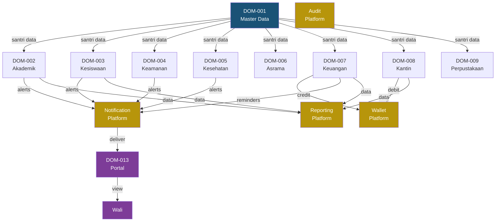
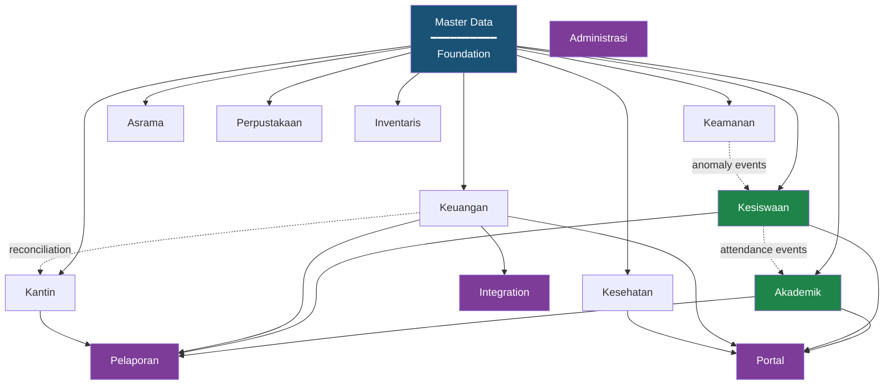

# EARS — Part 4: Domain Architecture

**APP MA'HAD Enterprise ERP**

| Metadata | Value |
|----------|-------|
| **Document** | Enterprise Architecture Refinement Specification (EARS) |
| **Part** | 4 — Domain Architecture |
| **Version** | 1.0 |
| **Status** | Enterprise Domain Architecture |
| **Classification** | Enterprise Domain Layer — CRITICAL |
| **Author** | Enterprise Architecture Board |
| **Date** | 2026-08-05 |
| **Review Cycle** | Domain Architecture Review |
| **Prerequisite** | EARS Part 1, Part 2, Part 3, Appendix A, Appendix B |

---

## Table of Contents

1. [Domain Philosophy](#1-domain-philosophy)
2. [Enterprise Domain Registry](#2-enterprise-domain-registry)
3. [Domain Boundary](#3-domain-boundary)
4. [Domain Capability](#4-domain-capability)
5. [Business Object Model](#5-business-object-model)
6. [Domain Event Registry](#6-domain-event-registry)
7. [Domain Data Ownership](#7-domain-data-ownership)
8. [Platform Consumption Matrix](#8-platform-consumption-matrix)
9. [Domain Interaction Map](#9-domain-interaction-map)
10. [Domain Lifecycle](#10-domain-lifecycle)
11. [Domain Operational Unit](#11-domain-operational-unit)
12. [Domain Security Model](#12-domain-security-model)
13. [Domain Anti-Patterns](#13-domain-anti-patterns)
14. [Domain Governance](#14-domain-governance)
15. [Domain Maturity Matrix](#15-domain-maturity-matrix)
16. [Domain Roadmap](#16-domain-roadmap)
17. [Domain Architecture Summary](#17-domain-architecture-summary)

**Appendices**

- [Appendix A: Enterprise Domain Dependency Diagram](#appendix-a-enterprise-domain-dependency-diagram)
- [Appendix B: Domain Communication Matrix](#appendix-b-domain-communication-matrix)
- [Appendix C: Domain Event Catalog](#appendix-c-domain-event-catalog)
- [Appendix D: Domain Capability Heat Map](#appendix-d-domain-capability-heat-map)
- [Appendix E: Domain Aggregate Catalog](#appendix-e-domain-aggregate-catalog)
- [Appendix F: Cross-Domain Integration Policy](#appendix-f-cross-domain-integration-policy)
- [Appendix G: Domain Review Checklist](#appendix-g-domain-review-checklist)

---

## 1. Domain Philosophy

### 1.1 What is a Domain?

A Domain is a **bounded business context** that represents a distinct area of operational responsibility within the pesantren. Each domain:

- Encapsulates its own business rules
- Owns its own data entities
- Has its own lifecycle
- Has its own operators
- Publishes its own events
- Consumes shared platforms but never builds them

### 1.2 Domain vs Platform vs Operational Unit vs Module

| Concept | Has Business Rules? | Owns Business Data? | Reusable Across Domains? | Has Operators? | Can Have Multiple Instances? |
|---------|:---:|:---:|:---:|:---:|:---:|
| **Domain** | YES | YES | NO — specific to one business context | YES | Only via Operational Units |
| **Platform** | NO — only technical logic | Owns technical data | YES — consumed by all domains | NO | NO — exactly one instance |
| **Operational Unit** | Inherits from Domain | YES — scoped subset | NO — lives inside a domain | YES — assigned operators | YES — that is the purpose |
| **Module** | Depends | Depends | Depends | Depends | Depends |

### 1.3 Why Domains Have Business Rules

Business rules are the encoded decisions of how the pesantren operates. "SPP is charged monthly per program" is a Keuangan rule. "Pelanggaran berat triggers SP escalation" is a Kesiswaan rule. These rules belong to their domain because:

- Only the domain owner understands the rule's context
- Only the domain owner can change the rule
- Cross-domain rule conflicts are detected at the domain boundary, not inside a platform

### 1.4 Why Domains Must Not Build Platforms

If Keuangan builds its own notification system, and Kesiswaan builds another, and Kesehatan builds a third:

- 3 separate codebases to maintain
- 3 separate bug surfaces
- 3 separate channel integrations
- When push notification is added, 3 implementations are needed

Domains CONSUME platforms. They do not BUILD them. This is inviolable (ARC-012 through ARC-016).

### 1.5 Why Domains Must Not Have Shared Services

A "shared service" inside a domain creates a hidden platform. If Akademik creates a "shared grading utility" that Kesiswaan also uses, the utility becomes a cross-domain dependency. If Akademik changes it, Kesiswaan breaks.

If a service is truly needed by multiple domains, it must be elevated to a Core Platform through the Platform Evolution Policy (Part 3, Section 13).

---

## 2. Enterprise Domain Registry

### DOM-001: Master Data

| Attribute | Detail |
|-----------|--------|
| **Purpose** | Manage the foundational identity and profile data of all persons in the pesantren ecosystem |
| **Business Capability** | Pendataan Santri, Pendataan Guru, Pendataan Pegawai, Pendataan Wali |
| **Business Owner** | Admin Pondok |
| **Operator** | Admin |
| **Consumer** | ALL Operational Domains (reference santri, guru, pegawai data) |
| **Platform Consumed** | Identity, Authentication, Tenant, Audit, Configuration |
| **Business Objects** | Santri, Guru, Pegawai, Wali, Wali-Santri Relationship |
| **Business Events** | SANTRI_REGISTERED, SANTRI_DEACTIVATED, GURU_REGISTERED, GURU_DEACTIVATED, PEGAWAI_REGISTERED |
| **Dependencies** | None — Master Data is the foundational domain |

### DOM-002: Akademik

| Attribute | Detail |
|-----------|--------|
| **Purpose** | Manage the entire academic lifecycle from curriculum design through graduation |
| **Business Capability** | Manajemen Program, Kurikulum, Kelas, Distribusi Guru, Jadwal, KBM, Penilaian, Rapor, Kelulusan |
| **Business Owner** | Kepala Akademik |
| **Operator** | Operator Akademik, Guru |
| **Consumer** | Santri, Wali (via Portal), Mudir (via Dashboard) |
| **Platform Consumed** | Identity, Authorization, Tenant, Audit, Notification, Event, Document, Reporting, Scheduler, Configuration |
| **Business Objects** | Program Akademik, Kurikulum, Mata Pelajaran, Kelas/Rombel, Jadwal, Nilai, Rapor, Jurnal Mengajar, Absensi |
| **Business Events** | SEMESTER_CREATED, KELAS_ASSIGNED, NILAI_SUBMITTED, RAPOR_PUBLISHED, SANTRI_PROMOTED, SANTRI_GRADUATED |
| **Dependencies** | Master Data (santri, guru references) |

### DOM-003: Kesiswaan

| Attribute | Detail |
|-----------|--------|
| **Purpose** | Manage santri behavior, discipline, achievement, and character development |
| **Business Capability** | Pelaporan Perilaku, Governance Review, Pelanggaran, Surat Peringatan (SP), Hukuman, Quest Pemulihan, Prestasi, Bimbingan |
| **Business Owner** | Kepala Kesiswaan |
| **Operator** | Musyrif, Guru, Tim Kesiswaan |
| **Consumer** | Santri, Wali (via Notification), Mudir (via Dashboard) |
| **Platform Consumed** | Identity, Authorization, Tenant, Audit, Notification, Event, Document, Configuration |
| **Business Objects** | Pelanggaran, Tingkat Pelanggaran, Surat Peringatan, Hukuman, Quest, Prestasi, Bimbingan, Governance Case |
| **Business Events** | VIOLATION_REPORTED, VIOLATION_CONFIRMED, SP_ISSUED, PUNISHMENT_ASSIGNED, QUEST_COMPLETED, ACHIEVEMENT_RECORDED |
| **Dependencies** | Master Data (santri, guru references) |

### DOM-004: Keamanan

| Attribute | Detail |
|-----------|--------|
| **Purpose** | Manage physical security, gate access, leave permissions, and movement monitoring |
| **Business Capability** | Gate Checkpoint, Perizinan Keluar, Monitoring Pergerakan, Alert Anomali |
| **Business Owner** | Kepala Keamanan |
| **Operator** | Petugas Keamanan |
| **Consumer** | Santri, Wali (via Notification), Musyrif |
| **Platform Consumed** | Identity, Authorization, Tenant, Audit, Notification, Event, RFID, Configuration |
| **Business Objects** | Gate Log, Perizinan, Movement Record, Alert |
| **Business Events** | GATE_ENTRY, GATE_EXIT, LEAVE_REQUESTED, LEAVE_APPROVED, LEAVE_EXPIRED, ANOMALY_DETECTED |
| **Dependencies** | Master Data (santri reference), RFID Platform (card identity) |

### DOM-005: Kesehatan

| Attribute | Detail |
|-----------|--------|
| **Purpose** | Manage on-site healthcare services, medical records, and health-related communications |
| **Business Capability** | Kunjungan UKS, Rekam Medis, Izin Berobat, Rujukan RS, Obat & Persediaan |
| **Business Owner** | Petugas UKS Senior |
| **Operator** | Petugas UKS |
| **Consumer** | Santri, Wali (via Notification), Musyrif |
| **Platform Consumed** | Identity, Authorization, Tenant, Audit, Notification, Event, Document, Configuration |
| **Business Objects** | Kunjungan, Rekam Medis, Diagnosa, Resep, Rujukan, Stok Obat |
| **Business Events** | VISIT_CREATED, DIAGNOSIS_RECORDED, REFERRAL_ISSUED, MEDICATION_DISPENSED, SANTRI_RECOVERED |
| **Dependencies** | Master Data (santri reference) |

### DOM-006: Asrama

| Attribute | Detail |
|-----------|--------|
| **Purpose** | Manage residential life: buildings, rooms, occupancy, supervision, and daily activities |
| **Business Capability** | Manajemen Gedung, Manajemen Kamar, Penempatan Santri, Musyrif Assignment, Aktivitas Asrama |
| **Business Owner** | Kepala Asrama |
| **Operator** | Musyrif, Pembina Asrama |
| **Consumer** | Santri, Wali (via Portal) |
| **Platform Consumed** | Identity, Authorization, Tenant, Audit, Notification, Event, Configuration |
| **Business Objects** | Gedung Asrama, Kamar, Penempatan, Musyrif Assignment, Aktivitas Harian |
| **Business Events** | ROOM_ASSIGNED, ROOM_VACATED, MUSYRIF_ASSIGNED, ACTIVITY_RECORDED |
| **Dependencies** | Master Data (santri, pegawai references) |

### DOM-007: Keuangan

| Attribute | Detail |
|-----------|--------|
| **Purpose** | Manage financial operations: billing, payment collection, wallet top-up, and financial reporting |
| **Business Capability** | Manajemen SPP, Pembayaran, Top-up Wallet, Rekonsiliasi, Laporan Keuangan, PPOB |
| **Business Owner** | Admin Keuangan |
| **Operator** | Staff Keuangan |
| **Consumer** | Wali (via Portal), Mudir (via Dashboard), Yayasan |
| **Platform Consumed** | Identity, Authorization, Tenant, Audit, Notification, Event, Wallet, Reporting, Scheduler, Configuration |
| **Business Objects** | Invoice, Payment, Top-up Request, Rekonsiliasi, Kategori Biaya |
| **Business Events** | INVOICE_CREATED, PAYMENT_RECEIVED, TOPUP_COMPLETED, RECONCILIATION_DONE, SPP_OVERDUE |
| **Dependencies** | Master Data (santri, wali references), Wallet Platform (balance operations) |

### DOM-008: Kantin

| Attribute | Detail |
|-----------|--------|
| **Purpose** | Manage food service operations: outlets, catalogs, POS transactions, inventory, and daily reconciliation |
| **Business Capability** | Manajemen Outlet, Katalog Menu, Point of Sale, Stok Management, Rekonsiliasi Harian, Laporan Penjualan |
| **Business Owner** | Admin Kantin |
| **Operator** | Kasir per outlet |
| **Consumer** | Santri (via wallet), Admin Keuangan (via reconciliation) |
| **Platform Consumed** | Identity, Authorization, Tenant, Audit, Event, Wallet, Reporting, Configuration |
| **Business Objects** | Outlet, Produk/Menu, Kategori, Transaksi, Stok, Rekonsiliasi Harian |
| **Business Events** | TRANSACTION_COMPLETED, STOCK_LOW, RECONCILIATION_COMPLETED, OUTLET_OPENED, OUTLET_CLOSED |
| **Dependencies** | Master Data (santri reference), Wallet Platform (debit operations) |

### DOM-009: Perpustakaan

| Attribute | Detail |
|-----------|--------|
| **Purpose** | Manage library operations: collection, lending, returns, and late fee tracking |
| **Business Capability** | Katalog Buku, Peminjaman, Pengembalian, Denda Keterlambatan, Pencarian |
| **Business Owner** | Pustakawan Senior |
| **Operator** | Pustakawan |
| **Consumer** | Santri, Guru |
| **Platform Consumed** | Identity, Authorization, Tenant, Audit, Notification, Scheduler, Search, Configuration |
| **Business Objects** | Buku, Kategori Buku, Peminjaman, Pengembalian, Denda |
| **Business Events** | BOOK_BORROWED, BOOK_RETURNED, BOOK_OVERDUE, FINE_CREATED |
| **Dependencies** | Master Data (santri reference) |

### DOM-010: Inventaris

| Attribute | Detail |
|-----------|--------|
| **Purpose** | Manage physical assets: registration, distribution, maintenance, and disposal |
| **Business Capability** | Pendataan Aset, Distribusi, Pemeliharaan, Penghapusan |
| **Business Owner** | Admin Inventaris |
| **Operator** | Staff Inventaris |
| **Consumer** | Seluruh Unit (asset users) |
| **Platform Consumed** | Identity, Authorization, Tenant, Audit, Document, Configuration |
| **Business Objects** | Aset, Kategori Aset, Distribusi, Jadwal Pemeliharaan, Berita Acara Penghapusan |
| **Business Events** | ASSET_REGISTERED, ASSET_DISTRIBUTED, MAINTENANCE_DUE, ASSET_DISPOSED |
| **Dependencies** | Master Data (pegawai reference for custodian) |

### DOM-011: Administrasi

| Attribute | Detail |
|-----------|--------|
| **Purpose** | System administration: user management, role management, operational unit setup, and system oversight |
| **Business Capability** | Manajemen User, Manajemen Role, Manajemen Assignment, System Monitoring |
| **Business Owner** | Admin Pondok |
| **Operator** | Admin |
| **Consumer** | Seluruh User |
| **Platform Consumed** | Identity, Authentication, Authorization, Tenant, Audit, Configuration |
| **Business Objects** | User Account, Role Definition, Permission Set, Assignment Record |
| **Business Events** | USER_CREATED, ROLE_ASSIGNED, ASSIGNMENT_GRANTED, SYSTEM_CONFIG_CHANGED |
| **Dependencies** | Identity Platform (user management), Authorization Platform (role/permission management) |

### DOM-012: Pelaporan

| Attribute | Detail |
|-----------|--------|
| **Purpose** | Enterprise-wide reporting and analytics across all domains |
| **Business Capability** | Dashboard Mudir, Dashboard Akademik, Dashboard Kesiswaan, Dashboard Keuangan, Laporan Periodik |
| **Business Owner** | Mudir |
| **Operator** | Admin |
| **Consumer** | Mudir, Yayasan, Kepala Bidang |
| **Platform Consumed** | Identity, Authorization, Tenant, Reporting, Configuration |
| **Business Objects** | Report Definition, Report Schedule, Dashboard Widget, Aggregate Cache |
| **Business Events** | REPORT_GENERATED, DASHBOARD_REFRESHED |
| **Dependencies** | ALL Operational Domains (read-only data aggregation) |

### DOM-013: Portal

| Attribute | Detail |
|-----------|--------|
| **Purpose** | Provide role-specific views and interfaces for external stakeholders |
| **Business Capability** | Portal Wali, Portal Guru, Portal Santri (future) |
| **Business Owner** | Product Owner |
| **Operator** | System (self-service portals) |
| **Consumer** | Wali, Guru, Santri |
| **Platform Consumed** | Identity, Authentication, Authorization, Tenant, Notification, Configuration |
| **Business Objects** | Portal Session, Portal Preference, Portal Notification Queue |
| **Business Events** | PORTAL_ACCESSED, PORTAL_ACTION_TAKEN |
| **Dependencies** | ALL Operational Domains (read-only views), Notification Platform (delivery channel) |

### DOM-014: Integration

| Attribute | Detail |
|-----------|--------|
| **Purpose** | Manage all external system integrations: payment gateways, messaging, storage, and third-party services |
| **Business Capability** | Payment Gateway Integration, WhatsApp Gateway, Google Drive Integration, PPOB Integration |
| **Business Owner** | Admin Pondok |
| **Operator** | Admin |
| **Consumer** | Keuangan (payments), Notification Platform (WhatsApp), Document Platform (Drive) |
| **Platform Consumed** | Tenant, Audit, Configuration |
| **Business Objects** | Integration Credential, Gateway Configuration, Webhook Record, Delivery Log |
| **Business Events** | PAYMENT_WEBHOOK_RECEIVED, WA_MESSAGE_SENT, DRIVE_FILE_SYNCED, INTEGRATION_ERROR |
| **Dependencies** | Configuration Platform (credentials), Tenant Platform (per-tenant integrations) |

---

## 3. Domain Boundary

### DOM-001: Master Data

| Aspect | Detail |
|--------|--------|
| **In Scope** | Santri CRUD, Guru CRUD, Pegawai CRUD, Wali CRUD, Wali-Santri linking, profile photos, status management (aktif/nonaktif/alumni) |
| **Out of Scope** | Academic placement, room assignment, financial billing, discipline records |
| **Forbidden** | Must not store kelas assignment (Akademik), must not store kamar assignment (Asrama), must not store wallet balance (Wallet Platform) |
| **Shared** | Santri/Guru/Pegawai identity is referenced by ALL operational domains via foreign key |

### DOM-002: Akademik

| Aspect | Detail |
|--------|--------|
| **In Scope** | Program management, kurikulum, kelas/rombel, jadwal, distribusi guru, absensi KBM, penilaian, rapor, jurnal mengajar, kenaikan kelas, kelulusan |
| **Out of Scope** | Santri registration (Master Data), discipline management (Kesiswaan), SPP billing (Keuangan), room assignment (Asrama) |
| **Forbidden** | Must not manage santri profiles, must not process payments, must not manage discipline cases |
| **Shared** | Attendance data may be consumed by Kesiswaan for discipline pattern analysis (read-only) |

### DOM-003: Kesiswaan

| Aspect | Detail |
|--------|--------|
| **In Scope** | Behavior reporting, governance review, pelanggaran management, SP issuance, hukuman, quest pemulihan, prestasi, bimbingan |
| **Out of Scope** | Academic grading (Akademik), room management (Asrama), gate operations (Keamanan) |
| **Forbidden** | Must not assign kelas, must not manage academic schedules, must not control gate access |
| **Shared** | Pelanggaran alerts shared with Wali via Notification Platform |

### DOM-004: Keamanan

| Aspect | Detail |
|--------|--------|
| **In Scope** | Gate checkpoint management, perizinan keluar, movement tracking, anomaly detection |
| **Out of Scope** | Discipline management (Kesiswaan), academic attendance (Akademik), room assignment (Asrama) |
| **Forbidden** | Must not issue SP or hukuman (Kesiswaan), must not manage RFID cards (RFID Platform) |
| **Shared** | Anomaly alerts may trigger Kesiswaan investigation (via Event Platform) |

### DOM-005: Kesehatan

| Aspect | Detail |
|--------|--------|
| **In Scope** | UKS visits, medical records, diagnoses, prescriptions, hospital referrals, medication inventory |
| **Out of Scope** | Discipline actions (Kesiswaan), academic excuses (Akademik), insurance claims |
| **Forbidden** | Must not issue academic excuses directly (coordinate via Event), must not manage santri profiles |
| **Shared** | Health events notified to Wali and Musyrif via Notification Platform |

### DOM-006: Asrama

| Aspect | Detail |
|--------|--------|
| **In Scope** | Building management, room management, santri room placement, musyrif assignment, daily activities |
| **Out of Scope** | Santri registration (Master Data), discipline (Kesiswaan), academic scheduling (Akademik) |
| **Forbidden** | Must not manage santri profiles, must not process discipline cases, must not manage academic programs |
| **Shared** | Room placement data referenced by Keamanan (location context) and Kesiswaan (incident context) |

### DOM-007: Keuangan

| Aspect | Detail |
|--------|--------|
| **In Scope** | SPP invoicing, payment collection, wallet top-up initiation, reconciliation, financial reporting, PPOB |
| **Out of Scope** | Canteen transactions (Kantin), academic grading (Akademik), discipline (Kesiswaan) |
| **Forbidden** | Must not directly modify wallet balance (Wallet Platform), must not process gateway directly (Integration Domain) |
| **Shared** | Financial data consumed by Pelaporan (read-only). Revenue from Kantin flows via reconciliation |

### DOM-008: Kantin

| Aspect | Detail |
|--------|--------|
| **In Scope** | Outlet management, product catalog, POS transactions, stock tracking, daily reconciliation, sales reports |
| **Out of Scope** | Wallet management (Wallet Platform), payment gateway (Integration), santri profiles (Master Data) |
| **Forbidden** | Must not manage wallet balances, must not create its own payment processing, must not manage santri data |
| **Shared** | Daily reconciliation data consumed by Keuangan (financial consolidation) |

### DOM-009: Perpustakaan

| Aspect | Detail |
|--------|--------|
| **In Scope** | Book catalog, lending, returns, fines, search |
| **Out of Scope** | Santri profiles (Master Data), financial processing (Keuangan), discipline (Kesiswaan) |
| **Forbidden** | Must not manage santri profiles, must not process payments directly |
| **Shared** | Overdue data may trigger fine or discipline consideration (via Event Platform) |

### DOM-010: Inventaris

| Aspect | Detail |
|--------|--------|
| **In Scope** | Asset registration, distribution, maintenance scheduling, disposal documentation |
| **Out of Scope** | Financial depreciation (Keuangan), procurement (future), room management (Asrama) |
| **Forbidden** | Must not process financial transactions, must not manage building data |
| **Shared** | Asset distribution records referenced by receiving departments |

### DOM-011 through DOM-014

| Domain | In Scope | Forbidden |
|--------|----------|-----------|
| **Administrasi** | User CRUD, role CRUD, assignment CRUD, system config | Must not contain domain business logic |
| **Pelaporan** | Report aggregation, dashboard data, scheduled reports | Must not modify source domain data |
| **Portal** | Role-specific views, self-service actions | Must not contain independent business logic |
| **Integration** | External API management, webhook processing, credential storage | Must not contain domain business rules |

---

## 4. Domain Capability

### DOM-001: Master Data Capabilities

| Capability | Sub-Capabilities |
|-----------|-----------------|
| **Pendataan Santri** | Registrasi, Update Profil, Status (aktif/nonaktif/alumni/keluar), Foto, Riwayat |
| **Pendataan Guru** | Registrasi, Kompetensi, Status, Penugasan History |
| **Pendataan Pegawai** | Registrasi, Jabatan, Status, Departemen |
| **Pendataan Wali** | Registrasi, Linking ke Santri, Kontak |

### DOM-002: Akademik Capabilities

| Capability | Sub-Capabilities |
|-----------|-----------------|
| **Manajemen Program** | Program CRUD, Jenjang, Tingkat, Periode Akademik (Tahun Ajaran, Semester) |
| **Manajemen Kurikulum** | Mata Pelajaran per Program, KKM, Bobot, Struktur Kurikulum |
| **Manajemen Kelas** | Kelas/Rombel CRUD, Enrollment Santri, Wali Kelas, Kapasitas |
| **Distribusi Guru** | Assign Guru ke Kelas + Mapel, Beban Mengajar, Validasi Konflik |
| **Jadwal** | Jadwal KBM, Resolusi Konflik, Template Jadwal |
| **KBM** | Absensi Harian, Jurnal Mengajar, Catatan Kegiatan |
| **Penilaian** | Input Nilai (Harian, UTS, UAS), Rubrik, Perhitungan Akhir |
| **Rapor** | Generasi Rapor, Multi-Program Consolidation, Catatan Guru, Cetak |
| **Promosi** | Kenaikan Kelas, Syarat Kelulusan Tingkat, Batch Processing |
| **Kelulusan** | Ujian Akhir, Sertifikat, Transisi ke Alumni |

### DOM-003: Kesiswaan Capabilities

| Capability | Sub-Capabilities |
|-----------|-----------------|
| **Pelaporan Perilaku** | Incident Report, Bukti (foto/dokumen), Reporter Identity, Kategori |
| **Governance Review** | Panel Review, Keputusan, Voting (jika komite), Catatan |
| **Pelanggaran** | Kategorisasi (ringan/sedang/berat/sangat berat), Poin, Akumulasi, History |
| **Surat Peringatan** | SP1 Generation, SP2 Eskalasi, SP3 + Mudir Approval, Tracking |
| **Hukuman** | Assignment, Durasi, Status (aktif/selesai), Proporsionalitas |
| **Quest Pemulihan** | Quest Assignment, Progress Tracking, Completion Verification, Poin Recovery |
| **Prestasi** | Recording, Kategori, Poin Positif, Leaderboard |
| **Bimbingan** | Session Scheduling, Notes, Follow-up, Counselor Assignment |

### DOM-004: Keamanan Capabilities

| Capability | Sub-Capabilities |
|-----------|-----------------|
| **Gate Checkpoint** | Entry Recording, Exit Recording, RFID Tap Processing, Manual Override |
| **Perizinan Keluar** | Request, Wali Approval, Security Validation, Periode Validitas, Return Verification |
| **Monitoring Pergerakan** | Movement Log, Timeline View, Location Context |
| **Alert Anomali** | Unauthorized Exit Detection, Curfew Violation, Pattern Analysis |

### DOM-005: Kesehatan Capabilities

| Capability | Sub-Capabilities |
|-----------|-----------------|
| **Kunjungan UKS** | Check-in, Keluhan, Pemeriksaan, Diagnosa, Tindakan |
| **Rekam Medis** | Riwayat Alergi, Kondisi Kronis, Riwayat Kunjungan, Catatan Khusus |
| **Izin Berobat** | Permohonan, Jenis (rawat jalan/rawat inap), Wali Approval |
| **Rujukan RS** | Surat Rujukan, RS Tujuan, Kontak Wali, Follow-up |
| **Obat & Persediaan** | Stok Obat, Dispensing Log, Restock Alert, Expiry Tracking |

### DOM-006: Asrama Capabilities

| Capability | Sub-Capabilities |
|-----------|-----------------|
| **Manajemen Gedung** | Gedung CRUD, Kapasitas, Fasilitas, Kondisi |
| **Manajemen Kamar** | Kamar CRUD, Kapasitas, Gender Segregation, Status |
| **Penempatan Santri** | Room Assignment, Transfer, Vacancy Management |
| **Musyrif Assignment** | Assign per Gedung/Lantai, Rotation Schedule |
| **Aktivitas Asrama** | Daily Activity Tracking, Cleaning, Muhadharah, Study Time |

### DOM-007: Keuangan Capabilities

| Capability | Sub-Capabilities |
|-----------|-----------------|
| **Manajemen SPP** | Invoice Generation, Installment, Tarif per Tingkat/Program, Batch Billing |
| **Pembayaran** | Payment Processing, Verification, Receipt Generation |
| **Top-up Wallet** | Request Processing, Gateway Verification, Balance Credit |
| **Rekonsiliasi** | Gateway ↔ Internal Matching, Discrepancy Resolution |
| **Laporan Keuangan** | Revenue, Receivables, Outstanding, Cash Flow |
| **PPOB** | Bill Payment Catalog, Transaction Processing, Commission Tracking |

### DOM-008: Kantin Capabilities

| Capability | Sub-Capabilities |
|-----------|-----------------|
| **Manajemen Outlet** | Outlet CRUD, Operating Hours, Kasir Assignment |
| **Katalog Menu** | Product CRUD, Pricing, Category, Availability Toggle |
| **Point of Sale** | Cart, Checkout, Wallet Debit, Receipt, Quick-sell |
| **Stok Management** | Stock Level, Restock, Adjustment, History |
| **Rekonsiliasi** | Daily Close, Kasir Settlement, Discrepancy Report |
| **Laporan Penjualan** | Revenue per Outlet, Top Items, Transaction Volume, Trend |

### DOM-009: Perpustakaan Capabilities

| Capability | Sub-Capabilities |
|-----------|-----------------|
| **Katalog Buku** | Book CRUD, ISBN, Category, Location, Condition |
| **Peminjaman** | Checkout, Due Date, Limit Check, Confirmation |
| **Pengembalian** | Return, Condition Assessment, Late Check |
| **Denda** | Calculation, Notification, Collection |
| **Pencarian** | Full-text Search, Filter, Available Copy Check |

### DOM-010: Inventaris Capabilities

| Capability | Sub-Capabilities |
|-----------|-----------------|
| **Pendataan Aset** | Registration, Tagging, Category, Photo, Condition |
| **Distribusi** | Assignment to Unit, Transfer, Custodian |
| **Pemeliharaan** | Schedule, Log, Cost Tracking |
| **Penghapusan** | Proposal, Approval, Documentation, Disposal |

---

## 5. Business Object Model

### 5.1 Object Classification

| Classification | Definition |
|---------------|-----------|
| **Aggregate Root** | Primary entity with its own lifecycle. Entry point for all operations on related objects |
| **Entity** | Object with unique identity that exists within an aggregate boundary |
| **Value Object** | Object defined by its attributes, not by identity. Immutable within context |
| **Reference Object** | Foreign key reference to an entity owned by another domain or platform |

### 5.2 Per-Domain Object Model

#### Master Data Objects

| Object | Classification | Description |
|--------|---------------|-------------|
| **Santri** | Aggregate Root | Central entity. All operational domains reference santri_id |
| **Guru** | Aggregate Root | Teaching staff with competency and assignment history |
| **Pegawai** | Aggregate Root | Non-teaching staff |
| **Wali** | Aggregate Root | Parent/guardian linked to one or more santri |
| Wali-Santri Link | Entity | Many-to-many relationship between wali and santri |

#### Akademik Objects

| Object | Classification | Description |
|--------|---------------|-------------|
| **Program Akademik** | Aggregate Root | Academic track (Formal, Pesantren, Tahfidz). Also an Operational Unit |
| Kurikulum | Entity | Curriculum structure within a program |
| Mata Pelajaran | Entity | Subject within a kurikulum |
| **Kelas/Rombel** | Aggregate Root | Student group in a program at a specific tingkat |
| Jadwal | Entity | KBM schedule entries |
| **Nilai** | Aggregate Root | Grade records per santri per mapel per period |
| **Rapor** | Aggregate Root | Report card per santri per semester per program |
| Absensi | Entity | Attendance per santri per class session |
| Jurnal Mengajar | Entity | Teacher teaching log per class session |
| Santri (ref) | Reference Object | FK to Master Data |
| Guru (ref) | Reference Object | FK to Master Data |

#### Kesiswaan Objects

| Object | Classification | Description |
|--------|---------------|-------------|
| **Pelanggaran** | Aggregate Root | Violation record with evidence, poin, status |
| Governance Case | Entity | Review case for a violation |
| **Surat Peringatan** | Aggregate Root | SP1/SP2/SP3 with lifecycle |
| Hukuman | Entity | Sanction assigned for a violation |
| **Quest** | Aggregate Root | Redemption task with progress tracking |
| **Prestasi** | Aggregate Root | Achievement record |
| Bimbingan | Entity | Counseling session record |
| Santri (ref) | Reference Object | FK to Master Data |
| Reporter (ref) | Reference Object | FK to Identity (guru/musyrif who reported) |

#### Keamanan Objects

| Object | Classification | Description |
|--------|---------------|-------------|
| **Gate Log** | Aggregate Root | Entry/exit record at gate checkpoint |
| **Perizinan** | Aggregate Root | Leave permission with lifecycle (requested → approved → active → completed) |
| Movement Record | Entity | Movement data point within gate logs |
| Alert | Entity | Anomaly alert record |
| Santri (ref) | Reference Object | FK to Master Data |
| Card (ref) | Reference Object | FK to RFID Platform |

#### Kesehatan Objects

| Object | Classification | Description |
|--------|---------------|-------------|
| **Kunjungan** | Aggregate Root | UKS visit with diagnosis and treatment |
| Rekam Medis | Entity | Medical history per santri (aggregate of visits) |
| Resep | Entity | Prescription within a visit |
| **Rujukan** | Aggregate Root | Hospital referral with follow-up |
| Stok Obat | Entity | Medication inventory item |
| Santri (ref) | Reference Object | FK to Master Data |

#### Keuangan Objects

| Object | Classification | Description |
|--------|---------------|-------------|
| **Invoice** | Aggregate Root | Billing record for santri/wali |
| Payment | Entity | Payment against an invoice |
| **Top-up Request** | Aggregate Root | Wallet top-up request from wali |
| Rekonsiliasi | Entity | Reconciliation record |
| Santri (ref) | Reference Object | FK to Master Data |
| Wali (ref) | Reference Object | FK to Master Data |
| Wallet (ref) | Reference Object | FK to Wallet Platform |

#### Kantin Objects

| Object | Classification | Description |
|--------|---------------|-------------|
| **Outlet** | Aggregate Root | Canteen outlet. Also an Operational Unit |
| Produk/Menu | Entity | Product within an outlet catalog |
| **Transaksi** | Aggregate Root | POS transaction record |
| Stok | Entity | Stock level per product per outlet |
| Rekonsiliasi | Entity | Daily reconciliation per outlet |
| Santri (ref) | Reference Object | FK to Master Data |
| Wallet (ref) | Reference Object | FK to Wallet Platform |

#### Perpustakaan Objects

| Object | Classification | Description |
|--------|---------------|-------------|
| **Buku** | Aggregate Root | Book in the collection |
| Kategori | Value Object | Book category/genre |
| **Peminjaman** | Aggregate Root | Lending record with lifecycle |
| Denda | Entity | Fine record for overdue |
| Santri (ref) | Reference Object | FK to Master Data |

#### Inventaris Objects

| Object | Classification | Description |
|--------|---------------|-------------|
| **Aset** | Aggregate Root | Physical asset with lifecycle |
| Kategori Aset | Value Object | Asset category |
| Distribusi | Entity | Asset distribution record |
| Pemeliharaan | Entity | Maintenance record |

---

## 6. Domain Event Registry

### 6.1 Master Data Events

| Event | Publisher | Subscribers | Platform Route |
|-------|----------|-------------|---------------|
| MASTER_SANTRI_REGISTERED | Master Data | Akademik, Asrama, Keuangan, Keamanan | Event Platform → Notification |
| MASTER_SANTRI_DEACTIVATED | Master Data | ALL Operational Domains | Event Platform |
| MASTER_GURU_REGISTERED | Master Data | Akademik | Event Platform |

### 6.2 Akademik Events

| Event | Publisher | Subscribers | Platform Route |
|-------|----------|-------------|---------------|
| AKADEMIK_SEMESTER_CREATED | Akademik | Keuangan (SPP generation) | Event Platform |
| AKADEMIK_KELAS_ASSIGNED | Akademik | Portal (wali view) | Event Platform |
| AKADEMIK_NILAI_SUBMITTED | Akademik | Portal (wali view) | Event Platform → Notification |
| AKADEMIK_RAPOR_PUBLISHED | Akademik | Portal, Notification | Event Platform → Notification |
| AKADEMIK_SANTRI_PROMOTED | Akademik | Keuangan (new SPP rate) | Event Platform |
| AKADEMIK_SANTRI_GRADUATED | Akademik | Master Data (status change), Keuangan (final settlement) | Event Platform |

### 6.3 Kesiswaan Events

| Event | Publisher | Subscribers | Platform Route |
|-------|----------|-------------|---------------|
| KESISWAAN_VIOLATION_REPORTED | Kesiswaan | Notification (wali alert) | Event → Notification |
| KESISWAAN_VIOLATION_CONFIRMED | Kesiswaan | Dashboard (counter) | Event Platform |
| KESISWAAN_SP_ISSUED | Kesiswaan | Notification (wali alert), Dashboard | Event → Notification |
| KESISWAAN_QUEST_COMPLETED | Kesiswaan | Notification (wali positive) | Event → Notification |
| KESISWAAN_ACHIEVEMENT_RECORDED | Kesiswaan | Notification (wali positive), Dashboard | Event → Notification |

### 6.4 Keamanan Events

| Event | Publisher | Subscribers | Platform Route |
|-------|----------|-------------|---------------|
| KEAMANAN_GATE_ENTRY | Keamanan | Asrama (location context) | Event Platform |
| KEAMANAN_GATE_EXIT | Keamanan | Notification (wali, if configured) | Event → Notification |
| KEAMANAN_ANOMALY_DETECTED | Keamanan | Kesiswaan (potential violation), Notification (musyrif alert) | Event → Notification |
| KEAMANAN_LEAVE_APPROVED | Keamanan | Notification (santri, security) | Event → Notification |

### 6.5 Remaining Domain Events

| Event | Publisher | Subscribers |
|-------|----------|-------------|
| KESEHATAN_VISIT_CREATED | Kesehatan | Notification (wali) |
| KESEHATAN_REFERRAL_ISSUED | Kesehatan | Notification (wali — urgent) |
| ASRAMA_ROOM_ASSIGNED | Asrama | Portal (wali view) |
| KEUANGAN_INVOICE_CREATED | Keuangan | Notification (wali), Portal |
| KEUANGAN_PAYMENT_RECEIVED | Keuangan | Notification (wali confirmation) |
| KEUANGAN_SPP_OVERDUE | Keuangan | Notification (wali reminder) |
| KANTIN_TRANSACTION_COMPLETED | Kantin | Audit, Reporting |
| KANTIN_RECONCILIATION_COMPLETED | Kantin | Keuangan (revenue data) |
| PERPUSTAKAAN_BOOK_OVERDUE | Perpustakaan | Notification (santri reminder) |

---

## 7. Domain Data Ownership

### 7.1 Ownership Matrix

| Domain | Owns (CUD) | Reads from Domain | Reads from Platform |
|--------|-----------|-------------------|---------------------|
| **Master Data** | Santri, Guru, Pegawai, Wali | — | Identity (user accounts) |
| **Akademik** | Program, Kurikulum, Kelas, Jadwal, Nilai, Rapor, Absensi | Master Data (santri, guru) | Identity, Tenant |
| **Kesiswaan** | Pelanggaran, SP, Hukuman, Quest, Prestasi, Bimbingan | Master Data (santri) | Identity, Tenant |
| **Keamanan** | Gate Log, Perizinan, Movement, Alert | Master Data (santri) | Identity, RFID, Tenant |
| **Kesehatan** | Kunjungan, Rekam Medis, Rujukan, Stok Obat | Master Data (santri) | Identity, Tenant |
| **Asrama** | Gedung, Kamar, Penempatan, Aktivitas | Master Data (santri, pegawai) | Identity, Tenant |
| **Keuangan** | Invoice, Payment, Top-up Request, Rekonsiliasi | Master Data (santri, wali) | Wallet, Identity, Tenant |
| **Kantin** | Outlet, Produk, Transaksi, Stok | Master Data (santri) | Wallet, Identity, Tenant |
| **Perpustakaan** | Buku, Peminjaman, Denda | Master Data (santri) | Identity, Tenant |
| **Inventaris** | Aset, Distribusi, Pemeliharaan | Master Data (pegawai) | Identity, Tenant |

### 7.2 Ownership Rules

| Rule | Description |
|------|-------------|
| **DOMOWN-001** | Each business entity has exactly ONE domain owner. No entity is shared-owned |
| **DOMOWN-002** | Only the owner domain may Create, Update, or Delete the entity |
| **DOMOWN-003** | Other domains may Read the entity via foreign key reference |
| **DOMOWN-004** | Platform data (wallet balance, user profile) is owned by the platform, not by any domain |
| **DOMOWN-005** | Denormalized copies (e.g., santri_name in transaction records) must be documented and tracked |

---

## 8. Platform Consumption Matrix

| Domain | Identity | Auth'n | Auth'z | Tenant | Wallet | Notif | Audit | Doc | Config | Event | Search | Report | Sched | RFID |
|--------|:---:|:---:|:---:|:---:|:---:|:---:|:---:|:---:|:---:|:---:|:---:|:---:|:---:|:---:|
| Master Data | ● | ● | ● | ● | | | ● | | ● | ● | ● | | | |
| Akademik | ● | | ● | ● | | ● | ● | ● | ● | ● | | ● | ● | |
| Kesiswaan | ● | | ● | ● | | ● | ● | ● | ● | ● | | | | |
| Keamanan | ● | | ● | ● | | ● | ● | | ● | ● | | | | ● |
| Kesehatan | ● | | ● | ● | | ● | ● | ● | ● | ● | | | | |
| Asrama | ● | | ● | ● | | ● | ● | | ● | ● | | | | |
| Keuangan | ● | | ● | ● | ● | ● | ● | | ● | ● | | ● | ● | |
| Kantin | ● | | ● | ● | ● | | ● | | ● | ● | | ● | | |
| Perpustakaan | ● | | ● | ● | | ● | ● | | ● | | ● | | ● | |
| Inventaris | ● | | ● | ● | | | ● | ● | ● | | | | | |
| Administrasi | ● | ● | ● | ● | | | ● | | ● | | | | | |
| Pelaporan | ● | | ● | ● | | | | | ● | | | ● | | |
| Portal | ● | ● | ● | ● | | ● | | | ● | | | | | |
| Integration | | | | ● | | | ● | | ● | ● | | | | |

● = Platform consumed by this domain

---

## 9. Domain Interaction Map

### 9.1 Primary Interaction Diagram



---

## 10. Domain Lifecycle

### DOM-002: Akademik Lifecycle

```
TAHUN AJARAN DIBUAT → SEMESTER DIBUAT → KURIKULUM DISIAPKAN
        │
        ▼
KELAS DIBUAT → SANTRI DI-ENROLL → GURU DIDISTRIBUSIKAN
        │
        ▼
JADWAL DISUSUN → KBM BERJALAN → ABSENSI HARIAN → JURNAL MENGAJAR
        │
        ▼
PENILAIAN HARIAN → UTS → UAS → NILAI AKHIR DIHITUNG
        │
        ▼
RAPOR DIGENERATE → RAPOR DIPUBLISH → WALI MENERIMA
        │
        ▼
EVALUASI KENAIKAN → NAIK KELAS / TINGGAL / LULUS
        │
        ▼
(Jika Lulus) → SERTIFIKAT → ALUMNI
```

### DOM-003: Kesiswaan Lifecycle

```
INSIDEN TERJADI → LAPORAN DITULIS (Musyrif/Guru)
        │
        ▼
GOVERNANCE REVIEW → KEPUTUSAN (Pelanggaran dikonfirmasi / ditolak)
        │
        ▼
PELANGGARAN DIKATEGORIKAN → POIN DIBERIKAN → AKUMULASI DIHITUNG
        │
        ├── (Threshold SP1) → SP1 DITERBITKAN → WALI DIBERITAHU
        ├── (Threshold SP2) → SP2 DITERBITKAN → WALI DIBERITAHU
        └── (Threshold SP3) → SP3 DRAFT → MUDIR APPROVAL → DIKELUARKAN / DIBINA
        │
        ▼
HUKUMAN DIBERIKAN → SANTRI MENJALANI → HUKUMAN SELESAI
        │
        ▼
QUEST PEMULIHAN DITAWARKAN → SANTRI MENGERJAKAN → QUEST SELESAI → POIN RECOVERY
```

### DOM-004: Keamanan Lifecycle

```
SANTRI REQUEST IZIN → WALI MENYETUJUI → PERIZINAN AKTIF
        │
        ▼
SANTRI TAP RFID DI GATE KELUAR → GATE LOG TERCATAT → COUNTDOWN DIMULAI
        │
        ▼
SANTRI TAP RFID DI GATE MASUK → GATE LOG TERCATAT → PERIZINAN SELESAI
        │
        ▼
(Jika tidak kembali tepat waktu) → ANOMALY ALERT → MUSYRIF DIBERITAHU
```

### DOM-007: Keuangan Lifecycle

```
SEMESTER BARU → INVOICE SPP DIGENERATE (batch per santri)
        │
        ▼
WALI MENERIMA TAGIHAN → WALI MEMBAYAR VIA GATEWAY → PAYMENT VERIFIED
        │
        ▼
INVOICE LUNAS → RECEIPT GENERATED → WALI MENERIMA KONFIRMASI
        │
        ▼
(Jika top-up) → TOP-UP REQUEST → GATEWAY VERIFIED → WALLET CREDITED
        │
        ▼
REKONSILIASI HARIAN → LAPORAN KEUANGAN → DASHBOARD MUDIR
```

### DOM-008: Kantin Lifecycle

```
OUTLET DIBUKA → KASIR LOGIN → STOK DIPERIKSA
        │
        ▼
SANTRI DATANG → PILIH ITEM → CHECKOUT → WALLET DEBIT → RECEIPT
        │
        ▼
(Repeat sepanjang hari)
        │
        ▼
AKHIR HARI → KASIR TUTUP → REKONSILIASI → LAPORAN HARIAN
        │
        ▼
DATA REVENUE → KEUANGAN (konsolidasi)
```

### DOM-009: Perpustakaan Lifecycle

```
BUKU MASUK → KATALOG DIUPDATE → BUKU TERSEDIA
        │
        ▼
SANTRI DATANG → CARI BUKU → PINJAM → DUE DATE SET → REMINDER SCHEDULED
        │
        ▼
SANTRI KEMBALI → BUKU DIKEMBALIKAN → KONDISI DICEK → STOK UPDATED
        │
        ├── (Tepat waktu) → SELESAI
        └── (Terlambat) → DENDA DIHITUNG → SANTRI DIBERITAHU
```

---

## 11. Domain Operational Unit

### 11.1 Operational Unit Mapping

| Domain | Has OU? | Unit Type | Example Units | Operator per Unit |
|--------|:---:|----------|---------------|-------------------|
| **Master Data** | NO | — | — | Admin Pondok (global) |
| **Akademik** | YES | Program Akademik | Program Formal, Program Pesantren, Program Tahfidz | Operator Akademik per Program |
| **Kesiswaan** | NO | — | — | Tim Kesiswaan (pondok-wide) |
| **Keamanan** | NO | — | — | Petugas Keamanan (pondok-wide) |
| **Kesehatan** | NO | — | — | Petugas UKS (pondok-wide) |
| **Asrama** | YES | Gedung Asrama | Asrama Al-Fatih, Asrama Khadijah | Musyrif per Gedung |
| **Keuangan** | NO | — | — | Admin Keuangan (pondok-wide) |
| **Kantin** | YES | Outlet Kantin | Kantin Utama, Kantin Putra, Kantin Putri | Kasir per Outlet |
| **Perpustakaan** | NO | — | — | Pustakawan (pondok-wide) |
| **Inventaris** | NO | — | — | Admin Inventaris (pondok-wide) |

### 11.2 OU Hierarchy

```
DOMAIN (Akademik)
    │
    ├── Operational Unit: Program Formal
    │       ├── Operator: Admin Formal
    │       ├── Guru: assigned to this program
    │       └── Santri: enrolled in this program
    │
    ├── Operational Unit: Program Pesantren
    │       ├── Operator: Admin Pesantren
    │       ├── Guru: assigned to this program
    │       └── Santri: enrolled in this program
    │
    └── Operational Unit: Program Tahfidz
            ├── Operator: Admin Tahfidz
            ├── Guru: assigned to this program
            └── Santri: enrolled in this program

DOMAIN (Kantin)
    │
    ├── Operational Unit: Kantin Utama
    │       └── Kasir: assigned to this outlet
    │
    └── Operational Unit: Kantin Putri
            └── Kasir: assigned to this outlet
```

### 11.3 OU Rules

| Rule | Description |
|------|-------------|
| **OU-001** | Data within one OU is isolated from other OUs in the same domain |
| **OU-002** | An operator assigned to OU-A cannot access OU-B data unless explicitly assigned |
| **OU-003** | Administrator role bypasses OU restrictions (sees all OUs) |
| **OU-004** | New OUs can be created without code changes (runtime configuration) |
| **OU-005** | Each OU has its own operational context (workspace) in the sidebar |

---

## 12. Domain Security Model

### 12.1 Permission Model

| Aspect | Description |
|--------|-------------|
| **Permission** | A named capability (e.g., `MANAGE_KELAS`, `VIEW_PELANGGARAN`, `PROCESS_POS`). Each domain defines its own permissions |
| **Role** | A named collection of permissions (e.g., `OPERATOR_AKADEMIK` has `MANAGE_KELAS`, `MANAGE_KURIKULUM`, `INPUT_NILAI`) |
| **Assignment** | Binds a user to an Operational Unit. User with role `OPERATOR_AKADEMIK` assigned to `Program Formal` can only manage kelas in that program |
| **Effective Access** | Union of all role permissions, filtered by OU assignment. `Can user X perform action Y in unit Z?` |

### 12.2 Domain Permission Registry

| Domain | Key Permissions |
|--------|----------------|
| **Master Data** | MANAGE_SANTRI, MANAGE_GURU, MANAGE_PEGAWAI, MANAGE_WALI, VIEW_SANTRI |
| **Akademik** | MANAGE_PROGRAM, MANAGE_KURIKULUM, MANAGE_KELAS, MANAGE_JADWAL, INPUT_NILAI, GENERATE_RAPOR, MANAGE_KELULUSAN |
| **Kesiswaan** | REPORT_VIOLATION, REVIEW_VIOLATION, ISSUE_SP, ASSIGN_PUNISHMENT, MANAGE_QUEST, RECORD_ACHIEVEMENT |
| **Keamanan** | MANAGE_GATE, MANAGE_PERIZINAN, VIEW_MOVEMENT, RESPOND_ALERT |
| **Kesehatan** | CREATE_VISIT, MANAGE_MEDICAL_RECORD, ISSUE_REFERRAL, MANAGE_MEDICATION |
| **Asrama** | MANAGE_GEDUNG, MANAGE_KAMAR, ASSIGN_ROOM, MANAGE_ACTIVITY |
| **Keuangan** | MANAGE_INVOICE, PROCESS_PAYMENT, MANAGE_TOPUP, RECONCILE, VIEW_FINANCIAL_REPORT |
| **Kantin** | MANAGE_OUTLET, MANAGE_PRODUCT, PROCESS_POS, MANAGE_STOCK, RECONCILE_OUTLET |
| **Perpustakaan** | MANAGE_BOOK, PROCESS_LENDING, PROCESS_RETURN, MANAGE_FINE |
| **Inventaris** | MANAGE_ASSET, DISTRIBUTE_ASSET, MANAGE_MAINTENANCE, DISPOSE_ASSET |

### 12.3 Isolation and Visibility

| Level | Description |
|-------|-------------|
| **Tenant Isolation** | Data is completely isolated between tenants (pesantren). Tenant A cannot see Tenant B data |
| **OU Isolation** | Within a tenant, data in OU-A is not visible to OU-B operators unless assigned to both |
| **Role Visibility** | Menu items and actions visible only if user has the required permission |
| **Admin Override** | Administrator role sees all OUs and all data within their tenant |

---

## 13. Domain Anti-Patterns

| # | Anti-Pattern | Why Wrong | Correct Approach |
|---|-------------|-----------|-----------------|
| **DAP-01** | **Duplicate Business Rule**: Akademik and Kesiswaan both implement attendance threshold rules with different logic | Conflicting behavior. One changes, the other doesn't | One domain owns the rule. Other domain consumes via event |
| **DAP-02** | **Duplicate Wallet**: Keuangan tracks its own saldo_santri field | Two balances drift. Double-spending risk | Use Wallet Platform exclusively |
| **DAP-03** | **Duplicate Identity**: Kantin maintains kasir_users table | Permission drift. Maintenance burden | Use Identity Platform for all users |
| **DAP-04** | **Cross-Domain Query**: Kesiswaan queries Akademik's absensi table directly | Schema coupling. Akademik changes break Kesiswaan | Akademik publishes attendance events. Kesiswaan subscribes |
| **DAP-05** | **Shared Database Table**: Multiple domains write to a shared activity_log table | Ownership ambiguity. Schema conflicts. Migration hazard | Each domain owns its tables. Audit Platform handles cross-domain logging |
| **DAP-06** | **Shared Aggregate**: Santri aggregate used directly by Kesiswaan and Akademik | Aggregate boundary violation. Conflicting lifecycle rules | Each domain references santri_id (FK). Owns its own domain-specific records |
| **DAP-07** | **Domain Creates Platform**: Kesiswaan builds its own notification module | Duplicates Notification Platform. Other domains can't reuse | Use Notification Platform |
| **DAP-08** | **Business Rule in UI**: "SP threshold is 50 points" hardcoded in React component | Rule invisible to other layers. Cannot be changed without deployment | Business rules live in domain logic, configurable via Configuration Platform |
| **DAP-09** | **Business Rule in Scheduler**: "Send SPP reminder on the 25th" hardcoded in cron job | Rule embedded in infrastructure. Not domain-owned | Domain defines schedule via Scheduler Platform. Rule lives in domain |
| **DAP-10** | **Business Rule in Notification**: Notification Platform checks "if violation_count > 3, send to Mudir" | Platform becomes domain-aware. Violates PLT-001 | Kesiswaan decides when to notify. Notification Platform delivers |

---

## 14. Domain Governance

### 14.1 Domain Change Process

| Change Type | Process | Approval |
|-------------|---------|----------|
| **New Domain** | Extension Contract (12 checkpoints, Appendix A §7) → ARB Review | Architecture Review Board + Product Owner |
| **Domain Boundary Change** | Document impact analysis → Update boundary definition → ARB Review | Architecture Review Board |
| **Domain Split** | Justify separation → Define new boundaries → Migration plan → ARB Review | Architecture Review Board |
| **Domain Merge** | Justify merger → Define combined boundary → Migration plan → ARB Review | Architecture Review Board |
| **Domain Deprecation** | Confirm no consumers → Migration path → Deprecation period → Archive | Architecture Review Board |
| **New Business Rule** | Document as BR-{DOM}-NNN → Domain Owner review → Cross-domain check | Domain Owner (+ ARB if cross-domain) |
| **New Business Object** | Declare ownership → Update object model → Update dependency matrix | Domain Owner + ARB |

---

## 15. Domain Maturity Matrix

| Domain | Current State | Target State | Gap |
|--------|--------------|-------------|-----|
| **Master Data** | Partial: santri/guru CRUD exists, mock data | Full: complete CRUD, status lifecycle, photo, wali linking | Status lifecycle, wali management |
| **Akademik** | Partial: struktur akademik page, basic kelas | Full: multi-program OU, jadwal, penilaian, rapor, kelulusan | OU pattern, jadwal, penilaian engine |
| **Kesiswaan** | Partial: basic pelanggaran structure | Full: governance engine, SP lifecycle, quest, prestasi | Governance review, SP automation, quest |
| **Keamanan** | Not started | Full: gate checkpoint, perizinan, RFID integration, anomaly | Complete build required |
| **Kesehatan** | Not started | Full: UKS, medical records, referral, medication | Complete build required |
| **Asrama** | Not started | Full: gedung, kamar, penempatan, musyrif, activities | Complete build required |
| **Keuangan** | Partial: basic finance schema, wallet tables | Full: SPP invoicing, payment gateway, top-up, reconciliation | Invoice engine, gateway integration |
| **Kantin** | Not started | Full: multi-outlet POS, catalog, stock, reconciliation | Complete build required |
| **Perpustakaan** | Not started | Full: catalog, lending, returns, fines, search | Complete build required |
| **Inventaris** | Not started | Full: asset lifecycle, distribution, maintenance | Complete build required |
| **Administrasi** | Partial: basic user management | Full: multi-role, assignment, OU management | Multi-role, assignment system |
| **Pelaporan** | Not started | Full: dashboards per role, scheduled reports | Complete build required |
| **Portal** | Not started | Full: wali portal, guru portal | Complete build required |
| **Integration** | Partial: Flip webhook | Full: multi-gateway, WA, Drive, PPOB | WA integration, Drive sync, PPOB |

---

## 16. Domain Roadmap

### 16.1 Implementation Priority

| Priority | Phase | Domains | Rationale |
|----------|-------|---------|-----------|
| **P0 — Foundation** | Sprint 8-10 | Master Data, Administrasi | Every domain depends on Master Data. Admin manages users and roles. Must be built first |
| **P1 — Core Academic** | Sprint 11-14 | Akademik (multi-program OU) | Primary business value. Most complex domain. Requires OU pattern to be proven |
| **P2 — Core Operations** | Sprint 15-18 | Kesiswaan, Keuangan | Governance engine and financial operations are critical for daily pondok operations |
| **P3 — Financial Ecosystem** | Sprint 19-21 | Kantin, Wallet integration | Cashless economy. High transaction volume. Proves Wallet Platform |
| **P4 — Residential & Safety** | Sprint 22-25 | Asrama, Keamanan, RFID integration | Residential management and physical security. RFID integration |
| **P5 — Support Services** | Sprint 26-28 | Kesehatan, Perpustakaan, Inventaris | Support domains that enhance operational coverage |
| **P6 — Portals & Reporting** | Sprint 29-31 | Portal (Wali, Guru), Pelaporan, Integration | User-facing portals and enterprise reporting. Requires all domains operational |
| **P7 — Future Domains** | Sprint 32+ | Laundry, Koperasi, Mini Market, Transportasi, Masjid, Dapur, Percetakan, Marketplace | Extension domains following Extension Contract |

### 16.2 Domain Classification Summary

| Classification | Domains | Count |
|---------------|---------|-------|
| **Core Domain** | Master Data, Akademik, Kesiswaan | 3 |
| **Operational Domain** | Keamanan, Kesehatan, Asrama, Keuangan, Kantin, Perpustakaan, Inventaris | 7 (was 9, Akademik/Kesiswaan elevated to Core) |
| **Support Domain** | Administrasi, Pelaporan, Portal, Integration | 4 |
| **Future Domain** | Laundry, Koperasi, Mini Market, Transportasi, Masjid, Dapur, Percetakan, Marketplace | 8 |

---

## 17. Domain Architecture Summary

### 17.1 What This Document Establishes

| Aspect | Established |
|--------|------------|
| What domains exist | 14 Official Domains (DOM-001 to DOM-014) |
| What each domain does | Purpose, capabilities, business objects, events |
| What each domain owns | Data ownership matrix, aggregate catalog |
| What each domain must not do | Boundary definitions, forbidden responsibilities |
| How domains consume platforms | Platform Consumption Matrix (14 domains × 14 platforms) |
| How domains interact | Domain Interaction Map |
| How domains evolve | Lifecycle per domain, governance process |
| How domains are secured | Permission model, OU isolation, admin override |
| What to avoid | 10 domain anti-patterns |
| Where we are vs where we go | Maturity matrix, implementation roadmap |

### 17.2 Relationship to Other Documents

```
PART 1: Enterprise Foundation          WHAT exists
    │
APPENDIX A: Standards                  HOW rules are made
    │
APPENDIX B: Playbook                   HOW teams work
    │
PART 2: Business Architecture          WHY things exist
    │
PART 3: Platform Architecture          HOW platforms work
    │
PART 4: Domain Architecture            HOW domains work    ◄── THIS
    │
PART 5 (next): Data Architecture
    │
PART 6 (next): Integration Architecture
```

Part 4 is the **last architectural layer before Sprint implementation**. With Part 4 complete, the architecture defines:

1. **What exists** (Part 1: Foundation)
2. **How rules are enforced** (Appendix A: Standards)
3. **How teams operate** (Appendix B: Playbook)
4. **Why things exist** (Part 2: Business)
5. **How shared services work** (Part 3: Platforms)
6. **How business contexts work** (Part 4: Domains) ← THIS

The remaining Parts (5: Data Architecture, 6: Integration Architecture) provide additional depth but are not blockers for Sprint implementation.

---

## Appendix A: Enterprise Domain Dependency Diagram



---

## Appendix B: Domain Communication Matrix

| From \ To | Master Data | Akademik | Kesiswaan | Keamanan | Kesehatan | Asrama | Keuangan | Kantin | Perpustakaan | Inventaris |
|-----------|:---:|:---:|:---:|:---:|:---:|:---:|:---:|:---:|:---:|:---:|
| **Master Data** | — | Event | Event | Event | Event | Event | Event | Event | Event | Event |
| **Akademik** | Read | — | Event | | | | Event | | | |
| **Kesiswaan** | Read | | — | | | | | | | |
| **Keamanan** | Read | | Event | — | | Read | | | | |
| **Kesehatan** | Read | | | | — | | | | | |
| **Asrama** | Read | | Event | | | — | | | | |
| **Keuangan** | Read | | | | | | — | Read | | |
| **Kantin** | Read | | | | | | Event | — | | |
| **Perpustakaan** | Read | | | | | | | | — | |
| **Inventaris** | Read | | | | | | | | | — |

Legend: **Read** = FK reference (read-only) | **Event** = Async event communication | **—** = Self

---

## Appendix C: Domain Event Catalog

| # | Event Name | Publisher | Type |
|---|-----------|----------|------|
| 1 | MASTER_SANTRI_REGISTERED | Master Data | Lifecycle |
| 2 | MASTER_SANTRI_DEACTIVATED | Master Data | Lifecycle |
| 3 | MASTER_GURU_REGISTERED | Master Data | Lifecycle |
| 4 | AKADEMIK_SEMESTER_CREATED | Akademik | Lifecycle |
| 5 | AKADEMIK_KELAS_ASSIGNED | Akademik | Operation |
| 6 | AKADEMIK_NILAI_SUBMITTED | Akademik | Operation |
| 7 | AKADEMIK_RAPOR_PUBLISHED | Akademik | Lifecycle |
| 8 | AKADEMIK_SANTRI_PROMOTED | Akademik | Lifecycle |
| 9 | AKADEMIK_SANTRI_GRADUATED | Akademik | Lifecycle |
| 10 | KESISWAAN_VIOLATION_REPORTED | Kesiswaan | Operation |
| 11 | KESISWAAN_VIOLATION_CONFIRMED | Kesiswaan | Operation |
| 12 | KESISWAAN_SP_ISSUED | Kesiswaan | Lifecycle |
| 13 | KESISWAAN_QUEST_COMPLETED | Kesiswaan | Operation |
| 14 | KESISWAAN_ACHIEVEMENT_RECORDED | Kesiswaan | Operation |
| 15 | KEAMANAN_GATE_ENTRY | Keamanan | Operation |
| 16 | KEAMANAN_GATE_EXIT | Keamanan | Operation |
| 17 | KEAMANAN_ANOMALY_DETECTED | Keamanan | Alert |
| 18 | KEAMANAN_LEAVE_APPROVED | Keamanan | Operation |
| 19 | KESEHATAN_VISIT_CREATED | Kesehatan | Operation |
| 20 | KESEHATAN_REFERRAL_ISSUED | Kesehatan | Operation |
| 21 | ASRAMA_ROOM_ASSIGNED | Asrama | Operation |
| 22 | KEUANGAN_INVOICE_CREATED | Keuangan | Lifecycle |
| 23 | KEUANGAN_PAYMENT_RECEIVED | Keuangan | Operation |
| 24 | KEUANGAN_SPP_OVERDUE | Keuangan | Alert |
| 25 | KEUANGAN_TOPUP_COMPLETED | Keuangan | Operation |
| 26 | KANTIN_TRANSACTION_COMPLETED | Kantin | Operation |
| 27 | KANTIN_STOCK_LOW | Kantin | Alert |
| 28 | KANTIN_RECONCILIATION_COMPLETED | Kantin | Lifecycle |
| 29 | PERPUSTAKAAN_BOOK_BORROWED | Perpustakaan | Operation |
| 30 | PERPUSTAKAAN_BOOK_OVERDUE | Perpustakaan | Alert |

---

## Appendix D: Domain Capability Heat Map

| Domain | Core (must-have) | Important (high-value) | Optional (nice-to-have) | Future |
|--------|:---:|:---:|:---:|:---:|
| **Master Data** | Santri CRUD, Guru CRUD | Wali management, Status lifecycle | Photo management | Alumni tracking |
| **Akademik** | Kelas, Penilaian, Rapor | Kurikulum, Jadwal, Distribusi Guru | Jurnal Mengajar | Transkrip, E-learning |
| **Kesiswaan** | Pelanggaran, SP | Governance Review, Prestasi | Quest Pemulihan, Bimbingan | Behavior analytics |
| **Keamanan** | Gate Checkpoint, Perizinan | Movement Monitoring | Anomaly Alert | Pattern analysis |
| **Kesehatan** | Kunjungan UKS | Rekam Medis, Rujukan | Stok Obat | Health analytics |
| **Asrama** | Kamar, Penempatan | Musyrif Assignment | Aktivitas Harian | IoT integration |
| **Keuangan** | SPP, Pembayaran | Top-up, Rekonsiliasi | Laporan Keuangan | PPOB |
| **Kantin** | POS, Catalog | Stok, Rekonsiliasi | Laporan Penjualan | Multi-outlet analytics |
| **Perpustakaan** | Peminjaman, Pengembalian | Katalog, Denda | Pencarian | Self-checkout |
| **Inventaris** | Pendataan Aset | Distribusi | Pemeliharaan | Depreciation tracking |

---

## Appendix E: Domain Aggregate Catalog

| # | Aggregate Root | Domain | Key Entities | Lifecycle States |
|---|---------------|--------|-------------|-----------------|
| 1 | **Santri** | Master Data | Profile, Status | Draft → Active → Inactive → Alumni |
| 2 | **Guru** | Master Data | Profile, Kompetensi | Draft → Active → Inactive |
| 3 | **Pegawai** | Master Data | Profile, Jabatan | Draft → Active → Inactive |
| 4 | **Wali** | Master Data | Profile, Kontak | Active → Inactive |
| 5 | **Program Akademik** | Akademik | Kurikulum, Jenjang, Tingkat | Created → Active → Archived |
| 6 | **Kelas/Rombel** | Akademik | Enrollment, Wali Kelas | Created → Active → Closed |
| 7 | **Nilai** | Akademik | Komponen Nilai | Draft → Submitted → Published |
| 8 | **Rapor** | Akademik | Nilai Summary, Catatan | Draft → Generated → Published |
| 9 | **Pelanggaran** | Kesiswaan | Evidence, Poin | Reported → Under Review → Confirmed → Resolved |
| 10 | **Surat Peringatan** | Kesiswaan | SP Level, Status | Draft → Issued → Acknowledged |
| 11 | **Quest** | Kesiswaan | Tasks, Progress | Assigned → In Progress → Completed → Verified |
| 12 | **Prestasi** | Kesiswaan | Category, Poin | Recorded → Published |
| 13 | **Gate Log** | Keamanan | Tap Data, Direction | Created (append-only) |
| 14 | **Perizinan** | Keamanan | Period, Approval | Requested → Approved → Active → Completed / Expired |
| 15 | **Kunjungan** | Kesehatan | Diagnosa, Tindakan | Created → In Treatment → Resolved |
| 16 | **Rujukan** | Kesehatan | RS, Follow-up | Created → Sent → Followed Up → Closed |
| 17 | **Gedung Asrama** | Asrama | Kamar, Kapasitas | Active → Under Maintenance → Inactive |
| 18 | **Invoice** | Keuangan | Line Items, Payment | Created → Sent → Partial → Paid → Overdue |
| 19 | **Outlet Kantin** | Kantin | Produk, Kasir | Active → Closed |
| 20 | **Transaksi** | Kantin | Items, Total | Created → Completed (atomic) |
| 21 | **Buku** | Perpustakaan | Metadata, Copies | Available → Borrowed → Returned → Lost |
| 22 | **Peminjaman** | Perpustakaan | Book, Borrower, Due | Active → Returned → Overdue |
| 23 | **Aset** | Inventaris | Metadata, Location | Registered → Distributed → Maintained → Disposed |

---

## Appendix F: Cross-Domain Integration Policy

| Rule | Description |
|------|-------------|
| **XDOM-001** | Domains communicate via Event Platform, not direct queries. Event is the primary cross-domain communication pattern |
| **XDOM-002** | Read-only access to Core Domain data (Master Data) is permitted via foreign key reference |
| **XDOM-003** | Operational Domains must not reference each other's internal tables. Use events or read-models |
| **XDOM-004** | Support Domains (Pelaporan, Portal) may read from Operational Domains in read-only mode for aggregation and display |
| **XDOM-005** | Integration Domain acts as an adapter between APP MA'HAD and external systems. No domain should integrate directly with external services |
| **XDOM-006** | Cross-domain business rules are forbidden. If a rule involves two domains, one domain owns the rule and the other provides data via event |
| **XDOM-007** | Denormalized cross-domain references (e.g., santri_name in a transaction record) must be documented as trade-offs with a plan for consolidation |
| **XDOM-008** | No domain may subscribe to more than 10 events from a single other domain. Excessive subscription indicates boundary misalignment |

---

## Appendix G: Domain Review Checklist

Before a domain is declared **LOCK-READY**, it must satisfy:

| # | Check | Required |
|---|-------|----------|
| DRC-01 | Domain registered in Domain Registry (DOM-NNN) | YES |
| DRC-02 | Domain classified (Core / Operational / Support) | YES |
| DRC-03 | Domain boundary defined (In Scope / Out of Scope / Forbidden) | YES |
| DRC-04 | All capabilities listed with sub-capabilities | YES |
| DRC-05 | All business objects classified (Aggregate / Entity / Value / Reference) | YES |
| DRC-06 | All business events registered with publisher and subscribers | YES |
| DRC-07 | Data ownership declared for all entities | YES |
| DRC-08 | Platform consumption identified | YES |
| DRC-09 | Domain interactions mapped | YES |
| DRC-10 | Domain lifecycle documented | YES |
| DRC-11 | Operational Unit strategy defined (has OU or not, with justification) | YES |
| DRC-12 | Permissions defined for all capabilities | YES |
| DRC-13 | Security model (isolation, visibility, approval) documented | YES |
| DRC-14 | No domain anti-patterns present | YES |
| DRC-15 | Cross-domain dependencies documented | YES |
| DRC-16 | Business rules numbered (BR-{DOM}-NNN) | YES |
| DRC-17 | Architecture Review Board approval obtained | YES |
| DRC-18 | Product Owner approval for navigation items | YES (if applicable) |

---

## Quality Gate

### Self-Assessment

| Dimension | Score | Justification |
|-----------|-------|---------------|
| **Domain Consistency** | **95/100** | All 14 domains follow identical specification structure. Boundaries, capabilities, objects, events, and ownership uniformly documented. -5 for Support Domains having less detail than Operational Domains |
| **Boundary Consistency** | **94/100** | Every domain has clear In Scope / Out of Scope / Forbidden. No overlapping responsibilities detected. -6 for some cross-domain event flows needing implementation validation |
| **Business Alignment** | **96/100** | Direct mapping between Part 2 Business Capabilities and Part 4 Domain Capabilities. Every business process has a domain home. -4 for future domains not yet having detailed capability breakdowns |
| **Platform Alignment** | **95/100** | Platform Consumption Matrix shows clear, justified consumption patterns. No domain duplicates platform capability. -5 for Search and Reporting Platform consumption patterns being preliminary |
| **Scalability** | **93/100** | OU pattern proven for Akademik, Kantin, Asrama. Extension Contract ensures new domains follow same structure. -7 for Marketplace and cross-tenant scenarios needing separate analysis |
| **Maintainability** | **94/100** | Aggregate catalog, event catalog, and dependency diagram provide complete domain reference. Anti-patterns prevent common mistakes. -6 for governance process needing real Sprint validation |
| **Future Readiness** | **92/100** | 8 future domains analyzed. Extension Contract and roadmap defined. -8 for some future domains requiring significant new platform capabilities |
| **Enterprise Readiness** | **95/100** | 14 domains covering entire pesantren operation. Clear ownership, lifecycle, and security per domain. -5 for some domains in "not started" state |

**Overall Score: 94 / 100**

---

## Final Status

### READY FOR DOMAIN ARCHITECTURE REVIEW

EARS Part 4: Domain Architecture has been composed as the definitive domain reference for APP MA'HAD.

This document contains:

**Main Sections (17):**
- Domain Philosophy with 5 distinctions
- 14 Official Domains (DOM-001 to DOM-014) with full specifications
- Domain Boundary (14 domains × In Scope / Out of Scope / Forbidden)
- Domain Capability (10 domains with detailed sub-capabilities)
- Business Object Model (23 aggregate roots, 4 object classifications)
- Domain Event Registry (30 events across 9 domains)
- Domain Data Ownership (DOMOWN-001 to DOMOWN-005)
- Platform Consumption Matrix (14 domains × 14 platforms)
- Domain Interaction Map (Mermaid diagram)
- Domain Lifecycle (5 domain lifecycle flows)
- Domain Operational Unit (3 OU-bearing domains, 5 OU rules)
- Domain Security Model (permission registry, isolation levels)
- 10 Domain Anti-Patterns
- Domain Governance (7 change types)
- Domain Maturity Matrix (14 domains with current/target/gap)
- Domain Roadmap (7 implementation phases, P0 through P7)
- Document ecosystem summary

**Appendices (7):**
- A: Enterprise Domain Dependency Diagram
- B: Domain Communication Matrix (10×10)
- C: Domain Event Catalog (30 events)
- D: Domain Capability Heat Map (Core/Important/Optional/Future)
- E: Domain Aggregate Catalog (23 aggregates with lifecycle states)
- F: Cross-Domain Integration Policy (8 XDOM rules)
- G: Domain Review Checklist (18 checkpoints)

Pending Domain Architecture Review Board evaluation.

---

*Document Classification: Enterprise Domain Architecture — CRITICAL*
*APP MA'HAD Enterprise ERP Architecture Registry*
*This document defines how all business domains operate within the enterprise.*
*Changes require Architecture Review Board approval.*
