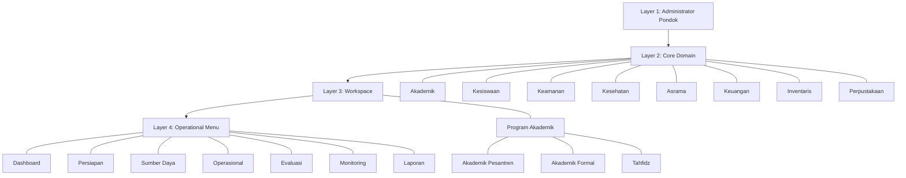
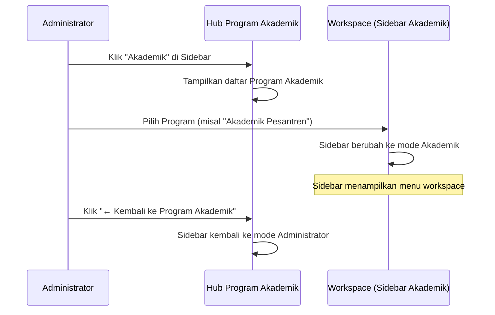
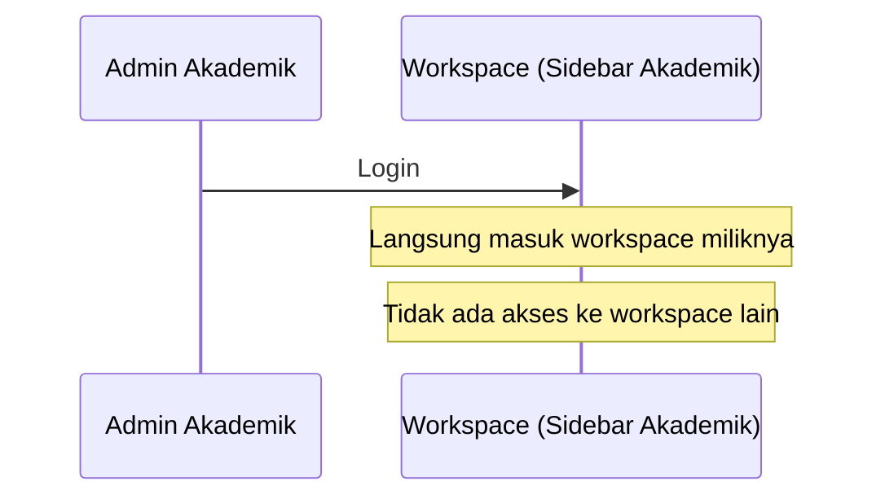
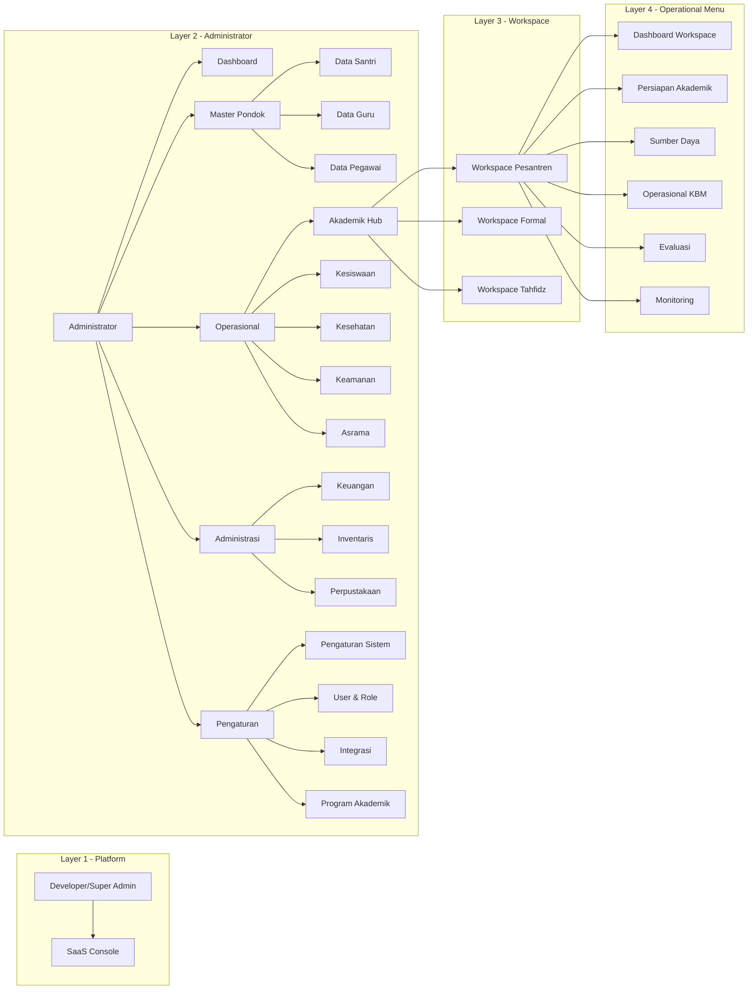

# Navigation Architecture v1.0
# ADR-007 — LOCKED

**Status**: LOCKED  
**Owner**: Product Owner  
**Architecture**: APP MA'HAD Enterprise  
**Date**: 2026-08-05  
**Sprint**: 7  

---

## 1. Filosofi Navigation

APP MA'HAD Navigation **bukan sekadar UI**. Navigation merupakan manifestasi dari:

- **Information Architecture** — Organisasi informasi berdasarkan alur kerja nyata pengguna
- **User Journey** — Setiap pengguna memiliki perjalanan unik sesuai perannya
- **RBAC** — Navigation adalah penegakan hak akses secara visual
- **Workspace Architecture** — Pemisahan konteks kerja per domain operasional
- **Operational Workflow** — Menu disusun berdasarkan alur kerja, bukan struktur database

### General Principle

```
Core Domain → Workspace → Operational Menu
```

Navigation disusun berdasarkan **alur kerja nyata pengguna**, bukan berdasarkan struktur database atau master data.

---

## 2. Information Architecture — Layer Model



---

## 3. Sidebar Administrator (LOCKED)

Sidebar utama yang dilihat oleh **Administrator Pondok** saat masuk ke sistem.

```
APP MA'HAD
🏠 Dashboard
══════════════════════════════
MASTER PONDOK
  👥 Data Santri
  👨‍🏫 Data Guru
  👨‍💼 Data Pegawai
══════════════════════════════
OPERASIONAL
  🎓 Akademik
  🧑‍🎓 Kesiswaan
  🏥 Kesehatan
  🛡 Keamanan
  🏠 Asrama
══════════════════════════════
ADMINISTRASI
  💰 Keuangan
  📦 Inventaris
  📚 Perpustakaan
══════════════════════════════
PENGATURAN
  ⚙ Pengaturan Sistem
  👤 User & Role
  🔌 Integrasi
  📖 Program Akademik
```

### Catatan Administrator Sidebar
- **Akademik** pada section Operasional merujuk ke Hub Program Akademik (workspace selector)
- **Kesiswaan** mencakup Governance, E-Tatib, Hukuman, Quest
- **Keamanan** mencakup Gate Checkpoint & RFID
- **Kesehatan** mencakup UKS & Izin Berobat
- **Asrama** mencakup manajemen kamar & penempatan santri
- **Integrasi** mencakup Payment Gateway, WhatsApp, Email, Google, Telegram, API
- **Program Akademik** mengarah ke halaman Pustaka Program untuk mengelola curriculum programs

---

## 4. Sidebar Admin Akademik / Workspace Akademik (LOCKED)

Sidebar yang muncul setelah Administrator memilih sebuah **Program Akademik** (Workspace), atau yang langsung tampil untuk **Admin Akademik** yang hanya memiliki akses ke satu workspace.

```
[Nama Program Akademik]
🏠 Dashboard
══════════════════════════════
⚙ PERSIAPAN AKADEMIK
  🏫 Struktur Akademik
  📖 Kurikulum Pembelajaran
  📅 Kalender Akademik
══════════════════════════════
👥 SUMBER DAYA
  👨‍🏫 Guru
  🏫 Kelas & Rombel
  📚 Mata Pelajaran
══════════════════════════════
🎓 OPERASIONAL KBM
  🗓 Jadwal Pelajaran
  ▶ Operasional KBM
  📖 Jurnal Mengajar
  📝 Kehadiran Guru
  👨‍🎓 Kehadiran Santri
══════════════════════════════
📝 EVALUASI
  📋 Assessment
  📊 Academic Ledger
  📄 Transkrip
  🎓 Rapor
══════════════════════════════
📈 MONITORING
  📊 Dashboard Akademik
  📈 Analitik
  📑 Laporan
──────────────────────────────
← Kembali ke Program Akademik
```

### Catatan Admin Akademik Sidebar
- Nama program ditampilkan di header sidebar
- Setiap menu di-scope otomatis ke `prog` query parameter aktif
- Tombol "← Kembali ke Program Akademik" mengembalikan sidebar ke mode Administrator / Hub
- Admin Akademik yang hanya memiliki 1 workspace langsung masuk tanpa Hub

---

## 5. Workspace Architecture

### Flow Administrator


### Flow Admin Akademik


---

## 6. Business Rules — Program Akademik

| Rule | Keterangan |
|:-----|:-----------|
| Minimal 1 Program | Setiap Tenant wajib memiliki minimal 1 Program Akademik |
| Auto-create | Program pertama dibuat otomatis saat onboarding |
| Tambah | Administrator dapat menambah program baru |
| Ubah | Administrator dapat mengubah konfigurasi program |
| Arsipkan | Administrator dapat mengarsipkan program |
| Delete Guard | Program terakhir tidak boleh dihapus |

---

## 7. RBAC — Role-Based Navigation Visibility

### Role → Sidebar Mode Matrix

| Role | Sidebar Mode | Workspace Access | Catatan |
|:-----|:-------------|:-----------------|:--------|
| Developer | SaaS Console | — | Hanya SaaS Platform Console |
| Super Admin | SaaS Console | — | Hanya SaaS Platform Console |
| Admin | Administrator | All Workspaces | Full access, can enter any workspace |
| Kepala Kesiswaan | Administrator | All Workspaces | Same view as Admin |
| Admin Akademik* | Workspace Only | 1 Workspace | Langsung masuk workspace |
| Guru | Workspace Only | Assigned Only | Hanya menu KBM |
| Musyrif | Administrator (Limited) | — | Kesiswaan, Asrama, Kesehatan |
| Staff | Administrator (Limited) | — | Limited operational access |
| Wali | Portal Wali | — | Sprint 7 Out of Scope |
| Santri | Portal Santri | — | Sprint 7 Out of Scope |

### Admin Akademik Restrictions
Admin Akademik **TIDAK boleh melihat**:
- Integrasi
- Payment Gateway
- User Management
- Pengaturan Sistem

---

## 8. Integration Rule

Seluruh Integrasi berada di bawah domain **Administrator**:
- Payment Gateway (Flip, Midtrans)
- WhatsApp Gateway
- Email (SMTP, Resend)
- Google (Drive, Calendar)
- Telegram Bot
- REST API Keys
- Integrasi lainnya

> **Payment Gateway BUKAN bagian dari Workspace Akademik.**

---

## 9. User Journey

### 9.1 Administrator → Akademik
1. Login sebagai Administrator
2. Dashboard utama menampilkan ringkasan seluruh domain
3. Klik **Akademik** di sidebar → Masuk Hub Program Akademik
4. Pilih salah satu program (misal "Akademik Pesantren")
5. Sidebar **berubah** ke mode Workspace Akademik
6. Bekerja dalam workspace: Struktur, Kurikulum, KBM, Evaluasi, dll.
7. Klik **← Kembali ke Program Akademik** → Sidebar kembali ke Administrator

### 9.2 Administrator → Kesiswaan
1. Login sebagai Administrator
2. Klik **Kesiswaan** di sidebar → Masuk ke fitur Kesiswaan
3. Langsung di-render dalam sidebar Administrator (tanpa workspace switching)
4. Akses Governance, E-Tatib, Hukuman, Quest

### 9.3 Admin Akademik
1. Login sebagai Admin Akademik
2. Langsung masuk ke Workspace miliknya
3. Sidebar langsung mode Workspace Akademik
4. Tidak ada pilihan untuk berpindah workspace

---

## 10. Diagram Navigation Architecture



---

## 11. Future Extension

Fitur yang **belum** termasuk dalam Sprint 7 tetapi arsitektur ini mendukung penambahan di masa depan:

| Future Feature | Layer | Catatan |
|:---------------|:------|:--------|
| Portal Guru | Layer 3 | Workspace personal guru |
| Portal Wali | Layer 3 | Read-only view anak |
| Portal Santri | Layer 3 | Read-only view pribadi |
| Inventaris | Layer 2 | Core domain baru |
| Perpustakaan | Layer 2 | Core domain baru |
| Chat / Messaging | Cross-layer | Integrasi komunikasi |
| Notification Center | Cross-layer | Push notification system |
| Analytics Dashboard | Layer 4 | Deep academic analytics |

---

## 12. Engineering Governance

### DILARANG tanpa persetujuan Product Owner:
- ❌ Menambah menu baru
- ❌ Menghapus menu
- ❌ Memindahkan menu
- ❌ Mengganti kategori
- ❌ Mengubah urutan sidebar

### Perubahan hanya dapat dilakukan apabila:
Product Owner secara **eksplisit** membuka kembali Architecture Lock.

---

**Navigation Architecture v1.0 — STATUS: LOCKED**
