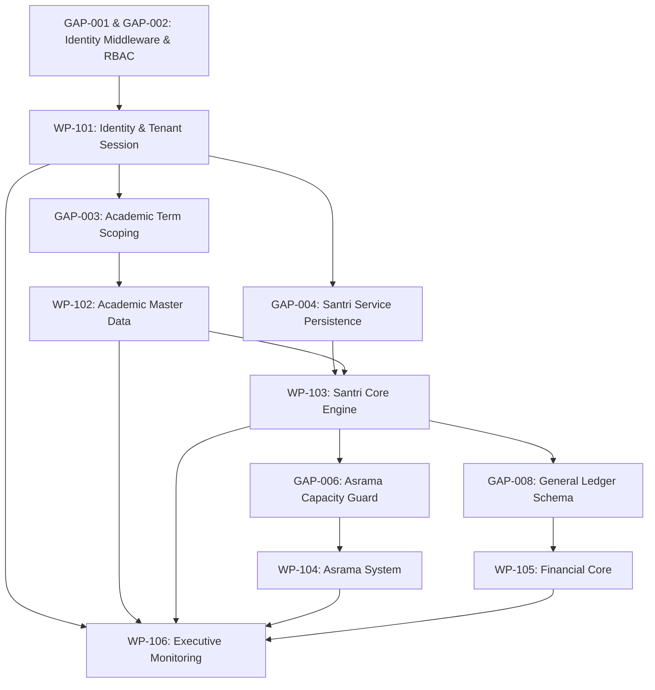

# Sprint 1 Architecture Gap & Dependency Analysis
**APP MA'HAD Enterprise SaaS ERP — Architecture Blueprint**

---

## 1. Executive Summary

This document details the **Architecture Gap & Dependency Analysis** comparing the **Current Repository State** against the **Target Domain Architecture**. Each architectural gap is classified by severity (`Critical`, `High`, `Medium`, `Low`, `Future`) and mapped strictly to its prerequisite Work Package (`WP-101` through `WP-106`) or marked as safe to defer.

---

## 2. Master Architecture Gap Registry

| Gap ID | Architectural Gap Description | Target Domain Context | Severity | Dependency / Required Before | Deferred Option? | Risk Assessment |
|---|---|---|---|---|---|---|
| **GAP-001** | **Missing Zero-Trust Middleware Tenant Extractor**: Current proxy (`src/proxy.ts`) lacks unified Next.js 16 `middleware.ts` for zero-trust header (`x-tenant-id`) extraction and session binding. | Identity & Access | **Critical (P0)** | **Required before WP-101** | **NO** — Fundamental dependency for all Sprint 1 WPs. | High |
| **GAP-002** | **Lack of Centralized RBAC Route Guards**: Role-based access control guards enforcing user permissions across `/api/` endpoints are fragmented. | Identity & Access | **Critical (P0)** | **Required before WP-101** | **NO** — Required for security compliance. | High |
| **GAP-003** | **Unbound Academic Term Scoping in Workspace Services**: Academic master schemas lack explicit active `TahunAjaran` and `Semester` scoping on API queries. | Academic Context | **High (P1)** | **Required before WP-102** | **NO** — Required for accurate term-based data isolation. | Medium |
| **GAP-004** | **Missing Santri Service DB Persistence Linkage**: While `SantriStateMachine` is complete, high-level persistence service saving state transition records to Drizzle DB is unlinked. | Santri Core | **High (P1)** | **Required before WP-103** | **NO** — Required for state machine execution. | Medium |
| **GAP-005** | **Lack of Automatic National NIS/NISN Generator**: Santri registration lacks standardized tenant-scoped student index generation logic. | Santri Core | **Medium (P2)** | **Required before WP-103** | Can use manual input temporarily, but automated generator preferred. | Low |
| **GAP-006** | **Dormitory Bed Capacity Constraint Trigger Missing**: `asrama` and `kamar` tables store capacity as integer columns but lack database/service guards preventing overbooking. | Dormitory Context | **High (P1)** | **Required before WP-104** | **NO** — Violates domain invariant `INV-DORM-001`. | Medium |
| **GAP-007** | **Absence of Reusable Room Transfer History Entity**: Room transfers mutate `kamar_id` directly without logging immutable placement history. | Dormitory Context | **Medium (P2)** | **Required before WP-104** | Safe to defer full history table if audit log captures mutation. | Low |
| **GAP-008** | **Missing Double-Entry General Ledger Schemas**: `src/lib/db/schema/finance.ts` has billing and wallet tables, but lacks `ledger_journals` and `ledger_accounts`. | Financial Context | **Critical (P0)** | **Required before WP-105** | **NO** — Core requirement for financial double-entry engine. | High |
| **GAP-009** | **Unprotected Reversal & Immutability Rules on Financial Tables**: PostgreSQL triggers enforcing immutability (`UPDATE`/`DELETE` blocks) on posted financial ledgers are missing. | Financial Context | **High (P1)** | **Required before WP-105** | **NO** — Essential for financial audit compliance. | High |
| **GAP-010** | **Executive Dashboard Aggregator Engine Missing**: Monitoring pages lack optimized multi-tenant SQL aggregate views for real-time KPI rendering. | Executive Monitoring | **Medium (P2)** | **Required before WP-106** | **NO** — Essential for WP-106 execution. | Low |
| **GAP-011** | **Outbox Event Processing Queue Unimplemented**: Domain events are defined in code, but persistent `outbox_events` dispatch worker is missing. | Platform Event Bus | **Medium (P2)** | **Safe to Defer to Post-Sprint 1** | **YES** — Direct synchronous handlers can be used for Sprint 1. | Low |
| **GAP-012** | **Explicit Bed Unit Aggregate Entity**: Missing physical `bed_id` table (currently capacity is integer count on room). | Dormitory Context | **Low (P3)** | **Safe to Defer** | **YES** — Business Decision Pending; integer capacity is sufficient for Sprint 1. | Low |

---

## 3. Work Package Dependency Matrix

### 3.1 Work Package Readiness Checklist
- **WP-101**: Zero pre-existing blockers. WP-101 resolves `GAP-001` and `GAP-002`.
- **WP-102**: Blocked ONLY by `WP-101`.
- **WP-103**: Blocked by `WP-101` and `WP-102`.
- **WP-104**: Blocked by `WP-101` and `WP-103`.
- **WP-105**: Blocked by `WP-101` and `WP-103`.
- **WP-106**: Blocked by `WP-101` through `WP-105`.
