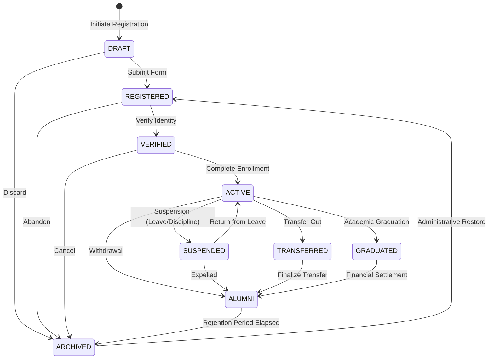

# Sprint 1 Domain Architecture Specification
**APP MA'HAD Enterprise SaaS ERP — Canonical Domain Model Reference**

---

## 1. Executive Summary & Workshop Background

This document establishes the canonical domain model for **APP MA'HAD Enterprise SaaS ERP** following the **Sprint 1 — Phase 0 Domain Architecture Workshop**. It synthesizes business concepts from the EARS enterprise specifications, Sprint 0 governance foundations, and current repository evidence (`src/lib/db/schema.ts`, `src/modules/santri/domain/`, etc.).

The primary objective is to solidify domain boundaries, aggregate ownership, entity classifications, and business invariants before executing `WP-101` through `WP-106`.

---

## 2. Part 1: Domain Discovery

Analysis of repository source code and planning artifacts reveals the following classification of domain concepts:

| Concept | Discovery Status | Current Repository Location | Description |
|---|---|---|---|
| **Tenant** | Existing | `src/lib/db/schema.ts` (`tenants`, `tenantSettings`) | Multi-tenant organization container (`tenant_id`). |
| **User** | Existing | `src/lib/db/schema.ts` (`users`) | Auth identity bound to tenant with role classification. |
| **Santri Core** | Existing | `src/lib/db/schema.ts` (`santri`), `src/modules/santri/` | Student identity, profile data, and state machine transitions. |
| **Santri Lifecycle State Machine** | Existing | `src/modules/santri/domain/state-machine.ts` | Formal state machine (`DRAFT` → `REGISTERED` → `VERIFIED` → `ACTIVE` → `SUSPENDED`/`TRANSFERRED`/`GRADUATED` → `ALUMNI` → `ARCHIVED`). |
| **Status Change Ledger** | Existing | `src/lib/db/schema.ts` (`status_ledgers`, `status_change_records`) | Audit record of state transitions. |
| **Asrama & Kamar** | Partially Existing | `src/lib/db/schema.ts` (`asrama`, `kamar`) | Basic table definitions present; room transfer history and capacity invariants missing. |
| **Master Jenjang & Tingkat** | Partially Existing | `src/lib/db/schema.ts` (`masterJenjang`, `masterTingkat`) | Structural academic hierarchy present; year/semester binding partially established. |
| **Kelas & Mapel** | Partially Existing | `src/lib/db/schema.ts` (`kelas`, `mapel`, `teacherAssignments`) | Basic classroom and subject mapping present; historical academic term scoping incomplete. |
| **Guru & Musyrif** | Partially Existing | `src/lib/db/schema.ts` (`guru`, `asrama.musyrif`) | Defined as string fields or separate tables; explicit User identity linkage incomplete. |
| **Wali Santri** | Partially Existing | `src/lib/db/schema.ts` (`users` with role `orang_tua`, `santri.wali_id`) | Referenced in `santri` and `wallets`; aggregate root and guardian entity structure incomplete. |
| **Tahun Ajaran & Semester** | Planned | `src/lib/db/schema/academic_workspace.ts` | Defined in workspace schema; full academic term activation lifecycle planned in WP-102. |
| **Tuition Invoice (`Tagihan`)** | Partially Existing | `src/lib/db/schema/finance.ts` (`invoices`) | Bundled invoice tables present; double-entry journal posting planned in WP-105. |
| **Wallet & Pockets** | Partially Existing | `src/lib/db/schema/finance.ts` (`wallets`, `walletPockets`) | Canteen/pocket balance structures present; multi-tenant financial ledger integration planned. |
| **General Ledger & Journal** | Planned | WP-105 Planning Specs | Double-entry financial transaction ledger planned for WP-105. |
| **Canteen POS & Items** | Partially Existing | `src/lib/db/schema/finance.ts` (`canteens`, `canteenItems`, `canteenTransactions`) | Outlet catalog & transaction log present. |
| **PPOB Checkout** | Partially Existing | `src/lib/db/schema/ppob.ts` | PPOB transaction & catalog schemas present. |
| **RFID / Gate Pass** | Partially Existing | `src/lib/db/schema/rfid.ts`, `gate_pass.ts` | Gate logs & cards present. |
| **Governance & Discipline** | Existing | `src/lib/db/schema.ts` (`pelanggaran`, `hukuman`, `governanceCases`) | Violation logging & penalty workflows present. |
| **Health / UKS** | Existing | `src/lib/db/schema.ts` (`healthVisits`, `healthPermissions`) | Clinic visits and medical leave tracking present. |
| **Dormitory Bed Unit** | Unknown / NOT YET DETERMINED | N/A | Explicit `bed` table absent; capacity stored as integer on `kamar` and `asrama`. |
| **Multi-Guardian Mapping** | Unknown / NOT YET DETERMINED | N/A | Model currently supports single `wali_id`/`wali_name`; secondary guardian/custody rules NOT YET DETERMINED. |

---

## 3. Part 5: Domain Entities Catalog & Classification

To ensure architectural clarity, all business concepts are categorized into distinct DDD constructs:

```
┌─────────────────────────────────────────────────────────────────────────┐
│                      DOMAIN CONCEPT CLASSIFICATION                      │
├───────────────┬────────────────┬─────────────────┬──────────────────────┤
│ Entity        │ Value Object   │ Reference Data  │ Configuration        │
│ (Identity)    │ (Immutable)    │ (Master Data)   │ (Tenant Scoped)      │
├───────────────┼────────────────┼─────────────────┼──────────────────────┤
│ • Tenant      │ • Money/Amount │ • MasterJenjang │ • TenantSettings     │
│ • User        │ • Period/Month │ • MasterTingkat │ • TolerancePolicies  │
│ • Santri      │ • RoomNumber   │ • MasterMapel   │ • CanteenOperating   │
│ • Wali        │ • WalletPocket │ • MasterViolation│   Hours              │
│ • Asrama      │ • Transition   │ • MasterPenalty │                      │
│ • Kamar       │   Record       │                 │                      │
│ • Kelas       │                │                 │                      │
│ • Invoice     │                │                 │                      │
│ • LedgerJournal│               │                 │                      │
└───────────────┴────────────────┴─────────────────┴──────────────────────┘
```

### Entity Classification Table

| Entity Name | Category | Primary Key Identity | Owner Bounded Context | Description & Repository Evidence |
|---|---|---|---|---|
| **Tenant** | Root Entity | `id` (uuid/slug) | Identity & Access | Top-level organization boundary. Repository: `schema.ts:tenants`. |
| **User** | Entity | `id` (uuid) | Identity & Access | User identity with role (`admin`, `guru`, `musyrif`, `orang_tua`, `santri`). Repository: `schema.ts:users`. |
| **Santri** | Entity / Aggregate Root | `id` (uuid) | Santri Core | Central student record with unique NIS and status. Repository: `schema.ts:santri`. |
| **Wali** | Entity / Aggregate Root | `id` (uuid) | Santri / Financial | Guardian profile managing financial wallet and student relation. Repository: `schema.ts:users` + `finance.ts:wallets`. |
| **Asrama** | Entity / Aggregate Root | `id` (uuid) | Dormitory | Dormitory building container owned by Musyrif supervisor. Repository: `schema.ts:asrama`. |
| **Kamar** | Entity | `id` (uuid) | Dormitory | Physical room within Asrama with max bed capacity. Repository: `schema.ts:kamar`. |
| **TahunAjaran** | Entity / Aggregate Root | `id` (uuid) | Academic | Academic year period (e.g. 2026/2027) with active flag. Repository: `academic_workspace.ts`. |
| **Semester** | Entity | `id` (uuid) | Academic | Academic term (Ganjil/Genap) within a TahunAjaran. Repository: `academic_workspace.ts`. |
| **Kelas** | Entity / Aggregate Root | `id` (uuid) | Academic | Classroom cohort bound to Jenjang, Tingkat, and Wali Kelas. Repository: `schema.ts:kelas`. |
| **MataPelajaran** | Reference / Entity | `id` (uuid) | Academic | Curriculum subject item. Repository: `schema.ts:mapel`. |
| **Wallet** | Entity / Aggregate Root | `id` (uuid) | Financial | Virtual balance container for Santri managed by Wali. Repository: `finance.ts:wallets`. |
| **Invoice (`Tagihan`)**| Entity / Aggregate Root | `id` (uuid) | Financial | Billing record generated for tuition/fees. Repository: `finance.ts:invoices`. |
| **LedgerJournal** | Entity / Aggregate Root | `id` (uuid) | Financial | Double-entry financial journal entry. Repository: Planned WP-105. |
| **CanteenOutlet** | Entity / Aggregate Root | `id` (uuid) | Financial (Kantin) | Canteen merchant/POS location. Repository: `finance.ts:canteens`. |

---

## 4. Part 4: Aggregate Discovery & Boundaries

An **Aggregate** is a cluster of domain objects that can be treated as a single unit for data changes.

### Aggregate 1: Tenant Aggregate
- **Aggregate Root**: `Tenant`
- **Owned Entities**: `TenantSettings`
- **Value Objects**: `BrandingConfig`, `IntegrationCredentials`
- **Invariants**:
  1. `slug` must be globally unique across the platform.
  2. Setting modifications must strictly belong to the root `tenant_id`.
- **Allowed Mutations**: Update branding, update gateway tokens, change tenant operational status.

### Aggregate 2: User & Access Aggregate
- **Aggregate Root**: `User`
- **Owned Entities**: None
- **Value Objects**: `UserRole` (`super_admin`, `admin`, `guru`, `musyrif`, `orang_tua`, `santri`)
- **Invariants**:
  1. Email must be unique per tenant (or globally unique if email auth is shared).
  2. Role assignment must comply with RBAC policies.

### Aggregate 3: Santri Domain Aggregate
- **Aggregate Root**: `Santri`
- **Owned Entities**: `StatusLedger`
- **Value Objects**: `NIS`, `SantriState`, `Gender`, `StatusChangeRecord`
- **Invariants**:
  1. `nis` must be unique within the tenant.
  2. State transitions must strictly follow `SantriStateMachine` legal transition edges.
  3. Status mutation must produce a `StatusChangeRecord` in the `StatusLedger`.
- **Allowed Mutations**: Register, Verify Identity, Activate, Suspend, Transfer, Graduate, Finalize Alumni, Archive.
- **External References**: `waliId` (Refers to `Wali`/`User`), `kelasId` (Refers to `Kelas`), `kamarId` (Refers to `Kamar`).

### Aggregate 4: Academic Year & Term Aggregate
- **Aggregate Root**: `TahunAjaran`
- **Owned Entities**: `Semester`
- **Value Objects**: `AcademicYearCode` (e.g. "2026/2027"), `TermType` (`GANJIL`, `GENAP`)
- **Invariants**:
  1. Exactly ONE `TahunAjaran` can be marked `ACTIVE` per tenant at any point in time.
  2. Exactly ONE `Semester` can be marked `ACTIVE` per tenant within the active `TahunAjaran`.
- **Allowed Mutations**: Activate Academic Year, Open Term, Close Term.

### Aggregate 5: Dormitory (Asrama) Aggregate
- **Aggregate Root**: `Asrama`
- **Owned Entities**: `Kamar`
- **Value Objects**: `BedCapacity`, `Gender`
- **Invariants**:
  1. Gender of `Asrama` must match gender of all contained `Kamar`.
  2. Sum of `filled` beds across all `Kamar` in an `Asrama` must equal `filled` on `Asrama`.
  3. Total occupied beds in a `Kamar` cannot exceed `capacity`.
- **Allowed Mutations**: Add Room, Update Capacity, Assign Musyrif, Update Occupancy Count.

### Aggregate 6: Tuition Billing & Invoice Aggregate
- **Aggregate Root**: `Invoice`
- **Owned Entities**: `InvoiceLineItem` (SPP, Uang Saku, Tabungan)
- **Value Objects**: `InvoiceNumber`, `Money`, `PaymentStatus` (`PENDING`, `SUCCESS`, `EXPIRED`, `CANCELLED`)
- **Invariants**:
  1. `totalAmount` MUST equal `amountSpp + amountUangSaku + amountTabungan`.
  2. State transition from `PENDING` to `SUCCESS` is immutable once finalized.
  3. An invoice cannot be paid twice.

### Aggregate 7: Student Financial Wallet Aggregate
- **Aggregate Root**: `Wallet`
- **Owned Entities**: `WalletPocket` (`uang_saku`, `tabungan`)
- **Value Objects**: `DailyLimit`, `PocketMutation`
- **Invariants**:
  1. `balanceUangSaku` and `balanceTabungan` must NEVER be negative ($\ge 0$).
  2. Daily canteen deductions cannot exceed `dailyLimit` within a 24-hour cycle.

---

## 5. Part 6: Santri Domain Deep Dive

### 5.1 Santri Identity & Ownership Boundary
The `Santri` aggregate root owns personal profile details, academic identification numbers (`nis`), status progression, and violation points.

```
                           ┌────────────────────────┐
                           │      SANTRI ROOT       │
                           │ ─── ─── ─── ─── ─── ── │
                           │  id: UUID              │
                           │  tenantId: UUID        │
                           │  nis: Unique String    │
                           │  status: SantriState   │
                           └───────────┬────────────┘
                                       │
           ┌───────────────────────────┼───────────────────────────┐
           ▼                           ▼                           ▼
┌────────────────────┐      ┌────────────────────┐      ┌────────────────────┐
│   STATUS LEDGER    │      │ DORM ASSIGNMENT    │      │ ACADEMIC CLASS     │
│ (Owned Sub-Entity) │      │ (External Ref ID)  │      │ (External Ref ID)  │
├────────────────────┤      ├────────────────────┤      ├────────────────────┤
│ • StatusRecords    │      │ • kamarId          │      │ • kelasId          │
│ • Audit Trail      │      │ • asramaId         │      │ • jenjangId        │
└────────────────────┘      └────────────────────┘      └────────────────────┘
```

### 5.2 Santri Lifecycle State Machine
As implemented in `src/modules/santri/domain/state-machine.ts`, the lifecycle transition logic enforces business rules:



### 5.3 Allowed Status Transitions & Invariants

1. **Active Enrollment Gate**: A Santri CANNOT be assigned to a `Kelas` or `Kamar` unless `status === ACTIVE`.
2. **Financial Settlement Gate**: Transition from `GRADUATED` to `ALUMNI` requires verification that all tuition `Invoices` are `SUCCESS` and `Wallet` balances are settled.
3. **Audit Trail Guarantee**: Every transition produces a immutable `StatusChangeRecord` containing `fromState`, `toState`, `transitionType`, `actorId`, `effectiveDate`, and `reason`.

---

## 6. Part 7: Academic Domain Deep Dive

### 6.1 Hierarchy & Cardinality
The Academic domain models structural education levels:

$$\text{Madrasah/Jenjang} \longrightarrow (1:N) \longrightarrow \text{Tingkat} \longrightarrow (1:N) \longrightarrow \text{Kelas} \longrightarrow (1:N) \longrightarrow \text{Santri Assignment}$$

- **Madrasah / Jenjang**: Institutional education level (e.g. *MI*, *MTs*, *MA*, *Tahfizh*).
- **Tingkat**: Numerical grade progression within a Jenjang (e.g. Tingkat 7, 8, 9 for MTs).
- **Kelas**: Specific classroom section (e.g. "Kelas 7-A MTs Putra").
- **Tahun Ajaran & Semester**: Global temporal scope defining the current active academic period.

### 6.2 Master Data vs Transactional vs Historical Snapshot

| Concept | Nature | Lifespan | Scoping & Mutability |
|---|---|---|---|
| **Jenjang & Tingkat** | Master Data | Multi-Year | Static structural master data per tenant. |
| **Mata Pelajaran (Mapel)**| Master Data | Multi-Year | Curriculum catalog per Jenjang/Tingkat. |
| **Kelas** | Master Data / Config | Annual | Classroom definitions, recreated or rolled over per `TahunAjaran`. |
| **Teacher Assignment** | Transactional Data | Semester / Year | Linkage between `Guru`, `Mapel`, and `Kelas`. |
| **Academic Ledger Entry**| Historical Snapshot | Permanent | Immutable historical record of Santri enrollment in a `Kelas` for a specific `TahunAjaran` and `Semester`. |

---

## 7. Part 8: Dormitory (Asrama) Domain Analysis

### 7.1 Structural Hierarchy
- **Asrama**: Dormitory building scoped by gender (`L` or `P`). Owned by a lead supervisor (`Musyrif`).
- **Kamar**: Physical room inside an Asrama with fixed `capacity` (e.g. 8 beds).

### 7.2 Invariants & Rules

1. **Gender Isolation**: Male Santri (`gender = 'L'`) MUST ONLY be assigned to male Asrama (`gender = 'L'`). Female Santri (`gender = 'P'`) MUST ONLY be assigned to female Asrama (`gender = 'P'`).
2. **Capacity Limit**: Room occupancy (`filled`) MUST NOT exceed room `capacity`.
   $$\text{filled\_count} \le \text{capacity}$$
3. **Single Active Room Assignment**: A Santri can have at most ONE active room assignment at any given time.

### 7.3 Unresolved Dormitory Architecture Questions
- **Bed Entity**: Currently, the system models `capacity` as an integer on `kamar`. It does NOT have explicit `bed_id` records.
- *Status*: `BUSINESS DECISION REQUIRED` (See `Sprint-1-Business-Decisions.md`).

---

## 8. Part 9: Financial Domain Architecture

### 8.1 Core Financial Boundaries

```
                      ┌─────────────────────────────────────────┐
                      │            FINANCIAL DOMAIN             │
                      └────────────────────┬────────────────────┘
                                           │
           ┌───────────────────────────────┼───────────────────────────────┐
           ▼                               ▼                               ▼
┌──────────────────────┐        ┌──────────────────────┐        ┌──────────────────────┐
│  TUITION BILLING     │        │  VIRTUAL WALLET      │        │  GENERAL LEDGER      │
│  (Invoices)          │        │  (Uang Saku/Tabung)  │        │  (Double-Entry)      │
├──────────────────────┤        ├──────────────────────┤        ├──────────────────────┤
│ • Invoice Aggregate  │        │ • Wallet Aggregate   │        │ • LedgerJournal Root │
│ • Payment Webhooks   │        │ • WalletPockets      │        │ • Debit/Credit Lines │
│ • Flip Integration   │        │ • POS Cashier Deduct │        │ • Immutable Posting  │
└──────────────────────┘        └──────────────────────┘        └──────────────────────┘
```

### 8.2 Double-Entry Ledger Invariants
In accordance with Enterprise Financial Standards (WP-105):
1. **Balanced Journal Entry**: For every financial journal posting, total debits MUST equal total credits.
   $$\sum \text{Debit Amount} = \sum \text{Credit Amount}$$
2. **Tenant Isolation**: Every ledger journal entry and account balance MUST carry `tenant_id`. Cross-tenant posting is strictly forbidden.
3. **Immutability**: Posted journal entries CANNOT be updated or deleted (`UPDATE` and `DELETE` SQL operations prohibited on posted ledgers). Corrections require reversing journal entries.

---

## 9. Part 11: Domain Events Catalog

Events capture state transitions across bounded context boundaries:

| Event Name | Discovery Status | Producer Context | Consumer Contexts | Business Trigger |
|---|---|---|---|---|
| **`SantriRegisteredEvent`** | Confirmed | Santri | Identity, Financial, Notification | Santri registration form submitted. |
| **`IdentityVerifiedEvent`** | Confirmed | Santri | Administration, Notification | Admin verifies identity & legal docs. |
| **`SantriActivatedEvent`** | Confirmed | Santri | Academic, Dormitory, Financial | Santri activated for active schooling. |
| **`SantriSuspendedEvent`** | Confirmed | Santri | Academic, Dormitory, Security | Santri suspended due to leave or discipline. |
| **`SantriTransferredEvent`** | Confirmed | Santri | Academic, Financial | Santri transfers to another institution. |
| **`SantriGraduatedEvent`** | Confirmed | Santri | Financial, Academic | Academic requirements complete. |
| **`AlumniFinalizedEvent`** | Confirmed | Santri | Administration, Financial | Financial obligations settled, archived as Alumni. |
| **`RoomAssignedEvent`** | Proposed | Dormitory | Santri, Monitoring | Santri assigned to dormitory room. |
| **`RoomTransferredEvent`** | Proposed | Dormitory | Santri, Monitoring | Santri moved to a different room. |
| **`InvoiceIssuedEvent`** | Confirmed | Financial | Notification, Wali Portal | Monthly tuition invoice generated. |
| **`PaymentReceivedEvent`** | Confirmed | Financial | Ledger, Wallet, Notification | Flip webhook confirms payment success. |
| **`LedgerPostedEvent`** | Proposed | Financial | Executive Monitoring | Double-entry journal committed to ledger. |

---

## 10. Summary

The canonical domain model established here serves as the authoritative blueprint for Sprint 1. All implementation work packages (`WP-101` through `WP-106`) must strictly adhere to these aggregate boundaries, lifecycle state machines, and business invariants.
