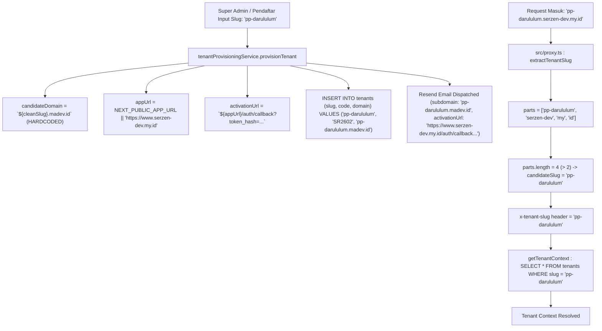

# WP-DOMAIN-TENANT-ROOT-AUDIT-001 REPORT
## Comprehensive Audit of Tenant Root Domain & Subdomain Resolution

**Audit Date**: September 26, 2026  
**Auditor**: Senior Principal Systems Architect  
**Audit Scope**: Read-Only Comprehensive Repository Audit (`madev.id` vs `serzen-dev.my.id`)  
**Safety Compliance**: 0 DB mutations, 0 Auth mutations, 0 Tenant mutations, 0 DNS mutations, 0 Vercel mutations, 0 Git commits.

---

## 1. Executive Summary

Audit komprehensif telah dilakukan terhadap seluruh codebase, konfigurasi, database, proxy, frontend, backend, email delivery, dan contract tests.

### Ringkasan Status
- **Root Domain Resmi Target**: `serzen-dev.my.id` (Wildcard: `*.serzen-dev.my.id`, Tenant: `<slug>.serzen-dev.my.id`).
- **Kondisi Aktual Runtime Code**: Masih menggunakan hardcoded `madev.id` di hampir seluruh generator subdomain backend, UI formulir pendaftaran, tampilan tabel tenant SaaS, dan contract test suites.
- **Kondisi Aktual Database**: Seluruh 6 tenant yang terdaftar di database (termasuk `SR2601` dan `SR2602`) memiliki nilai kolom `domain` berformat `<slug>.madev.id`.
- **Kondisi Email / Resend**: Sudah termigrasi dan konsisten menggunakan `noreply@serzen-dev.my.id`.
- **Temuan Kritis (Blocker Subdomain Parsing)**: Subdomain extraction di `src/proxy.ts` menggunakan split `.` berbasis asumsi domain 2-bagian (`sub.domain.id`). Pada domain `serzen-dev.my.id` (yang merupakan ccTLD `.my.id` dengan 3 bagian `[serzen-dev, my, id]`), request ke apex domain `serzen-dev.my.id` akan salah diekstrak sebagai tenant slug `'serzen-dev'` karena `'serzen-dev'` tidak terdaftar di `RESERVED_HOSTNAMES` dan `parts.length > 2`.

---

## 2. Current Domain Architecture

### A. Root Domain & Hostname Format
| Komponen | Nilai yang Ditemukan | Sumber / Implementasi | Status |
|---|---|---|---|
| **Platform Root URL** | `https://www.serzen-dev.my.id` | `process.env.NEXT_PUBLIC_APP_URL` fallback | ACTIVE |
| **Email Sender Domain** | `noreply@serzen-dev.my.id` | `RESEND_FROM_EMAIL` & `resend-service.ts` | ACTIVE |
| **Tenant Domain Generator** | `${cleanSlug}.madev.id` | `tenant-provisioning-service.ts:213` | ACTIVE (HARDCODED) |
| **Database `tenants.domain`** | `<slug>.madev.id` | PostgreSQL `tenants` table | ACTIVE (PERSISTED) |
| **Registration Form Preview** | `https://{slug}.madev.id` | `RegisterForm.tsx:332` | ACTIVE (HARDCODED UI) |
| **Super Admin Tenant UI** | `Subdomain Target (.madev.id)` | `saas/tenants/page.tsx:1017` | ACTIVE (HARDCODED UI) |
| **Proxy Hostname Splitter** | `hostname.split('.')[0]` if `parts.length > 2` | `src/proxy.ts:79` | ACTIVE (LOGIC FLAW ON ccTLD) |

---

## 3. Search Evidence Table

| File | Line / Location | Reference | Classification | Runtime Impact |
|---|---|---|---|---|
| `src/modules/saas/services/tenant-provisioning-service.ts` | 213 | `const candidateDomain = \`${cleanSlug}.madev.id\`;` | **ACTIVE** | Menghasilkan nilai domain tenant baru saat provisi |
| `src/modules/saas/services/tenant-provisioning-service.ts` | 622 | `subdomain: tenantRow.domain \|\| \`${tenantRow.slug}.madev.id\`` | **ACTIVE** | Fallback subdomain saat resend invitation email |
| `src/modules/saas/services/tenant-provisioning-service.ts` | 757 | `subdomain: t.domain \|\| \`${t.slug}.madev.id\`` | **ACTIVE** | Fallback subdomain pada list API SaaS tenants |
| `src/modules/saas/services/tenant-provisioning-service.ts` | 214, 573 | `process.env.NEXT_PUBLIC_APP_URL \|\| 'https://www.serzen-dev.my.id'` | **ACTIVE** | Base URL untuk callback onboarding dan link aktivasi |
| `src/lib/email/resend-service.ts` | 39, 43 | `Ma'had Manager <noreply@serzen-dev.my.id>` | **ACTIVE** | Default transactional email sender |
| `src/app/register/RegisterForm.tsx` | 325, 332 | `.madev.id` & `https://{slug}.madev.id` | **ACTIVE** | UI formulir pendaftaran mandiri calon tenant |
| `src/app/dashboard/saas/tenants/page.tsx` | 362 | `slug: newSubdomain.replace('.madev.id', '')` | **ACTIVE** | Normalisasi input subdomain saat create tenant |
| `src/app/dashboard/saas/tenants/page.tsx` | 1017, 1027 | `Subdomain Target (.madev.id)` & `.madev.id` | **ACTIVE** | UI label & input addon modal create tenant |
| `src/app/dashboard/saas/modul-fitur/page.tsx` | 63 | `subdomain: t.subdomain \|\| \`${t.slug \|\| t.id}.madev.id\`` | **ACTIVE** | Fallback tampilan subdomain di Modul Fitur |
| `src/app/dashboard/pengaturan/tenant-integrasi/page.tsx` | 47 | `subdomain: t.subdomain \|\| \`${t.slug \|\| t.id}.madev.id\`` | **ACTIVE** | Fallback tampilan subdomain di Integrasi Tenant |
| `src/app/api/auth/role-preview/route.ts` | 29–34, 99 | `preview.*@madev.id` & `superadmin@madev.id` | **ACTIVE** | Synthetic identities & allowlisted Super Admin email |
| `src/src/proxy.ts` | 35 | `'madev'` in `RESERVED_HOSTNAMES` | **ACTIVE** | Hostname blacklist untuk tenant slug extraction |
| `src/data/mock.ts` | 8 | `superadmin@madev.id` | **LEGACY / MOCK** | Mock user data untuk lokal/demo mode |
| `src/app/dashboard/pengaturan/manajemen-user-role/page.tsx` | 27–93 | `*@daruttahuid.madev.id` | **DEMO / UI** | Mock initial user list di halaman user-role |
| `PostgreSQL (tenants table)` | 6 baris | `domain: '<slug>.madev.id'` | **ACTIVE (DB)** | Data persisted di production/preview database |
| `tests/contracts/*.test.ts` | >40 baris | `*.madev.id` fixtures & assertions | **TEST/DEMO** | Contract verification & static assertions |

---

## 4. `madev.id` Findings (Deep Analysis)

1. **Tenant Domain Generator (`tenant-provisioning-service.ts`)**:
   - `candidateDomain` dibentuk secara hardcoded `${cleanSlug}.madev.id` tanpa membaca environment variable root domain.
   - Disimpan ke kolom `tenants.domain` pada saat transaksi provisi.
2. **UI Super Admin & Registrasi**:
   - `RegisterForm.tsx` dan `saas/tenants/page.tsx` menampilkan postfix `.madev.id` secara statis kepada pengguna.
   - Input slug membersihkan suffix `.madev.id` secara hardcoded.
3. **Role Preview Synthetic Identities**:
   - Endpoint `POST /api/auth/role-preview` mendefinisikan email sintetis:
     - `preview.developer@madev.id`
     - `preview.superadmin@madev.id`
     - `preview.admin@madev.id`
     - `preview.musyrif@madev.id`
     - `preview.wali@madev.id`
     - `preview.santri@madev.id`
   - Super admin check memeriksa `callerUser.email === 'superadmin@madev.id'`.
4. **Contract Tests**:
   - `tenant-provisioning-ui-zero-password.contract.test.ts` memiliki assertion eksplisit:
     ```typescript
     expect(content).toContain('Subdomain Target (.madev.id)');
     ```

---

## 5. `serzen-dev.my.id` Findings (Deep Analysis)

1. **Email Delivery**:
   - `src/lib/email/resend-service.ts` telah terkonfigurasi secara penuh ke `noreply@serzen-dev.my.id` dan verified di Resend.
2. **Platform Base URL**:
   - `NEXT_PUBLIC_APP_URL` default fallback di `tenant-provisioning-service.ts` telah menggunakan `https://www.serzen-dev.my.id`.
   - Dipakai untuk pembentukan link aktivasi Supabase Auth (`/auth/callback`).

---

## 6. Tenant URL Generation Flow



---

## 7. Proxy / Hostname Resolution Audit

Pada [src/proxy.ts](file:///e:/Projects/Os_Darta/src/proxy.ts#L58-L89):

```typescript
export function extractTenantSlug(request: NextRequest): string {
  const url = request.nextUrl;
  const hostname = request.headers.get('host') || '';

  // 1. Check path route /t/:slug
  if (url.pathname.startsWith('/t/')) {
    const pathParts = url.pathname.split('/');
    if (pathParts[2] && pathParts[2].trim() !== '') {
      const candidatePathSlug = pathParts[2].toLowerCase().trim();
      if (!RESERVED_HOSTNAMES.has(candidatePathSlug)) {
        return candidatePathSlug;
      }
    }
  }

  // 2. Extract subdomain if hostname contains domain dots and is not localhost/IP
  if (
    hostname.includes('.') &&
    !hostname.includes('localhost') &&
    !hostname.startsWith('127.0.0.1')
  ) {
    const parts = hostname.split('.');
    if (parts.length > 2) {
      const candidateSlug = parts[0].toLowerCase().trim();
      if (!RESERVED_HOSTNAMES.has(candidateSlug)) {
        return candidateSlug;
      }
    }
  }

  return 'default';
}
```

### ⚠️ Critical Flaw on ccTLD (`.my.id`):
1. **Kasus 1: Subdomain Tenant (`pp-darululum.serzen-dev.my.id`)**:
   - `parts` = `['pp-darululum', 'serzen-dev', 'my', 'id']` (length = 4).
   - `parts[0]` = `'pp-darululum'`.
   - Hasil: **BENAR** (`'pp-darululum'`).
2. **Kasus 2: Apex Platform Domain (`serzen-dev.my.id`)**:
   - `parts` = `['serzen-dev', 'my', 'id']` (length = 3).
   - `parts.length > 2` bernilai `true`!
   - `parts[0]` = `'serzen-dev'`.
   - Karena `'serzen-dev'` **TIDAK ADA** di `RESERVED_HOSTNAMES`, fungsi akan mengembalikan `'serzen-dev'` sebagai tenant slug!
   - Akibat: Platform root gagal resolve ke `'default'` tenant context.
3. **Kasus 3: `www.serzen-dev.my.id`**:
   - `parts` = `['www', 'serzen-dev', 'my', 'id']` (length = 4).
   - `parts[0]` = `'www'` (ada di `RESERVED_HOSTNAMES`).
   - Hasil: **BENAR** fallback ke `'default'`.

---

## 8. Environment Variable Audit

| Variable | Keberadaan di Code | Keberadaan di `.env.local.example` | Catatan |
|---|---|---|---|
| `NEXT_PUBLIC_APP_URL` | Ada (fallback `'https://www.serzen-dev.my.id'`) | Tidak tercantum eksplisit | Perlu ditambahkan ke dokumentasi `.env.local.example` |
| `NEXT_PUBLIC_TENANT_ROOT_DOMAIN` | **TIDAK ADA** | **TIDAK ADA** | Generator domain saat ini hardcoded |
| `RESEND_FROM_EMAIL` | Ada | Ada (`noreply@serzen-dev.my.id`) | Sudah konsisten |
| `NEXT_PUBLIC_DEFAULT_TENANT_ID` | Ada (fallback `'default-tenant'`) | Tidak tercantum | Untuk fallback context |

---

## 9. Vercel Configuration Audit
- File `vercel.json` tidak ada di root repository (Vercel menggunakan default Next.js output builder).
- Wildcard routing `*.serzen-dev.my.id` dan custom domain `serzen-dev.my.id` / `www.serzen-dev.my.id` dikelola di Vercel Dashboard / DNS registrar.

---

## 10. Risk Assessment

| Komponen / Masalah | Tingkat Risiko | Dampak |
|---|---|---|
| **ccTLD Apex Hostname Parsing di `src/proxy.ts`** | **BLOCKER** | Request ke `https://serzen-dev.my.id` (non-www) akan memicu pencarian tenant slug `'serzen-dev'` yang tidak ada di DB, merusak resolusi platform landing page. |
| **Hardcoded `.madev.id` di Provisioning Service** | **HIGH** | Tenant baru akan terus dibuat dengan domain `*.madev.id` di DB dan email invitation. |
| **Existing Tenants di DB berdomain `*.madev.id`** | **HIGH** | `SR2601` dan `SR2602` memiliki string `*.madev.id` pada kolom `domain`. |
| **UI Form & Contract Test Assertions** | **MEDIUM** | Frontend UI dan static contract test mengunci string literal `(.madev.id)`. |
| **Role Preview Synthetic Email `@madev.id`** | **LOW / INFORMATIONAL** | Synthetic identities untuk preview internal tidak mempengaruhi domain publik, namun dapat diselaraskan untuk kerapian. |

---

## 11. Recommended Changes (Architectural Roadmap)

> **Catatan**: Tidak ada perubahan yang diimplementasikan pada audit ini. Berikut rekomendasi terstruktur:

1. **Perbaikan Proxy Hostname Parser (`src/proxy.ts`)**:
   - Tambahkan `'serzen-dev'` ke `RESERVED_HOSTNAMES`.
   - Atau perbaiki algoritma ekstraksi subdomain agar menghormati configured root domain (`ROOT_DOMAIN = 'serzen-dev.my.id'`).
2. **Introduksi Konfigurasi Root Domain Terpusat**:
   - Buat konstan / environment variable terpusat (misal `TENANT_ROOT_DOMAIN = process.env.NEXT_PUBLIC_ROOT_DOMAIN || 'serzen-dev.my.id'`).
   - Ubah `tenant-provisioning-service.ts` agar menggunakan konfigurasi ini.
3. **Pembaruan UI Frontend**:
   - Ganti label statis `.madev.id` di `RegisterForm.tsx`, `saas/tenants/page.tsx`, `modul-fitur/page.tsx`, dan `tenant-integrasi/page.tsx` menjadi dynamic/terkonfigurasi `.serzen-dev.my.id`.
4. **Pembaruan Contract Tests**:
   - Sesuaikan contract test assertion yang mencari string `(.madev.id)`.
5. **Data Backfill / Migration Plan untuk DB Existing Tenants**:
   - Siapkan skrip update data DB read-only/idempotent untuk mengubah `domain` pada 6 tenant existing dari `*.madev.id` ke `*.serzen-dev.my.id`.

---

## 12. Production Impact Analysis

- **Production / Preview Deployment**: Saat ini traffic utama masih berjalan via direct Vercel URL atau `www.serzen-dev.my.id`. Migrasi domain tenant ke `*.serzen-dev.my.id` aman dilakukan secara bertahap.
- **Tenant Login & Activation Flow**: Onboarding activation link (`/auth/callback`) menggunakan `appUrl` (`https://www.serzen-dev.my.id`), sehingga alur aktivasi password yang baru saja diperbaiki di `WP-TENANT-ONBOARDING-SESSION-REFRESH-FIX-002` **TIDAK TERGANGGU**.
- **Existing Tenant SR2601 & SR2602**: Kolom `domain` saat ini hanya bersifat representasional/tampilan di tabel SaaS. Resolusi request tenant di `proxy.ts` dan `getTenantContext()` menggunakan `slug` (`pp-darunnajah` / `pp-darululum`), bukan nilai kolom `domain`. Sehingga sistem tetap berfungsi normal.

---

## 13. Explicit Safety Check

```text
Database mutations       : 0 (Strictly SELECT only)
Supabase Auth mutations  : 0
Tenant mutations         : 0 (SR2601 & SR2602 untouched)
DNS mutations            : 0
Vercel mutations         : 0
Git mutations / commits  : 0
```

---

## 14. Final Verdict

**`BLOCKED — NEEDS ARCHITECTURAL DECISION`**

### Alasan Blocker:
1. Logika parsing subdomain di `src/proxy.ts` memiliki cacat saat menghadapi domain berformat ccTLD (`.my.id`), di mana apex domain `serzen-dev.my.id` (3 parts) akan salah diinterpretasikan sebagai subdomain tenant `'serzen-dev'` jika non-www diakses.
2. Perlu keputusan arsitektur apakah root domain akan dikontrol via single environment variable (`NEXT_PUBLIC_ROOT_DOMAIN`) atau konfigurasi platform terpusat.
