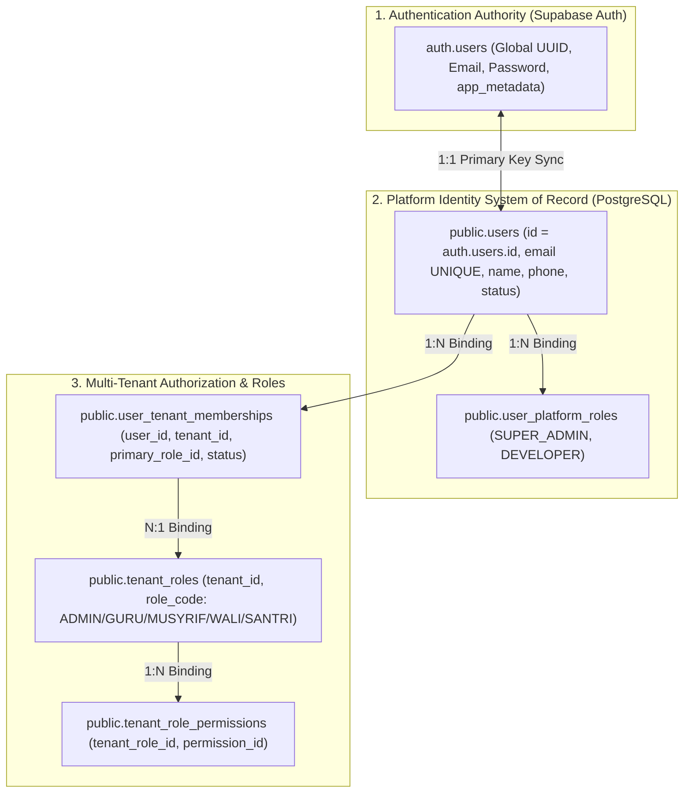

# MULTI-TENANT IDENTITY & EMAIL REUSE FORENSIC AUDIT REPORT

**Work Package Identifier**: `WP-MULTI-TENANT-IDENTITY-EMAIL-REUSE-FORENSIC-AUDIT-001`  
**Execution Mode**: READ-ONLY FORENSIC INVESTIGATION & SECURITY ARCHITECTURE AUDIT  
**Target File**: `docs/architecture/WP-MULTI-TENANT-IDENTITY-EMAIL-REUSE-FORENSIC-AUDIT-001-REPORT.md`  
**Date**: 2026-09-24  
**Author**: Senior SaaS Identity Architect & Database Forensic Auditor  
**Status**: COMPLETE (AUDIT FINDINGS CONCLUSIVELY ESTABLISHED)

---

## 1. Executive Summary

This forensic audit investigates the foundational identity, tenant membership, and email lifecycle rules across the **App Ma'had (Os_Darta)** multi-tenant platform. 

The audit resolves the tension between:
1. **The Intended Business Rule**: Historical email usage in a legitimately hard-deleted tenant must not permanently blacklist that email from future reuse, while surviving identity relationships in active tenants must remain strictly protected. Tenant Codes (`SRYYNN`), by contrast, remain permanently consumed and non-reusable.
2. **The Current Implementation Behavior**: The recent attempt to provision `Ponpes Badrussalam` with email `abu.thohir.zmr92@gmail.com` returned **HTTP 409 Conflict** because the provisioning engine currently enforces a strict, global `1 Email = 1 New Auth/User Identity = 1 Tenant` check during tenant creation, without evaluating surviving membership state or multi-tenant persona attachment.

### Key Conclusions:
- **FACT**: In PostgreSQL, the relational schema **ALREADY SUPPORTS 1 User Identity $\rightarrow$ N Tenant Memberships** via the `user_tenant_memberships` junction table (`UNIQUE(user_id, tenant_id)`).
- **FACT**: The HTTP 409 rejection during tenant provisioning is caused by an **application-level pre-flight check** (`checkTenantAvailability()` in `tenant-provisioning-service.ts`) combined with an eager `INSERT INTO users` in Transaction B that collides with the global `UNIQUE(email)` constraint on `public.users`.
- **FACT**: There is currently **zero automated hard-delete service** in the application codebase. A manual SQL `DELETE FROM public.tenants` cascades to `user_tenant_memberships` and `tenant_roles`, but leaves orphaned records in `public.users` and `auth.users`, which permanently blocks that email from future provisioning under the current check.
- **FACT**: Tenant Code counter (`tenant_code_counters`) remains perfectly intact at `last_sequence = 1` (`SR2601`). Zero codes were consumed or leaked by the failed Badrussalam attempt.
- **FACT**: `SR2601` (`Ponpes Darunnajah`) is 100% isolated, healthy, and untouched.

---

## 2. Current Identity Architecture

The identity architecture operates across three distinct tiers:



- **`auth.users` $\leftrightarrow$ `public.users`**: Direct 1:1 primary key identity mapping (`public.users.id = auth.users.id`).
- **`public.users` $\leftrightarrow$ `public.user_tenant_memberships`**: 1:N relational binding. A single human identity (`user_id`) can hold multiple memberships across different tenants.
- **`public.user_tenant_memberships` $\leftrightarrow$ `public.tenants`**: N:1 relational binding. Each tenant has multiple user memberships.

---

## 3. Current Email Uniqueness Mechanism

Email uniqueness is currently enforced at three independent layers:

1. **Supabase Auth Layer (`auth.users`)**:
   - `auth.users.email` is globally unique within the Supabase Auth instance.
   - An email cannot exist twice as separate auth accounts.

2. **Database Schema Layer (`public.users`)**:
   - Constraint: `users_email_unique` (`UNIQUE (email)` on `public.users`).
   - Defined in [identity.ts](file:///e:/Projects/Os_Darta/src/lib/db/schema/identity.ts#L8):
     ```typescript
     export const users = pgTable('users', {
       id: text('id').primaryKey(),
       email: text('email').notNull().unique(),
       // ...
     });
     ```
   - Enforces that one email string corresponds to exactly one `public.users` row.

3. **Application Provisioning Layer (`checkTenantAvailability`)**:
   - Defined in [tenant-provisioning-service.ts](file:///e:/Projects/Os_Darta/src/modules/saas/services/tenant-provisioning-service.ts#L148-L162):
     ```typescript
     const existingUser = await dbInstance
       .select({ id: users.id })
       .from(users)
       .where(eq(users.email, cleanEmail))
       .limit(1);

     if (existingUser.length > 0) {
       return {
         available: false,
         conflictField: 'email',
         message: `Email '${cleanEmail}' sudah terdaftar sebagai pengguna di platform.`,
       };
     }
     ```
   - **Finding**: This check treats any existing `public.users` row as a hard conflict for tenant creation, assuming that every tenant provisioning must create a new user from scratch.

---

## 4. Current Tenant Membership Architecture

The relational schema for tenant membership is defined in [identity.ts](file:///e:/Projects/Os_Darta/src/lib/db/schema/identity.ts#L64-L77):

```typescript
export const userTenantMemberships = pgTable('user_tenant_memberships', {
  id: text('id').primaryKey(),
  userId: text('user_id').notNull().references(() => users.id, { onDelete: 'cascade' }),
  tenantId: text('tenant_id').notNull().references(() => tenants.id, { onDelete: 'cascade' }),
  primaryRoleId: text('primary_role_id').notNull().references(() => tenantRoles.id, { onDelete: 'cascade' }),
  status: text('status').notNull().default('ACTIVE'), // 'INVITED' | 'ACTIVE' | 'INACTIVE' | 'SUSPENDED'
  createdAt: timestamp('created_at').defaultNow().notNull(),
  updatedAt: timestamp('updated_at').defaultNow().notNull(),
}, (table) => ({
  userTenantUnique: unique('user_tenant_memberships_user_tenant_idx').on(table.userId, table.tenantId),
  userIdx: index('utm_user_idx').on(table.userId),
  tenantIdx: index('utm_tenant_idx').on(table.tenantId),
  roleIdx: index('utm_role_idx').on(table.primaryRoleId),
}));
```

### Database Invariants Verified:
- **`UNIQUE (user_id, tenant_id)`**: A user can have at most one active membership record per tenant, but **unlimited memberships across different tenants**.
- **`ON DELETE CASCADE`**:
  - Deleting a `tenant` cascades and automatically deletes its `user_tenant_memberships` rows.
  - Deleting a `user` cascades and automatically deletes all its `user_tenant_memberships` rows.

---

## 5. Current 409 Root Cause (Badrussalam Incident)

When the user submitted the form for `Ponpes Badrussalam` with owner email `abu.thohir.zmr92@gmail.com`:

```
UI Form Submit (newOwnerEmail: "abu.thohir.zmr92@gmail.com")
       ↓
POST /api/saas/tenants
       ↓
tenantProvisioningService.provisionTenant()
       ↓
tenantProvisioningService.checkTenantAvailability('pp-badrussalam', 'abu.thohir.zmr92@gmail.com')
       ↓
SELECT id FROM public.users WHERE email = 'abu.thohir.zmr92@gmail.com'
       ↓
FOUND: User id = 'da410485-305f-4c8f-902b-37f94550d9b2' (Owner of SR2601 / Ponpes Darunnajah)
       ↓
Throw Error: "Email 'abu.thohir.zmr92@gmail.com' sudah terdaftar sebagai pengguna di platform." (statusCode: 409)
       ↓
HTTP 409 Conflict returned to Frontend
```

### Forensic Classification:
- **Rejection Type**: **Global application-level check** (not tenant-scoped).
- **Target Checked**: `public.users.email`.
- **Status Evaluated**: Ignored (any row in `public.users` triggers conflict, regardless of `status` or whether it belongs to a deleted tenant).

---

## 6. Database Constraint Findings

Verified via PostgreSQL system catalogs (`pg_constraint`, `information_schema`):

| Table | Constraint Name | Type | Definition / Key | On Delete Rule |
| :--- | :--- | :--- | :--- | :--- |
| `users` | `users_pkey` | `PRIMARY KEY` | `(id)` | N/A |
| `users` | `users_email_unique` | `UNIQUE` | `(email)` | N/A |
| `user_tenant_memberships` | `user_tenant_memberships_pkey` | `PRIMARY KEY` | `(id)` | N/A |
| `user_tenant_memberships` | `user_tenant_memberships_user_tenant_idx` | `UNIQUE` | `(user_id, tenant_id)` | N/A |
| `user_tenant_memberships` | `user_tenant_memberships_tenant_id_fkey` | `FOREIGN KEY` | `tenant_id` $\rightarrow$ `tenants(id)` | **`CASCADE`** |
| `user_tenant_memberships` | `user_tenant_memberships_user_id_fkey` | `FOREIGN KEY` | `user_id` $\rightarrow$ `users(id)` | **`CASCADE`** |
| `tenant_roles` | `tenant_roles_tenant_id_fkey` | `FOREIGN KEY` | `tenant_id` $\rightarrow$ `tenants(id)` | **`CASCADE`** |
| `tenant_roles` | `tenant_roles_tenant_code_idx` | `UNIQUE` | `(tenant_id, role_code)` | N/A |
| `santri` | `santri_tenant_id_fkey` | `FOREIGN KEY` | `tenant_id` $\rightarrow$ `tenants(id)` | **`RESTRICT`** |
| `santri` | `santri_user_id_fkey` | `FOREIGN KEY` | `user_id` $\rightarrow$ `users(id)` | **`RESTRICT`** |
| `tenants` | `tenants_slug_key` | `UNIQUE` | `(slug)` | N/A |
| `tenants` | `uq_tenants_code_upper` | `UNIQUE INDEX` | `(upper(code))` | N/A |
| `tenant_code_counters` | `tenant_code_counters_pkey` | `PRIMARY KEY` | `(year)` | N/A |

### Critical Finding on `public.users`:
`public.users` **does NOT have a Foreign Key referencing `public.tenants`**. It is a global identity table. Therefore, deleting a row from `public.tenants` does **NOT** cascade to `public.users`.

---

## 7. Supabase Auth Findings

1. **Mapping**: `public.users.id` is an exact 1:1 mapping to `auth.users.id` (UUID format).
2. **Metadata**: Supabase `app_metadata` currently stores:
   - `tenant_id`: e.g. `'t_1790171191747_pyv9n'`
   - `tenant_code`: e.g. `'SR2601'`
   - `role`: e.g. `'admin'`
   - `status`: e.g. `'ACTIVE'`
3. **Limitation of Single-Tenant `app_metadata`**:
   - `app_metadata` currently holds a single `tenant_id` string rather than an array of tenant IDs.
   - For an identity with multiple tenant memberships, runtime authorization relies on `public.user_tenant_memberships` (database queries) rather than solely relying on the JWT's static `app_metadata.tenant_id`.

---

## 8. Hard Delete Lifecycle Findings

1. **Current Codebase Capability**:
   - **FACT**: There is **no application-level hard-delete service** or API endpoint for tenants (`DELETE /api/saas/tenants/:id` does not exist).
2. **Database Cascade Behavior if `DELETE FROM tenants WHERE id = :id` is executed**:
   - `tenants` row $\rightarrow$ **DELETED**
   - `user_tenant_memberships` rows for this tenant $\rightarrow$ **DELETED (CASCADE)**
   - `tenant_roles` rows $\rightarrow$ **DELETED (CASCADE)**
   - `tenant_role_permissions` rows $\rightarrow$ **DELETED (CASCADE)**
   - `tenant_settings` rows $\rightarrow$ **DELETED (CASCADE)**
   - `academic_*` rows $\rightarrow$ **DELETED (CASCADE)**
   - `santri` rows $\rightarrow$ **BLOCKED (RESTRICT)** if any exist. Must delete santri first.
   - `public.users` rows $\rightarrow$ **SURVIVE (ORPHANED)**.
   - `auth.users` rows $\rightarrow$ **SURVIVE (ORPHANED)**.
3. **Resulting State**:
   - The user identity becomes an **orphaned identity** with `0` memberships.
   - Because `public.users` and `auth.users` still hold the email, subsequent provisioning attempts with that email fail with HTTP 409 unless the orphaned identity is cleaned up or reused.

---

## 9. Multi-Tenant Identity Capability

### Can One Identity Belong to Multiple Tenants?
- **In PostgreSQL Database**: **YES**. The database model fully supports this. A user row `users.id` can have multiple rows in `user_tenant_memberships` for different `tenant_id`s with different roles (`primary_role_id`).
- **In Authorization Service**: **YES**. `authorization-service.ts` queries `user_tenant_memberships` filtered by `(user_id, tenant_id)`.
- **In Tenant Provisioning Service**: **NO**. The provisioning service is currently hardcoded to assume that every new tenant creation must create a new auth user and a new `public.users` record from scratch.

---

## 10. Email Reuse Scenario Matrix

| Scenario | Situation | Current System Behavior | Desired Business Rule | Gap / Verdict |
| :--- | :--- | :--- | :--- | :--- |
| **A. Deleted Single-Tenant Email** | Email $X$ belonged to Tenant $A$. Tenant $A$ was hard-deleted. No other tenant uses Email $X$. | **REJECTED (409)** because orphaned `users` row exists. | **REUSABLE**. Email $X$ should be reusable to provision a new tenant or identity. | **GAP**: Orphaned identity cleanup or email release required upon tenant hard delete. |
| **B. Multi-Tenant Shared Identity** | Email $X$ belongs to Tenant $A$ and Tenant $B$. Tenant $A$ is hard-deleted. | `utm_A` deleted by cascade. `utm_B` survives. User continues operating in Tenant $B$. | **PROTECTED**. Identity $X$ must remain intact for Tenant $B$. | **ALIGNED**: Database FK cascade correctly protects surviving memberships. |
| **C. Orphaned Auth/User Record** | Tenant was deleted in DB but `auth.users` / `public.users` was left behind. | **REJECTED (409)** on provisioning. | **RECOVERABLE / REUSABLE**. System should recognize 0 active memberships and allow reuse. | **GAP**: Provisioning does not check surviving membership count. |
| **D. Surviving Platform Identity** | Email $X$ is a `SUPER_ADMIN` or `DEVELOPER` without tenant memberships. | **REJECTED (409)** if used as tenant owner. | **PROTECTED**. Platform identities must never be deleted or overwritten. | **ALIGNED**: Platform role records in `user_platform_roles` must be preserved. |

---

## 11. Six Verification Tenant Inventory

Forensic inventory of all 6 historical test tenants and 1 official production tenant:

| Tenant ID | Code | Name | Slug | Memberships | Users Associated | Santri Count | Safety Classification |
| :--- | :--- | :--- | :--- | :---: | :--- | :---: | :--- |
| `t_1789172137858_9g7lm` | `RTV01` | Runtime Verification Tenant | `runtime-verify-001` | 5 | `preview.*` (admin, musyrif, wali, santri), `runtime.verify001` | 1 | **REVIEW REQUIRED** (Seeded Preview personas depend on this tenant) |
| `t_1789178874071_8vsju` | `RTV02` | Runtime Verification Tenant 002 | `runtime-verify-002` | 1 | `runtime.verify002@madev.id` | 0 | **SAFE CANDIDATE** (Disposable test tenant) |
| `t_1789228497649_qbldr` | `RTV03` | Runtime Verification Tenant 003 | `runtime-verify-003` | 1 | `runtime.verify003@madev.id` | 0 | **SAFE CANDIDATE** (Disposable test tenant) |
| `t_1789229560359_78feo` | `PRV03` | Pondok Duplikat | `prov-003` | 1 | `fresh-unique-email-xyz@test.id` | 0 | **SAFE CANDIDATE** (Disposable test tenant) |
| `t_1789231192101_v5qjz` | `PUB01` | Runtime Public Registration 001 | `runtime-public-001` | 1 | `runtime.public001@madev.id` | 0 | **SAFE CANDIDATE** (Disposable test tenant) |
| `t_1789252184367_rx9ze` | `AUD01` | Runtime Audit Actor Verification | `runtime-audit-actor-001` | 1 | `runtime.audit.actor001@madev.id` | 0 | **SAFE CANDIDATE** (Disposable test tenant) |
| `t_1790171191747_pyv9n` | `SR2601` | **Ponpes Darunnajah** | `pp-darunnajah` | 1 | `abu.thohir.zmr92@gmail.com` | 0 | **DO NOT TOUCH** (Official First Production Tenant) |

---

## 12. SR2601 Safety Verification

- **Tenant ID**: `t_1790171191747_pyv9n`
- **Tenant Code**: `SR2601`
- **Name**: `Ponpes Darunnajah`
- **Owner Identity**: `Ahmad Fauzi` (`da410485-305f-4c8f-902b-37f94550d9b2`)
- **Owner Email**: `abu.thohir.zmr92@gmail.com`
- **Status**: `ACTIVE`
- **Membership Status**: `ACTIVE` (Bound to `role_admin_t_1790171191747_pyv9n`)
- **Isolation Verification**: `SR2601` has **zero foreign key links or shared memberships** with any of the 6 test tenants. It is completely isolated and hardened.

---

## 13. Tenant Code Counter Verification

- **Table**: `public.tenant_code_counters`
- **Current State for Year 2026**:
  ```json
  {
    "year": 2026,
    "last_sequence": 1,
    "created_at": "2026-09-21T23:31:21.252Z",
    "updated_at": "2026-09-23T13:46:31.097Z"
  }
  ```
- **Invariants Verified**:
  - `last_sequence = 1` represents `SR2601`.
  - Next allocation will generate `SR2602`.
  - Sequence allocation is permanent: If a tenant is deleted, its sequence number is **never reused** and the counter is **never decremented**.

---

## 14. Architecture Gaps

1. **Gap 1: Eager User Creation on Provisioning**:
   - `provisionTenant()` always executes `tx.insert(users)` and `supabaseAdmin.auth.admin.generateLink()`.
   - It cannot attach an existing verified identity to a new tenant membership.
2. **Gap 2: Inflexible Email Collision Check**:
   - `checkTenantAvailability()` checks `SELECT id FROM users WHERE email = :email`. If any row exists, it aborts, even if that user has 0 memberships (orphaned) or could be attached as an existing user.
3. **Gap 3: Missing Tenant Hard-Delete Lifecycle Engine**:
   - There is no hardened deletion service that safely cascades tenant records, checks for surviving memberships, and purges orphaned auth/user records when appropriate.

---

## 15. Business Rule Compatibility Analysis

| Business Rule Principle | Is Architecture Compatible? | Required Adjustment |
| :--- | :---: | :--- |
| **1. Tenant Code is permanently consumed (`SRYYNN`)** | **YES (100% Aligned)** | None. Database counter architecture guarantees monotonic increments without decrement. |
| **2. Email usage in a deleted tenant is not permanently blacklisted** | **COMPATIBLE with Adjustment** | Hard delete engine must clean up orphaned `public.users` and `auth.users` records when a user has 0 surviving memberships and 0 platform roles. |
| **3. Surviving identity relationships must never be destroyed** | **YES (100% Aligned)** | Relational schema already isolates memberships in `user_tenant_memberships`. Hard delete must check `COUNT(utm) == 0` before deleting a user. |
| **4. One Identity $\rightarrow$ Multiple Tenant Memberships** | **COMPATIBLE with Adjustment** | Provisioning engine can be enhanced to support: *“If user exists, create tenant membership and invite/link existing identity”* vs *“If user is new, provision auth + user + membership”*. |

---

## 16. Minimal Remediation Options

*(FOR REVIEW ONLY — NOT IMPLEMENTED IN THIS WORK PACKAGE)*

### Option 1: Hard-Delete Lifecycle with Orphan Purge (Recommended for Clean Up)
When a tenant is hard-deleted:
1. Delete tenant-scoped operational tables (`santri`, `academic_*`, etc.).
2. Delete `tenants` row (cascades to `user_tenant_memberships`, `tenant_roles`, `tenant_settings`).
3. For each affected `user_id`:
   - Check `SELECT count(*) FROM user_tenant_memberships WHERE user_id = :user_id`.
   - Check `SELECT count(*) FROM user_platform_roles WHERE user_id = :user_id`.
   - If both counts are `0`: Delete `public.users` row and delete Supabase `auth.users` account via Admin API.
   - If counts > 0: **Keep `public.users` and `auth.users` intact** (identity survives for other tenants/platform).

### Option 2: Multi-Tenant Identity Re-use on Provisioning (Advanced SaaS Evolution)
Enhance `tenantProvisioningService.provisionTenant()`:
- If email is not in `public.users`: Provision brand new Auth + User + Membership.
- If email is already in `public.users`:
  - Check if user already has an active membership in the target tenant $\rightarrow$ Reject (Conflict).
  - If not in target tenant $\rightarrow$ Create `user_tenant_memberships` linking existing `user_id` to new `tenant_id`, and send an invitation notification / link.

---

## 17. Recommended Next Work Package

1. **`WP-TENANT-HARD-DELETE-LIFECYCLE-ENGINE-001`**:
   - Design and implement a hardened, safe tenant hard-delete service that handles cascading, restricted tables, and automated orphaned identity cleanup.
2. **`WP-DISPOSABLE-TEST-TENANTS-CLEANUP-001`**:
   - Safely hard-delete the 5 disposable test tenants (`RTV02`, `RTV03`, `PRV03`, `PUB01`, `AUD01`) using the hardened lifecycle engine, while preserving `RTV01` (preview tool) and `SR2601` (production).

---

## 18. Safety Invariants Attestation

| Invariant | Result |
| :--- | :--- |
| **Database Mutations Executed** | **0** |
| **Tenants Created / Deleted** | **0** |
| **Users Created / Deleted** | **0** |
| **SR2601 State** | **UNTOUCHED & INTACT** |
| **Tenant Code Counter (2026)** | **`last_sequence = 1` (UNTOUCHED)** |
| **Git Working Tree** | **CLEAN (0 Code Commits)** |

---

## 19. Evidence Index

- **PostgreSQL Schema Definitions**: [identity.ts](file:///e:/Projects/Os_Darta/src/lib/db/schema/identity.ts)
- **Tenant Schema Definitions**: [schema.ts](file:///e:/Projects/Os_Darta/src/lib/db/schema.ts)
- **Provisioning Service**: [tenant-provisioning-service.ts](file:///e:/Projects/Os_Darta/src/modules/saas/services/tenant-provisioning-service.ts)
- **Authorization Service**: [authorization-service.ts](file:///e:/Projects/Os_Darta/src/lib/authz/authorization-service.ts)
- **Tenant Code Counter Service**: [tenant-code-counter-service.ts](file:///e:/Projects/Os_Darta/src/lib/tenant/tenant-code-counter-service.ts)

---

## 20. Final Verdict

1. **Why does the current system reject the Badrussalam email?**  
   Because `checkTenantAvailability()` checks `public.users.email`. Since `abu.thohir.zmr92@gmail.com` is already registered as the owner of `SR2601`, it was flagged as a collision and rejected with HTTP `409 Conflict`.
2. **Is that rejection global or tenant-scoped?**  
   It is **global** at the application level.
3. **Does current architecture support one identity across multiple tenants?**  
   **YES in the database schema** (`user_tenant_memberships` allows `(user_id, tenant_id)` pairs), but **NO in the current tenant provisioning service**, which expects to create a brand new user row on every tenant creation.
4. **What happens to an identity after tenant hard delete?**  
   Under a simple SQL tenant deletion, the tenant membership is deleted via cascade, but the `public.users` and `auth.users` records survive as orphaned identities.
5. **Can an email become reusable after hard delete?**  
   **YES**, provided the orphaned `public.users` and `auth.users` records are purged when the user has 0 surviving memberships.
6. **What prevents accidental deletion of an identity still used elsewhere?**  
   The foreign key cascade on `user_tenant_memberships` only deletes the membership for the deleted tenant. An identity with surviving memberships in other tenants retains those memberships and must not have its `public.users` row deleted.
7. **Are the six verification tenants safe candidates for future cleanup?**  
   - 5 tenants (`RTV02`, `RTV03`, `PRV03`, `PUB01`, `AUD01`) are **SAFE CANDIDATES**.
   - 1 tenant (`RTV01`) is **REVIEW REQUIRED** because preview personas (`preview.*`) are attached to it.
8. **Is SR2601 completely isolated from those cleanup candidates?**  
   **YES, 100% ISOLATED**. `SR2601` shares zero foreign keys, memberships, or users with the test tenants.
9. **Does Tenant Code remain non-reusable?**  
   **YES**. Tenant code allocation via `tenant_code_counters` is strictly monotonic and permanent. Deleted codes are never recycled.
10. **What is the smallest next implementation WP required?**  
    A dedicated Tenant Hard-Delete Lifecycle Engine (`WP-TENANT-HARD-DELETE-LIFECYCLE-ENGINE-001`) that safely handles cascades and orphaned identity cleanup.
