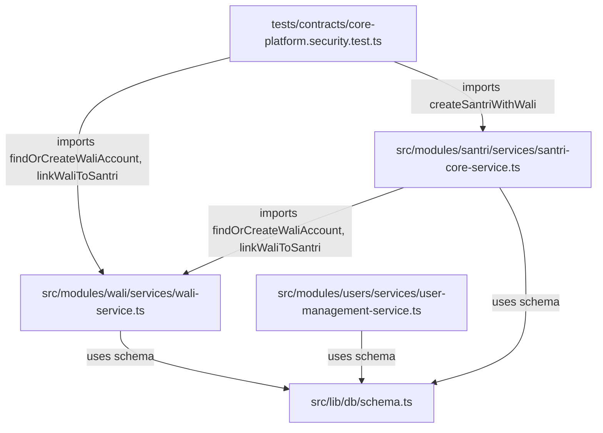

# WP-RECON-001A — Classification & Commit Boundary Audit

> **WORK PACKAGE:** WP-RECON-001A  
> **TITLE:** CONTROLLED WORKING TREE & COMMIT BOUNDARY AUDIT  
> **PROJECT:** Ma'had Manager / Madev SaaS Multi-Tenant Platform (`mahad-app`)  
> **AUDIT TARGET:** PC LAMA (Active Local Workspace)  
> **BRANCH:** `preview`  
> **DATE:** 2026-09-09  
> **MODE:** STRICT READ-ONLY / AUDIT ONLY  
> **STATUS:** EXECUTED  
> **GOVERNANCE VERDICT:** READY FOR CONTROLLED RECONCILIATION (AWAITING PO AUTHORIZATION)  

---

## 1. Executive Summary

Work Package **WP-RECON-001A** telah menyelesaikan audit forensik mendalam terhadap seluruh isi *working tree* lokal di PC Lama. Audit ini dilakukan secara **STRICT READ-ONLY** tanpa memodifikasi kode sumber, tanpa menjalankan migrasi database, dan tanpa membuat commit atau push.

### Temuan Utama:
1. **Repository Synchronization:** `HEAD` lokal dan `origin/preview` sinkron sempurna pada commit `ea88963` (`chore(release): reconcile notification-engine to canonical notification type`).
2. **Local Working Tree State:** Terdapat total **99 perubahan lokal** yang belum dikomit, terdiri dari:
   - **5 tracked modified files**
   - **94 untracked files** (3 application services, 4 drizzle migration files, 87 architecture/WP documents).
3. **Critical Fresh Clone Hazards (Penyelamatan Wajib):**
   - **Hazard A (Broken Automated Tests):** Tracked test file `tests/contracts/core-platform.security.test.ts` mengimpor `src/modules/wali/services/wali-service.ts` dan `src/modules/santri/services/santri-core-service.ts`. Jika repository di-clone di mesin baru (PC Baru / CI), pengujian akan langsung crash karena *module not found*.
   - **Hazard B (Broken Database Initialization):** Git hanya mencatat `drizzle/0002_tenant_rls_hardening.sql`. File migrasi dasar `0000_neat_machine_man.sql` (baseline schema 790 baris) dan `0001_kesiswaan_master_tables.sql` serta metadata `drizzle/meta/_journal.json` berstatus **UNTRACKED**. Clone baru tidak memiliki tabel dasar untuk mengaplikasikan migrasi 0002.
4. **Commit Boundary Blueprint:** Teridentifikasi **6 kelompok commit terisolasi (Commit Groups)** yang koheren, aman, dan siap distage tanpa mencampuradukkan urusan teknis (clean separation of concerns).

---

## 2. Repository Ground Truth

```text
$ git branch --show-current
preview

$ git rev-parse HEAD
ea88963de6c953bd2b2f5dbf6af8e361ad872785

$ git rev-parse origin/preview
ea88963de6c953bd2b2f5dbf6af8e361ad872785

$ git status --short --branch
## preview...origin/preview
 M docs/architecture/WP-RELEASE-005B-Controlled-Consumer-Reconciliation-Execution.md
 M package.json
 M src/lib/status-engine.ts
 M src/test/setup.ts
 M src/types/index.ts
?? docs/architecture/ (87 untracked files)
?? drizzle/ (4 untracked files)
?? src/modules/ (3 untracked files)
```

**Fakta:**
- `HEAD == origin/preview`: **YES** (Identical commit `ea88963`).
- Tidak ada commit lokal yang tertahan atau *unpushed*.
- Seluruh 99 file lokal berakar murni dari akumulasi pekerjaan lokal PC Lama.

---

## 3. Tracked Modification Inventory

Pemeriksaan mendalam terhadap 5 file tracked yang dimodifikasi secara lokal:

| File | Current Diff Summary | Related WP | Status | Category | Rekomendasi |
| :--- | :--- | :---: | :---: | :---: | :--- |
| [package.json](file:///d:/bikin%20app/APP%20MA'HAD/mahad-app/package.json) | Menghapus dependensi `firebase`, `firebase-admin`, `firebase-tools`, `@firebase/rules-unit-testing`, dan script `"emulator"`. | WP-RELEASE-004 / 005B | Complete | **CATEGORY A** (Ready for Canonical Commit) | Komit bersama Group 1 untuk memastikan runtime bebas dari Firebase SDK. |
| [src/test/setup.ts](file:///d:/bikin%20app/APP%20MA'HAD/mahad-app/src/test/setup.ts) | Menghapus inisialisasi environment variable emulator Firebase (`NEXT_PUBLIC_USE_EMULATOR`). | WP-RELEASE-004 | Complete | **CATEGORY A** (Ready for Canonical Commit) | Komit bersama Group 1 untuk mencegah mock emulator palsu saat unit testing. |
| [src/lib/status-engine.ts](file:///d:/bikin%20app/APP%20MA'HAD/mahad-app/src/lib/status-engine.ts) | Memperbarui teks komentar `// MIGRATION MAP (future: when Firestore data is migrated)` menjadi `// MIGRATION MAP (legacy status mapping)`. | Maintenance Hygiene | Complete | **CATEGORY A** (Ready for Canonical Commit) | Komit bersama Group 1 sebagai pembersihan komentar. |
| [docs/architecture/WP-RELEASE-005B-Controlled-Consumer-Reconciliation-Execution.md](file:///d:/bikin%20app/APP%20MA'HAD/mahad-app/docs/architecture/WP-RELEASE-005B-Controlled-Consumer-Reconciliation-Execution.md) | Memperbarui referensi hash commit hasil rilis dari commit sementara `8093db5` ke commit kanonikal `3ce9503`. | WP-RELEASE-005B | Complete | **CATEGORY E** (Documentation / Governance) | Komit bersama Group 1 untuk menjaga akurasi laporan rilis. |
| [src/types/index.ts](file:///d:/bikin%20app/APP%20MA'HAD/mahad-app/src/types/index.ts) | Menambahkan interface TypeScript `MasterInstitution`, `ViolationSeverityLevel`, `ViolationCategory` (WP-310/311). | WP-310 / WP-311 | Complete | **CATEGORY A** (Ready for Canonical Commit) | Komit bersama Group 3 (Core Platform & Domain Contracts). |

---

## 4. Untracked File Inventory

### 4.1 Application Code (3 files) — CATEGORY A / B
- [src/modules/santri/services/santri-core-service.ts](file:///d:/bikin%20app/APP%20MA'HAD/mahad-app/src/modules/santri/services/santri-core-service.ts) (111 baris): Service pembuatan data santri terisolasi per tenant dengan validasi NIS dan otorisasi RBAC `manage_santri`.
- [src/modules/wali/services/wali-service.ts](file:///d:/bikin%20app/APP%20MA'HAD/mahad-app/src/modules/wali/services/wali-service.ts) (245 baris): Service deduplikasi akun Wali (1 Wali = 1 Akun multi-anak), normalisasi nomor telepon, dan relasi santri.
- [src/modules/users/services/user-management-service.ts](file:///d:/bikin%20app/APP%20MA'HAD/mahad-app/src/modules/users/services/user-management-service.ts) (100 baris): Service pembuatan pengguna tenant dengan otorisasi `manage_pengaturan`.

### 4.2 Database / Migrations (4 files) — CATEGORY D
- [drizzle/0000_neat_machine_man.sql](file:///d:/bikin%20app/APP%20MA'HAD/mahad-app/drizzle/0000_neat_machine_man.sql) (28.6 KB, 790 baris): DDL dasar pembentukan seluruh tabel master PostgreSQL (`tenants`, `users`, `santri`, `asrama`, `wallets`, dll.).
- [drizzle/0001_kesiswaan_master_tables.sql](file:///d:/bikin%20app/APP%20MA'HAD/mahad-app/drizzle/0001_kesiswaan_master_tables.sql) (3.7 KB, 66 baris): DDL pembentukan tabel kesiswaan (`master_institutions`, `violation_severity_levels`, `violation_categories`).
- [drizzle/meta/0000_snapshot.json](file:///d:/bikin%20app/APP%20MA'HAD/mahad-app/drizzle/meta/0000_snapshot.json) (124 KB): Snapshot meta AST skema Drizzle v0.
- [drizzle/meta/_journal.json](file:///d:/bikin%20app/APP%20MA'HAD/mahad-app/drizzle/meta/_journal.json) (361 B): Log urutan migrasi Drizzle untuk migrasi 0000 dan 0001.

### 4.3 Architecture & Work Package Documentation (87 files) — CATEGORY E
- **Sprint 1 Architecture & Domain Contracts (15 files):**
  - `Sprint-1-ADR-Candidates.md`
  - `Sprint-1-Architecture-Gaps.md`
  - `Sprint-1-Bounded-Contexts.md`
  - `Sprint-1-Business-Decisions.md`
  - `Sprint-1-Context-Map.md`
  - `Sprint-1-Domain-Architecture.md`
  - `Sprint-1-Domain-Invariants.md`
  - `Sprint-1-Domain-Repository-Mapping.md`
  - `Sprint-1-Financial-Flow-Wallet-Payment-Architecture.md`
  - `Sprint-1-Payment-Architecture-Contract.md`
  - `Sprint-1-Ubiquitous-Language.md`
  - `Sprint-1-WP-101-Definition-of-Ready.md`
  - `Sprint-1-WP-101-Phase-1A-Ground-Truth-Forensic-Audit.md`
  - `Sprint-1-WP-101-Phase-1B-Identity-RBAC-Schema-Contract.md`
  - `Sprint-1-WP-101-Tenant-Web-Identity-Authorization-Contract.md`
- **WP-ARCH Governance & Conformance Triage (10 files):**
  - `WP-ARCH-001-Conflict-Register.md`
  - `WP-ARCH-001-Document-Inventory.md`
  - `WP-ARCH-001-Master-Source-of-Truth.md`
  - `WP-ARCH-CONF-001-Conformance-Audit.md`
  - `WP-ARCH-CONF-001-Critical-Findings.md`
  - `WP-ARCH-CONF-001-Gap-Register.md`
  - `WP-ARCH-FIX-001-Execution-Report.md`
  - `WP-ARCH-FIX-001-Gap-Triage.md`
  - `WP-ARCH-FIX-001-Governance-Baseline.md`
  - `WP-ARCH-FIX-001-Regression-Report.md`
- **WP-SAAS Branding, Portal & Security (10 files):**
  - `WP-SAAS-BRAND-001-Tenant-Branding-Discovery-Report.md`
  - `WP-SAAS-BRAND-003A-Conformance-Matrix.md`
  - `WP-SAAS-BRAND-003A-Final-Report.md`
  - `WP-SAAS-BRAND-003A-Governance-Baseline.md`
  - `WP-SAAS-BRAND-003A-Post-Implementation-Audit.md`
  - `WP-SAAS-BRAND-003A-Security-Verification.md`
  - `WP-SAAS-PORTAL-001-Tenant-Portal-Domain-Architecture-Discovery-Report.md`
  - `WP-SAAS-PORTAL-002-Execution-Report.md`
  - `WP-SAAS-PORTAL-003-Execution-Report.md`
  - `WP-SAAS-SEC-001-Tenant-RLS-Forensic-Discovery-Report.md`
- **WP-RELEASE Reconciliation Series (9 files):**
  - `WP-RELEASE-001-Brand-002-Release-Report.md`
  - `WP-RELEASE-001B-Controlled-Release-Recovery.md`
  - `WP-RELEASE-002B-Controlled-Repository-Synchronization.md`
  - `WP-RELEASE-004-Controlled-Firebase-Deletion-Reconciliation.md`
  - `WP-RELEASE-005C-Push-Reconciliation-Report.md`
  - `WP-RELEASE-005D-Clean-Build-Forensic-Report.md`
  - `WP-RELEASE-005E-Missing-Module-Inclusion-Report.md`
  - `WP-RELEASE-005F-Notification-Type-Forensic-Report.md`
  - `WP-RELEASE-005G-Notification-Type-Reconciliation-Report.md`
- **WP-UI Responsive Foundation & Transformation (39 files):**
  - `WP-UI-001` s/d `WP-UI-004` (Governance, Roadmap, Motion, Readiness)
  - `WP-UI-010` series (010, 010A, 010A Post-audit, 010B, 010C-1, 010C-1 Touch target, 010C-2, 010C-2 Input audit, 010C-3, 010C-3 Post-audit, 010C-4, Final integration audit)
  - `WP-UI-020` series (020, 020A, 020B, 020C-1, 020C-2 audit/exec, 020C-3 audit/exec, 020C-4 cert, 020C Academic plan)
  - `WP-UI-020D` series (020D-1, 020D-2, 020D-3 discovery/plan/exec/post-audit, 020D-4 final audit, Finance plan, Wallet freeze audit/exec/post-audit)
  - `WP-UI-020E` series (020E-1 discovery, 020E-1A s/d 020E-1D exec, 020E-2 integration audit, Master discovery audit)
  - `WP-UI-020F` series (020F-1A s/d 020F-1D exec, 020F-2 integration audit, Curriculum discovery)
- **WP-LIB & WP-NET Reports (3 files):**
  - `WP-LIB-001-Library-Architecture-Discovery-Report.md`
  - `WP-LIB-001A-Execution-Report.md`
  - `WP-NET-001-PREVIEW-Implementation-Report.md`
- **WP-GOV-001 Deliverable Report (1 file):**
  - `WP-GOV-001-Project-Ground-Truth-Audit.md`

---

## 5. Service Dependency Analysis

Pemeriksaan dependensi mendalam terhadap 3 service untracked:



### 5.1 `wali-service.ts`
- **Diimpor oleh:**
  - `tests/contracts/core-platform.security.test.ts` (Tracked test)
  - `src/modules/santri/services/santri-core-service.ts` (Untracked service)
- **Status Kelengkapan:** **COMPLETE**. Service memiliki logika lengkap untuk validasi nomor telepon (prefix `62`), deduplikasi nomor HP, pembuatan record user dengan role `wali`, dan relasi `waliSantriRelationships`.
- **Dampak Fresh Clone:** Jika dihilangkan/tidak dikomit, `core-platform.security.test.ts` langsung gagal kompilasi (*Module not found*).

### 5.2 `santri-core-service.ts`
- **Diimpor oleh:**
  - `tests/contracts/core-platform.security.test.ts` (Tracked test)
- **Status Kelengkapan:** **COMPLETE**. Mengimplementasikan alur registrasi santri dengan validasi keunikan NIS per-tenant dan pengecekan izin RBAC `manage_santri`.
- **Dampak Fresh Clone:** Sama dengan `wali-service.ts`, ketiadaan file ini merusak suite pengujian kontrak keamanan platform.

### 5.3 `user-management-service.ts`
- **Diimpor oleh:** Belum diimpor secara langsung oleh rute UI/test aktif, tetapi merupakan bagian integral dari Bounded Context `CTX-IDENTITY` Sprint 1 untuk membuat pengguna tenant dengan izin `manage_pengaturan`.
- **Status Kelengkapan:** **COMPLETE**.
- **Rekomendasi:** Wajib dikomit bersama `wali-service.ts` dan `santri-core-service.ts` sebagai satu kesatuan unit **Sprint 1 Core Services**.

---

## 6. Migration Reconciliation

Audit struktural direktori `drizzle/` terhadap database schema:

```text
Current Git State (Remote preview):
└── drizzle/
    └── 0002_tenant_rls_hardening.sql   <-- TRACKED & COMMITTED

Current Local State (Working Tree):
└── drizzle/
    ├── 0000_neat_machine_man.sql        <-- UNTRACKED (Baseline DDL 790 lines)
    ├── 0001_kesiswaan_master_tables.sql <-- UNTRACKED (Kesiswaan Master 66 lines)
    ├── 0002_tenant_rls_hardening.sql   <-- TRACKED & COMMITTED
    └── meta/
        ├── 0000_snapshot.json          <-- UNTRACKED (Meta Snapshot)
        └── _journal.json               <-- UNTRACKED (Drizzle Journal idx 0 & 1)
```

### Anomali Arsitektur yang Ditemukan:
1. **Migration Orphan:** `0002_tenant_rls_hardening.sql` mengeksekusi `ALTER TABLE "tenants" ENABLE ROW LEVEL SECURITY`, `ALTER TABLE "users" ...`, dsb. Tabel-tabel tersebut didefinisikan pada `0000_neat_machine_man.sql`.
2. **Missing Journal Record:** Metadata `_journal.json` mencatat `0000` dan `0001`, namun tidak mencatat `0002` (karena migrasi 0002 ditulis secara manual via hand-crafted SQL pada `WP-SAAS-SEC-002`).
3. **Fresh Clone Hazard:** Pada clone baru, perintah migrasi Drizzle akan gagal total karena tabel sasaran belum pernah dibuat.
4. **Rekomendasi:** Keempat file untracked (`0000`, `0001`, `snapshot`, `_journal.json`) **WAJIB DIKOMIT** ke Git untuk memulihkan keutuhan riwayat migrasi.

---

## 7. Documentation Reconciliation

Seluruh 87 dokumen untracked dianalisis dan diklasifikasikan:

| Kategori Dokumen | Jumlah File | Sifat / Status | Rekomendasi |
| :--- | :---: | :--- | :--- |
| **Sprint-1 Domain Specifications** | 15 | Canonical Architecture (ADR, Bounded Context, Identity, Wallet) | Komit dalam Group 6 |
| **WP-ARCH Governance & Triage** | 10 | Canonical Governance (Source of Truth, Conformance, Gap Triage) | Komit dalam Group 4 |
| **WP-SAAS Completed Reports** | 10 | Completed Audit & Execution Reports (Branding, Portal, RLS) | Komit dalam Group 4 |
| **WP-RELEASE Historical Reports** | 9 | Completed Release Reconciliation Reports (001 s/d 005G) | Komit dalam Group 4 |
| **WP-UI Responsive Transformation** | 39 | Completed UI Transformation Reports (010 & 020 series) | Komit dalam Group 5 |
| **WP-LIB & WP-NET Reports** | 3 | Architecture Discovery & Implementation Reports | Komit dalam Group 4 |
| **WP-GOV-001 Audit Report** | 1 | Master Project Ground Truth Audit Report | Komit dalam Group 4 |

**Kesimpulan:** Tidak ada satu pun dokumen yang merupakan file *scratch* sementara yang tidak bernilai. Seluruh dokumen merepresentasikan bukti tata kelola arsitektur (*governance evidence*) yang sah dan harus diabadikan dalam riwayat repositori.

---

## 8. Fresh Clone Risk Matrix

Analisis dampak jika seorang developer atau CI/CD melakukan `git clone -b preview https://github.com/serzendev-cloud/Os_Darta.git` saat ini:

| Item / Komponen | Hilang dari Git? | Dampak Runtime / Test pada Fresh Clone | Tingkat Keparahan | Rekomendasi Mitigasi |
| :--- | :---: | :--- | :---: | :--- |
| `src/modules/wali/services/wali-service.ts` | **YA** | `tests/contracts/core-platform.security.test.ts` gagal: *Cannot find module* | **CRITICAL** | Komit dalam Group 3 |
| `src/modules/santri/services/santri-core-service.ts` | **YA** | `tests/contracts/core-platform.security.test.ts` gagal: *Cannot find module* | **CRITICAL** | Komit dalam Group 3 |
| `drizzle/0000_neat_machine_man.sql` | **YA** | DDL skema dasar hilang; `0002_tenant_rls_hardening.sql` crash saat dijalankan | **CRITICAL** | Komit dalam Group 2 |
| `drizzle/0001_kesiswaan_master_tables.sql` | **YA** | Tabel kesiswaan master hilang | **HIGH** | Komit dalam Group 2 |
| `drizzle/meta/_journal.json` & `snapshot` | **YA** | Drizzle CLI kehilangan state riwayat migrasi | **HIGH** | Komit dalam Group 2 |
| `src/types/index.ts` (Kesiswaan Master Types) | **Terkendala (Uncommitted)** | Kompilasi modul kesiswaan masa depan kehilangan type definition | **MEDIUM** | Komit dalam Group 3 |
| `package.json` (Pembersihan Firebase) | **Terkendala (Uncommitted)** | `npm install` mendownload modul Firebase yang tidak terpakai | **LOW** | Komit dalam Group 1 |
| 87 Dokumen Arsitektur & Audit | **YA** | Hilangnya jejak tata kelola, acuan ADR, dan bukti audit historis | **LOW** | Komit dalam Group 4, 5, 6 |

---

## 9. Proposed Commit Boundaries

Untuk menjaga standar enterprise tanpa mencampuradukkan urusan teknis, diusulkan **6 Commit Groups** yang terisolasi:

```text
Commit Sequence Blueprint:
[HEAD ea88963]
      │
      ├─► GROUP 1: chore(release): finalize release 005 and prune deprecated firebase dependencies
      │
      ├─► GROUP 2: chore(db): restore canonical drizzle migration baseline and schema journal
      │
      ├─► GROUP 3: feat(core): register sprint-1 core services and kesiswaan master contracts
      │
      ├─► GROUP 4: docs(gov): record completed saas, security, release, and audit reports
      │
      ├─► GROUP 5: docs(ui): archive responsive transformation and presentation audit reports
      │
      └─► GROUP 6: docs(arch): establish sprint-1 domain architecture and bounded context specifications
```

---

### GROUP 1: Release 005 Finalization & Hygiene
- **Purpose:** Menyelesaikan pembersihan dependensi Firebase dari konfigurasi project dan setup test, menutup sepenuhnya serial rilis WP-RELEASE-005.
- **Files (4 files):**
  - `package.json`
  - `src/test/setup.ts`
  - `src/lib/status-engine.ts`
  - `docs/architecture/WP-RELEASE-005B-Controlled-Consumer-Reconciliation-Execution.md`
- **Related WP:** WP-RELEASE-004, WP-RELEASE-005B
- **Dependencies:** Tidak ada. Runtime Next.js sudah terbukti clean.
- **Readiness:** **CATEGORY A (READY FOR CANONICAL COMMIT)**
- **Risks:** 0 risiko runtime. `npm run build` telah terverifikasi sukses 100%.
- **Alasan Pengelompokan:** Seluruh file ini berkaitan langsung dengan pembersihan dependensi legacy Firebase dan rekonsiliasi hash rilis 005.

---

### GROUP 2: Drizzle Migration Baseline & Schema Journal
- **Purpose:** Memulihkan kelengkapan migration baseline yang hilang di Git tracking sehingga clone baru/CI dapat membangun database schema dari awal sebelum `0002_tenant_rls_hardening.sql` diterapkan.
- **Files (4 files):**
  - `drizzle/0000_neat_machine_man.sql`
  - `drizzle/0001_kesiswaan_master_tables.sql`
  - `drizzle/meta/0000_snapshot.json`
  - `drizzle/meta/_journal.json`
- **Related WP:** WP-310, WP-311, Drizzle Baseline
- **Dependencies:** PostgreSQL schema definitions.
- **Readiness:** **CATEGORY D (MIGRATION / DATABASE-SENSITIVE) — READY FOR STAGING**
- **Risks:** Tidak ada perubahan pada skema yang sedang berjalan; murni mencatatkan baseline DDL ke dalam tracking Git.
- **Alasan Pengelompokan:** File-file ini adalah satu kesatuan artefak engine migrasi Drizzle.

---

### GROUP 3: Kesiswaan Domain Contracts & Core Platform Services (Sprint 1)
- **Purpose:** Mengamankan implementasi modul core platform Sprint 1 dan tipe master kesiswaan ke dalam tracking Git, menyelesaikan blocker dependensi `wali-service.ts` dan `santri-core-service.ts` yang diimpor oleh `tests/contracts/core-platform.security.test.ts`.
- **Files (4 files):**
  - `src/types/index.ts`
  - `src/modules/wali/services/wali-service.ts`
  - `src/modules/santri/services/santri-core-service.ts`
  - `src/modules/users/services/user-management-service.ts`
- **Related WP:** Sprint-1-WP-101, WP-310, WP-311
- **Dependencies:** GROUP 2 (Drizzle schema).
- **Readiness:** **CATEGORY A (READY FOR CANONICAL COMMIT)**
- **Risks:** Sangat rendah. Mengeliminasi *broken imports* pada fresh clone dan melengkapi modul identity/santri.
- **Alasan Pengelompokan:** Seluruh file ini membentuk Bounded Context `CTX-IDENTITY` dan `CTX-KESISWAAN` fondasi Sprint 1.

---

### GROUP 4: Completed SaaS, Security, Release, & Governance Audit Reports
- **Purpose:** Mengarsipkan seluruh bukti audit, laporan eksekusi, serta sertifikasi arsitektur yang telah selesai dikerjakan ke dalam repositori resmi.
- **Files (33 files):**
  - `docs/architecture/WP-GOV-001-Project-Ground-Truth-Audit.md`
  - `docs/architecture/WP-ARCH-001-*` (3 files)
  - `docs/architecture/WP-ARCH-CONF-001-*` (3 files)
  - `docs/architecture/WP-ARCH-FIX-001-*` (4 files)
  - `docs/architecture/WP-SAAS-BRAND-001-*` & `WP-SAAS-BRAND-003A-*` (6 files)
  - `docs/architecture/WP-SAAS-PORTAL-*` (3 files: 001, 002, 003)
  - `docs/architecture/WP-SAAS-SEC-001-*` (1 file)
  - `docs/architecture/WP-RELEASE-001*` s/d `005G*` (9 files)
  - `docs/architecture/WP-LIB-001*`, `WP-NET-001*` (4 files)
- **Related WP:** Governance & Security Audit Series
- **Dependencies:** Tidak ada.
- **Readiness:** **CATEGORY E (DOCUMENTATION / GOVERNANCE) — READY FOR STAGING**
- **Risks:** 0 risiko runtime.
- **Alasan Pengelompokan:** Dokumen rekam jejak kepatuhan arsitektur, rilis, dan keamanan SaaS.

---

### GROUP 5: UI Responsive Transformation & Presentation Execution Reports
- **Purpose:** Mengarsipkan laporan implementasi dan audit integrasi menyeluruh perbaikan UI responsive (78 halaman) ke dalam repositori.
- **Files (39 files):**
  - `docs/architecture/WP-UI-001` s/d `WP-UI-004` (4 files)
  - `docs/architecture/WP-UI-010*` (10 files)
  - `docs/architecture/WP-UI-020*` (25 files)
- **Related WP:** WP-UI-010 & WP-UI-020 series
- **Dependencies:** Tidak ada.
- **Readiness:** **CATEGORY E (DOCUMENTATION / GOVERNANCE) — READY FOR STAGING**
- **Risks:** 0 risiko runtime.
- **Alasan Pengelompokan:** Seluruh deliverable dokumentasi UI responsive transformation.

---

### GROUP 6: Sprint 1 Domain Architecture & Bounded Context Specifications
- **Purpose:** Mengabadikan spesifikasi domain driven design (Bounded Contexts, Context Map, Ubiquitous Language, Identity RBAC Schema Contract, Financial Architecture) ke dalam repositori resmi.
- **Files (15 files):**
  - Seluruh file `docs/architecture/Sprint-1-*.md`
- **Related WP:** Sprint-1 Domain Architecture
- **Dependencies:** Tidak ada.
- **Readiness:** **CATEGORY E (DOCUMENTATION / GOVERNANCE) — READY FOR STAGING**
- **Risks:** 0 risiko runtime.
- **Alasan Pengelompokan:** Dokumen cetak biru spesifikasi arsitektur domain Sprint 1.

---

## 10. Files That MUST NOT Be Committed Yet

Berdasarkan hasil audit menyeluruh:
- **TIDAK DITEMUKAN FILE TEMPORER ATAU SCRATCH SENSITIF:** Tidak ada kredensial API, token rahasia, atau file temporary yang tidak sengaja tercipta di root project. File `.env.local` tetap terabaikan dengan benar oleh `.gitignore`.
- **DILARANG MENGHAPUS FILE APAPUN:** Seluruh 94 file untracked adalah artefak kerja bernilai tinggi dan **TIDAK BOLEH** dibersihkan melalui `git clean`.
- **DILARANG MEN-STAGE FILE REPORT WP-RECON-001A:** File report audit ini sendiri (`WP-RECON-001A-Classification-and-Commit-Boundary-Audit.md`) berada dalam status audit-only dan menunggu otorisasi sebelum distage.

---

## 11. Files Requiring Product Owner Decision

Product Owner diminta memberikan keputusan formal atas 3 butir berikut:

1. **Keputusan 1: Ratifikasi Rekonsiliasi Drizzle Migration (Group 2):**
   - *Pilihan A (Rekomendasi):* Men-stage dan mengomit file `0000`, `0001`, `snapshot`, dan `_journal.json` apa adanya ke Git untuk memulihkan keutuhan baseline DDL.
   - *Pilihan B:* Mengabaikan file lama dan men-generate ulang migrasi dari skema saat ini (Risiko: memicu konflik checksum jika database production sudah memiliki tabel tersebut).
2. **Keputusan 2: Ratifikasi Layanan Core Platform Sprint 1 (Group 3):**
   - *Pilihan A (Rekomendasi):* Men-stage dan mengomit `santri-core-service.ts`, `wali-service.ts`, `user-management-service.ts`, dan `src/types/index.ts` agar test suite tidak broken pada clone baru.
   - *Pilihan B:* Menunda commit service ini (Konsekuensi: fresh clone akan tetap broken).
3. **Keputusan 3: Strategi Eksekusi Commit Rekonsiliasi:**
   - *Pilihan A (Rekomendasi):* Menjalankan eksekusi terpisah secara sekuensial (Group 1 s/d Group 6) untuk menjaga histori git yang rapi dan mudah di-*bisect*.
   - *Pilihan B:* Menggabungkan seluruh 99 perubahan ke dalam 1 commit konsolidasi besar (`chore: reconcile complete repository working tree`).

---

## 12. Work Package Status Reconciliation

Status resmi seluruh inisiatif proyek dikonfirmasi tetap stabil:

| Status | Work Package Terkait | Catatan Rekonsiliasi |
| :--- | :--- | :--- |
| **DONE** | WP-UI-010, WP-UI-020 (A-F), WP-SAAS-PORTAL-002/003, WP-SAAS-BRAND-002/003A, WP-SAAS-SEC-002/003, WP-RELEASE-001-005G, WP-LIB-001A, WP-ARCH-FIX-001, WP-GOV-001, **WP-RECON-001A** | Seluruh implementasi & audit selesai. |
| **IN PROGRESS** | Sprint-1 Core Services (Identity, Users, Santri, Wali), Release 005 Package.json Cleanup | Siap dikonsolidasikan via Group 1 & Group 3. |
| **PENDING** | WP-102 (Academic Master), WP-103/104 (Santri Lifecycle), Double-Entry General Ledger, Client Supabase Live Auth | Menunggu rekonsiliasi repo selesai. |
| **PAUSED** | WP-LIB-001 (Full Library), WP-SAAS-DOMAIN-001 (Custom Domain), Qism/OSIM | Dilarang dikerjakan tanpa otorisasi PO. |
| **BLOCKED** | Fresh Clone Migration Execution, CI Test Pipeline | Akan ter-unblock setelah Group 2 & Group 3 dikomit serta test di-stabilisasi. |
| **NOT COMPLETED** | Vitest 100% Green (3 failing tests), ESLint Baseline Conformance (41 regressions) | Menjadi target perbaikan setelah working tree bersih. |

---

## 13. Risks

1. **Migration Ordering Risk:** Jika `0000` dan `0001` tidak tercatat di Git, setiap setup lingkungan baru (seperti PC Baru) akan gagal membangun skema database.
2. **Fresh Clone Test Breakage:** Ketiadaan `wali-service.ts` dan `santri-core-service.ts` di Git akan langsung menggagalkan CI pipeline pada tahap awal *import resolution*.
3. **Documentation Drift:** 87 dokumen arsitektur yang tidak dikomit berisiko hilang atau tertinggal dari versi rilis produksi.
4. **Accidental Premature Fix:** Memperbaiki unit test atau linter sebelum working tree dikonsolidasikan berisiko menambah kotor working copy dan menyulitkan pemisahan git staging.

---

## 14. Recommended Next Work Packages

Berdasarkan dependensi arsitektur, urutan pengerjaan berikutnya adalah:

1. **`WP-RECON-001B` — Controlled Canonical Commit Execution:**
   - Melakukan staging dan committing terisolasi untuk Group 1 sampai Group 6 sesuai arahan PO.
   - Mode: Staging & Commit strictly within authorized boundaries (tanpa mengubah source code).
2. **`WP-TEST-001` — Test Failure Reconciliation & Quality Gate Stabilization:**
   - Memperbaiki 2 mock `db.transaction` pada `authz-enforcement.integration.test.ts` dan 1 index array assertion pada `tenant-rls-isolation.security.test.ts` agar Vitest mencapai 100% PASS (179/179).
3. **`WP-LINT-001` — ESLint Baseline Reconciliation:**
   - Menyelaraskan 41 deviasi linter baru agar `npm run lint:ci` lulus aturan Zero Technical Debt.

---

## 15. Final Verdict

```text
FINAL VERDICT:
READY FOR CONTROLLED RECONCILIATION
```

Working tree lokal telah terpetakan 100% tanpa ada ambiguitas. Seluruh dependensi tersembunyi (*hidden dependencies*) yang mengancam integritas *fresh clone* telah diisolasi ke dalam 6 kelompok commit yang aman.

**Sistem kini berhenti (MANDATORY STOP) untuk menunggu telaah dan otorisasi Product Owner atas Proposed Commit Boundaries.**

---

==================================================  
WP-RECON-001A FINAL STATUS  
==================================================  

```text
WP:
WP-RECON-001A

MODE:
READ-ONLY

AUDIT:
PASS

FILES MODIFIED BY THIS WP:
ONLY docs/architecture/WP-RECON-001A-Classification-and-Commit-Boundary-Audit.md (This report)

CODE CHANGED:
NO

DATABASE CHANGED:
NO

MIGRATION EXECUTED:
NO

COMMIT CREATED:
NO

PUSH PERFORMED:
NO

FILES DELETED:
NO

FILES CLASSIFIED:
99 (5 tracked modified + 4 drizzle migration files + 3 application services + 87 architecture docs)

READY COMMIT GROUPS:
6 (Group 1: Release 005, Group 2: Drizzle Baseline, Group 3: Core Services, Group 4: Gov Reports, Group 5: UI Reports, Group 6: Domain Architecture)

PO DECISIONS REQUIRED:
3 (Drizzle migration ratification, Sprint-1 core services ratification, Commit grouping strategy)

FRESH CLONE RISKS:
4 (Missing wali-service, missing santri-core-service, missing migration 0000 baseline, missing migration 0001)

BLOCKERS:
Untracked Drizzle baseline migrations (0000, 0001), Untracked core services dependency, 3 Vitest failures

PAUSED WORK:
WP-LIB-001 (Full Library), WP-SAAS-DOMAIN-001 (Custom Domain), Qism/OSIM

NOT COMPLETED:
Vitest 100% Green, ESLint Baseline Conformance, Working Tree Consolidation

RECOMMENDED NEXT WP:
WP-RECON-001B — Controlled Canonical Commit Execution

AUTHORIZATION REQUIRED FOR NEXT STEP:
YES
```

---

==================================================  
STOP CONDITION  
==================================================  

Sesuai ketentuan tata kelola absolut **WP-RECON-001A**:  
**AUDIT SELESAI. SISTEM BERHENTI (MANDATORY STOP).**  

Tidak ada proses staging, commit, push, modifikasi kode, perbaikan test, perbaikan lint, maupun eksekusi database yang dijalankan.  
Menunggu konfirmasi dan otorisasi Product Owner untuk memulai **WP-RECON-001B**.
