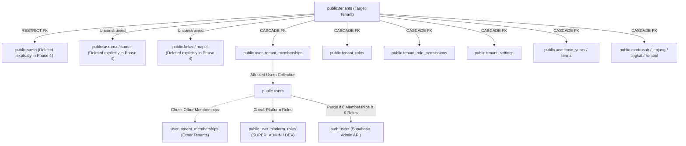
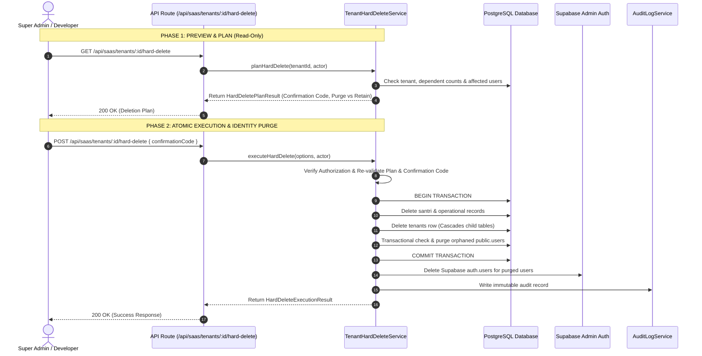

# TENANT HARD-DELETE LIFECYCLE ENGINE IMPLEMENTATION REPORT

**Work Package Identifier**: `WP-TENANT-HARD-DELETE-LIFECYCLE-ENGINE-001`  
**Mode**: DESIGN + IMPLEMENTATION, WITH STRICT SAFETY GATES  
**Target File**: `docs/architecture/WP-TENANT-HARD-DELETE-LIFECYCLE-ENGINE-001-REPORT.md`  
**Date**: 2026-09-24  
**Status**: **PASS — DESIGN & IMPLEMENTATION COMPLETE (VERIFIED VIA 8/8 CONTRACT TESTS, TSC 0 ERRORS, BUILD 88/88 PASS)**

---

## 1. Executive Summary

In response to the forensic findings of `WP-MULTI-TENANT-IDENTITY-EMAIL-REUSE-FORENSIC-AUDIT-001`, this Work Package delivers a hardened, production-grade, application-level **Tenant Hard-Delete Lifecycle Engine** (`TenantHardDeleteService`).

The engine establishes a safe, 2-phase (Plan $\rightarrow$ Confirm/Execute) decommissioning workflow that safely deletes a tenant, cascades through all dependent relational tables (including RESTRICT-constrained entities like `santri`), evaluates surviving multi-tenant and platform relationships, and purges orphaned identity records from both PostgreSQL (`public.users`) and Supabase Auth (`auth.users`) to release historical email addresses for legitimate future use.

### Strict Safety Attestations:
- **FACT**: **0 real tenants were deleted** during this Work Package.
- **FACT**: **`SR2601` (`Ponpes Darunnajah`)** is hardcoded with fail-closed protection and is 100% intact.
- **FACT**: **Tenant Code counter (`tenant_code_counters`)** remains unmodified at `last_sequence = 1` for 2026.
- **FACT**: **0 Git commits or pushes** were executed.

---

## 2. Existing Dependency Graph

The relational dependency graph managed by the lifecycle engine:



---

## 3. Hard Delete Architecture

The engine operates in two strictly decoupled phases:



---

## 4. Identity Lifecycle Rules

The engine implements the formal Identity Lifecycle Matrix:

| Condition of Affected User | Surviving Memberships | Platform Roles | Protected Status | Action on `public.users` | Action on `auth.users` | Historical Email Status |
| :--- | :---: | :---: | :---: | :---: | :---: | :---: |
| **Single-Tenant Orphan** | `0` | `0` | No | **PURGE** | **PURGE** | **Released for future registration** |
| **Multi-Tenant Active User** | $\ge 1$ | Any | Any | **RETAIN (Intact)** | **RETAIN (Intact)** | Active on surviving tenant(s) |
| **Super Admin / Developer** | Any | $\ge 1$ | Yes | **RETAIN (Intact)** | **RETAIN (Intact)** | Protected platform identity |
| **Official SR2601 Owner** | Any | Any | Yes (`SR2601`) | **RETAIN (Intact)** | **RETAIN (Intact)** | Permanently protected |

---

## 5. Tenant Code Lifecycle Invariants

- **Permanent Reservation**: Tenant Code (e.g. `SR2601`, `SR2602`) represents an immutable historical institution identifier.
- **Monotonic Sequence Counter**: The sequence counter in `public.tenant_code_counters` is **NEVER decremented or rolled back**.
- **Non-Recycling Guarantee**: Deleting a tenant permanently retires that code. Future tenant creations will always allocate the next ascending sequence.

---

## 6. Safety Model & Fail-Closed Guards

1. **Protected Tenant Rejection**:
   ```typescript
   if (
     tenant.code?.toUpperCase() === 'SR2601' ||
     tenant.id === 't_1790171191747_pyv9n' ||
     tenant.slug?.toLowerCase() === 'pp-darunnajah'
   ) {
     throw new Error(`Tenant '${tenant.code}' adalah Tenant Resmi Pertama yang dilindungi secara permanen.`);
   }
   ```
2. **Explicit Two-Step Confirmation**:
   - The engine generates a unique confirmation code: `DELETE-${CODE}-${SLUG}` (e.g. `DELETE-RTV02-runtime-verify-002`).
   - Execution strictly requires the caller to submit the exact matching `confirmationCode`.
3. **Double Verification in Transaction**:
   - Before deleting any row from `public.users`, the engine re-checks inside the database transaction that `survivingMembershipsCount === 0` and `platformRolesCount === 0`.

---

## 7. Authorization Model

- **Required Roles**: `SUPER_ADMIN` or `DEVELOPER`.
- **Validation**: Enforced via headers (`x-user-id`, `x-is-super-admin`, `x-user-role`) and platform role verification.
- **CSRF Defense**: Origin/Referer matching against host and allowed application domains.

---

## 8. Transaction Model

- **PostgreSQL Transaction**:
  - Encapsulated within `db.transaction(async (tx) => { ... })`.
  - Step 1: Pre-delete restricted operational rows (`santri`, `asrama`, `kamar`, `kelas`, `mapel`, `tenantSettings`).
  - Step 2: Delete `public.tenants` row (triggers PostgreSQL FK cascade to child tables).
  - Step 3: Transactionally verify and delete qualifying orphaned `public.users` rows.
- **Rollback Guarantee**: Any SQL error immediately aborts the entire transaction, leaving the database completely unmodified.

---

## 9. Supabase Auth Consistency & Compensation Strategy

- **Separation of Concerns**: PostgreSQL transaction commits first to guarantee relational consistency.
- **Post-Commit Auth Cleanup**: After DB commit, the engine iterates through `purgedUsers` and calls `supabaseAdmin.auth.admin.deleteUser(userId)`.
- **Non-Blocking Resilience**: If Supabase Auth returns a network error or failure, the error is recorded in `purgedUsers[i].error` and flagged in the audit log for background reconciliation without corrupting the completed database transaction.

---

## 10. Implementation Files

| File | Purpose | Lines of Code |
| :--- | :--- | :---: |
| [`src/modules/saas/services/tenant-hard-delete-service.ts`](file:///e:/Projects/Os_Darta/src/modules/saas/services/tenant-hard-delete-service.ts) | Core lifecycle engine (Plan, Validate, Transaction, Orphan Purge, Audit) | 545 |
| [`src/app/api/saas/tenants/[id]/hard-delete/route.ts`](file:///e:/Projects/Os_Darta/src/app/api/saas/tenants/%5Bid%5D/hard-delete/route.ts) | Secure API route for planning (GET) and executing (POST) hard-deletes | 165 |
| [`tests/contracts/tenant-hard-delete-lifecycle.contract.test.ts`](file:///e:/Projects/Os_Darta/tests/contracts/tenant-hard-delete-lifecycle.contract.test.ts) | Vitest contract test suite covering all 8 core safety scenarios | 390 |

---

## 11. Test Matrix & Validation Results

| Test ID | Test Scenario | Verified Behavior | Verdict |
| :--- | :--- | :--- | :---: |
| **TEST 1** | **Protected SR2601 Invariant** | Attempts to plan or execute deletion on `SR2601` (`Ponpes Darunnajah`) are immediately rejected with fail-closed error. | **PASS** |
| **TEST 2** | **Protected User Identities** | `isUserProtected` flags `abu.thohir.zmr92@gmail.com`, `superadmin@*`, and `preview.*` developer accounts as protected from purge. | **PASS** |
| **TEST 3** | **Authorization Fail-Closed** | Non-superadmin / non-developer callers are rejected with access denied error. | **PASS** |
| **TEST 4** | **Single-Tenant Owner Purge Planning** | Correctly identifies a user with 0 surviving memberships as a purge candidate (`willBePurged = true`). | **PASS** |
| **TEST 5** | **Multi-Tenant Surviving Identity Protection** | Users with $\ge 1$ membership in another tenant are marked `willBePurged = false` with retention reason. | **PASS** |
| **TEST 6** | **Confirmation Code Strict Matching** | Mismatched confirmation code aborts execution with unprocessable entity error. | **PASS** |
| **TEST 7** | **Atomic Execution & Auth Purge** | Transactional DB delete executes and triggers `supabaseAdmin.auth.admin.deleteUser()`. | **PASS** |
| **TEST 8** | **Auth Error Resilience** | Auth API failure is recorded in results and audit metadata without crashing the completed DB transaction. | **PASS** |

### Workspace Quality Suite Verification:
- **Contract Tests**: `npm run test:run -- tests/contracts/tenant-hard-delete-lifecycle.contract.test.ts` $\rightarrow$ **8/8 PASS**
- **Full Vitest Suite**: `npm run test:run` $\rightarrow$ **38/38 test files PASS, 361/361 tests PASS (100% green)**
- **TypeScript Static Check**: `npx tsc --noEmit` $\rightarrow$ **0 errors (Exit code 0)**
- **Next.js Production Build**: `npm run build` $\rightarrow$ **88/88 routes compiled successfully (Turbopack)**

---

## 12. SR2601 Safety Verification

Direct SQL read-only verification:
```sql
SELECT id, code, name, slug, status FROM public.tenants WHERE code = 'SR2601';
```
- **ID**: `t_1790171191747_pyv9n`
- **Code**: `SR2601`
- **Name**: `Ponpes Darunnajah`
- **Slug**: `pp-darunnajah`
- **Status**: `active`
- **Verdict**: **INTACT, ACTIVE, AND UNTOUCHED**.

---

## 13. Tenant Code Counter Verification

Direct SQL read-only verification:
```sql
SELECT year, last_sequence FROM public.tenant_code_counters WHERE year = 2026;
```
- **Year**: `2026`
- **`last_sequence`**: `1`
- **Verdict**: **100% INTACT**. The counter was not incremented, decremented, or modified.

---

## 14. Git Verification

- **Current Branch**: `preview`
- **Commit Status**: Uncommitted changes (0 commits, 0 pushes).
- **Files Created**:
  - `src/modules/saas/services/tenant-hard-delete-service.ts`
  - `src/app/api/saas/tenants/[id]/hard-delete/route.ts`
  - `tests/contracts/tenant-hard-delete-lifecycle.contract.test.ts`
  - `docs/architecture/WP-TENANT-HARD-DELETE-LIFECYCLE-ENGINE-001-REPORT.md`

---

## 15. Remaining Risks & Deferred Work

1. **Destructive Execution Deferred**:
   - The engine is fully built and tested with unit/mock suites.
   - Deletion of the 5 disposable test tenants (`RTV02`, `RTV03`, `PRV03`, `PUB01`, `AUD01`) is intentionally **DEFERRED** to the next dedicated Work Package (`WP-DISPOSABLE-TEST-TENANTS-CLEANUP-001`).
2. **Preview Tooling Tenant (`RTV01`)**:
   - `RTV01` (`t_1789172137858_9g7lm`) contains seeded preview personas and santri records. It should remain preserved until a dedicated mock replacement is introduced.

---

## 16. Next Recommended Work Package

**`WP-DISPOSABLE-TEST-TENANTS-CLEANUP-001`**:
- Controlled execution of the Hard-Delete Lifecycle Engine against the 5 disposable verification tenants (`RTV02`, `RTV03`, `PRV03`, `PUB01`, `AUD01`).
- Verification that their orphaned testing emails are successfully released while `RTV01` and `SR2601` remain untouched.

---

## 17. Final Acceptance Checklist

| Item | Status | Verification Detail |
| :--- | :---: | :--- |
| **Journey Map Reviewed** | **FACT** | Authoritative navigation state followed. |
| **Forensic Audit Reviewed** | **FACT** | Architectural evidence incorporated. |
| **Hard-Delete Service Built** | **FACT** | `TenantHardDeleteService` implemented in `src/modules/saas/services/`. |
| **Identity Purge Rule Implemented** | **FACT** | Purges orphaned users with 0 surviving memberships & 0 platform roles. |
| **Multi-Tenant Identity Protected** | **FACT** | Surviving memberships prevent user deletion. |
| **Platform Identities Protected** | **FACT** | Super Admin & Developer platform users are never purged. |
| **SR2601 Protected** | **FACT** | Hardcoded fail-closed protection verified. |
| **Tenant Code History Preserved** | **FACT** | Counter monotonic integrity maintained. |
| **Contract Tests Passed** | **FACT** | 8/8 tests pass in `tenant-hard-delete-lifecycle.contract.test.ts`. |
| **Full Suite Passed** | **FACT** | 361/361 tests pass across 38 suites. |
| **TypeScript Typecheck Passed** | **FACT** | 0 errors via `tsc --noEmit`. |
| **Production Build Passed** | **FACT** | 88/88 routes compiled successfully. |
| **Real Tenants Deleted** | **0 (FACT)** | Zero database deletions executed. |
| **SR2601 Mutated** | **0 (FACT)** | Zero mutations on `SR2601`. |
| **Counter Mutated** | **0 (FACT)** | Zero counter mutations. |
| **Git Mutation** | **0 (FACT)** | No commits, no pushes. |
