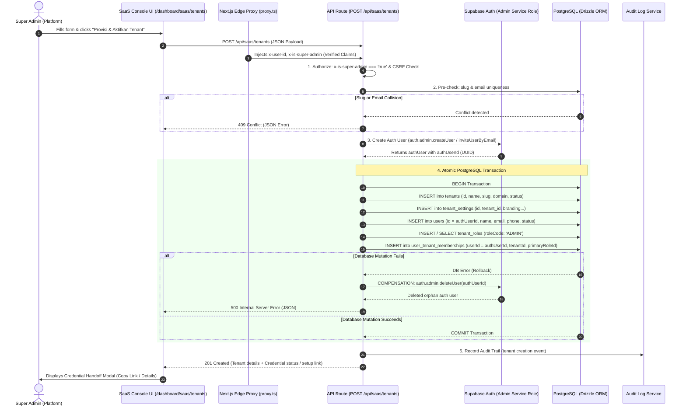

# WP-TENANT-PROVISION-002: Architecture & Implementation Plan
**TITLE**: End-to-End Enterprise Tenant & Admin Provisioning Engine  
**PROGRAM**: SAAS CORE  
**AUTHORITY**: Senior Principal Systems Architect & Chief Engineering Architect Specification  
**STATUS**: READY FOR PRODUCT OWNER REVIEW (READ-ONLY PLANNING)  
**DATE**: September 11, 2026  

---

## 1. Executive Summary

### 1.1 Context & Problem Statement
The recent forensic audit [`WP-TENANT-AUTH-PROVISIONING-001`](file:///e:/Projects/Os_Darta/docs/architecture/WP-TENANT-AUTH-PROVISIONING-001) established that the current Super Admin "Create Tenant" interface on `/dashboard/saas/tenants` is a **frontend prototype operating solely on ephemeral React state (`useState`)**. When a Super Admin provisions a new tenant (e.g. *Darunnajah*):
1. No record is written to PostgreSQL (`tenants`, `tenant_settings`).
2. No identity is created in Supabase Auth (`auth.users`).
3. No record is inserted into `public.users` or `user_tenant_memberships`.
4. No administrator credentials or activation links are generated.
5. As a result, the newly created tenant cannot authenticate, and all data vanishes upon page refresh.

### 1.2 Mission & Architectural Objective
This Work Package (`WP-TENANT-PROVISION-002`) transitions the SaaS control plane from a prototype to a **hardened, enterprise-grade, atomic multi-tenant provisioning engine** engineered to support 100+ Pesantren/Madrasah over a 10-year horizon.

The core objective is to deliver a server-side provisioning engine (`POST /api/saas/tenants` and `GET /api/saas/tenants`) that atomically orchestrates:
- Supabase Auth identity creation via Admin Service Role.
- Canonical PostgreSQL persistence across 5 relational tables (`tenants`, `tenant_settings`, `users`, `tenant_roles`, `user_tenant_memberships`).
- Strict identity chain alignment: $\text{auth.users.id} = \text{public.users.id} = \text{user\_tenant\_memberships.user\_id}$.
- Two-phase compensation rollback to guarantee zero orphaned authentication records upon database failure.
- A secure, enterprise-compliant credential distribution and activation lifecycle.

---

## 2. Current State

### 2.1 UI Layer
* **File**: [`src/app/dashboard/saas/tenants/page.tsx`](file:///e:/Projects/Os_Darta/src/app/dashboard/saas/tenants/page.tsx)
* **Component**: `SaasTenantsPage`
* **Current State**:
  * Tenants are stored in local state: `const [tenants, setTenants] = useState<ActiveTenant[]>(mockActiveTenants);` (line 66).
  * `mockActiveTenants` is an empty array `[]` (line 61).
  * Modal lines 640–777 collects `newTenantName`, `newSubdomain`, `newLocation`, `newPlan`, `newOwnerName`, `newOwnerEmail`, `newOwnerPhone`.
  * Form does **not** collect or generate any password, invitation toggle, or credential setup option.
  * Submit handler `handleCreateTenantSubmit` (lines 160–188) simply executes `setTenants([created, ...tenants])`, sets a toast, and closes the modal.
  * No network request (`fetch`, `axios`) or Server Action is called.

### 2.2 Backend & Data Layer
* **API Route**: No endpoint exists for tenant provisioning (only `/api/saas/company-contact` and `/api/tenant/branding` exist).
* **Database**: `tenants` and `tenant_settings` tables in [`src/lib/db/schema.ts`](file:///e:/Projects/Os_Darta/src/lib/db/schema.ts#L4-L33) remain empty.
* **Authentication**: `auth.users` receives no record; `public.users` receives no record.
* **Membership**: `user_tenant_memberships` receives no record.

---

## 3. Target State



---

## 4. Existing Architecture & Foundations

The provisioning engine will build upon the already established, production-verified foundations:
1. **Edge Proxy Auth Boundary** ([`src/proxy.ts`](file:///e:/Projects/Os_Darta/src/proxy.ts)):
   - Evaluates incoming session cookies with zero-trust fail-closed security.
   - Extracts `x-tenant-slug` from hostnames or paths.
   - Injects server-verified claims: `x-user-id`, `x-user-role`, `x-is-super-admin`.
2. **Canonical Multi-Tenant Schema** ([`src/lib/db/schema.ts`](file:///e:/Projects/Os_Darta/src/lib/db/schema.ts) & [`src/lib/db/schema/identity.ts`](file:///e:/Projects/Os_Darta/src/lib/db/schema/identity.ts)):
   - 9 core identity and RBAC tables established in Sprint 1 Phase 1C.
3. **Database Client & Session Context** ([`src/lib/db/index.ts`](file:///e:/Projects/Os_Darta/src/lib/db/index.ts) & [`src/lib/db/tenant-transaction.ts`](file:///e:/Projects/Os_Darta/src/lib/db/tenant-transaction.ts)):
   - Connection pool using `pg` and Drizzle ORM.
   - `withTenantTransaction` provides session-level `SET LOCAL app.current_tenant_id` and `SET LOCAL app.is_super_admin = 'true'`.
4. **Tenant Context Helper** ([`src/lib/tenant/context.ts`](file:///e:/Projects/Os_Darta/src/lib/tenant/context.ts)):
   - `getTenantContext()` queries `tenants` and `tenant_settings` based on `x-tenant-slug` to dynamically render branding on `/login`.

---

## 5. Reusable Components

| Component / Utility | File Path | Existing Capability | Planned Reuse in WP-002 |
|---|---|---|---|
| `withTenantTransaction` | [`src/lib/db/tenant-transaction.ts`](file:///e:/Projects/Os_Darta/src/lib/db/tenant-transaction.ts#L28) | Scoped `SET LOCAL` transaction execution | Wrap all 5 PostgreSQL table inserts in an isolated transaction. |
| `auditLogService` | [`src/lib/db/services/auditLog.ts`](file:///e:/Projects/Os_Darta/src/lib/db/services/auditLog.ts#L6) | Structured audit trail logger | Log `tenant.created` and `admin.provisioned` events with Super Admin actor details. |
| `validateOrigin` | [`src/app/api/saas/company-contact/route.ts`](file:///e:/Projects/Os_Darta/src/app/api/saas/company-contact/route.ts#L19-L56) | Origin & Referer CSRF validation | Enforce CSRF protection on `POST /api/saas/tenants`. |
| `createTenantUser` logic pattern | [`src/modules/users/services/user-management-service.ts`](file:///e:/Projects/Os_Darta/src/modules/users/services/user-management-service.ts#L13-L69) | `tenant_roles` & `user_tenant_memberships` insert pattern | Adapt the role-resolution and membership binding logic to use canonical Supabase Auth UUID. |
| Edge Claim Ingestion | [`src/proxy.ts`](file:///e:/Projects/Os_Darta/src/proxy.ts#L139-L154) | Injects `x-is-super-admin` | Enforce role gate at the API route boundary without redundant DB lookups. |

---

## 6. Required New Components

### 6.1 `src/lib/supabase/admin.ts`
* **Purpose**: Server-only Supabase Admin client factory initialized with `SUPABASE_SERVICE_ROLE_KEY`.
* **Security Constraints**:
  * Must be strictly isolated to server runtime (`import 'server-only'`).
  * Never exposed to client bundles or browser environment.
  * Configured with `auth: { autoRefreshToken: false, persistSession: false }`.

### 6.2 `src/modules/saas/services/tenant-provisioning-service.ts`
* **Purpose**: Encapsulates the complete two-phase provisioning workflow, including idempotency checks, Supabase Auth user creation, database transaction, and compensation rollback.
* **Exports**:
  * `provisionTenant(input: ProvisionTenantInput, superAdminActor: ActorContext): Promise<ProvisionTenantResult>`
  * `checkTenantAvailability(slug: string, email: string): Promise<AvailabilityResult>`
  * `listActiveTenants(): Promise<ActiveTenantDto[]>`

### 6.3 `src/app/api/saas/tenants/route.ts`
* **Purpose**: Next.js App Router Route Handler exposing:
  * `POST`: Handles tenant creation with Super Admin authorization, input validation, and audit logging.
  * `GET`: Fetches real, persistent tenants from PostgreSQL for the SaaS Console table.

### 6.4 `tests/contracts/tenant-provisioning.contract.test.ts`
* **Purpose**: Automated Vitest contract test suite validating:
  * Super Admin authorization gate.
  * Identity chain invariant ($\text{auth.users.id} = \text{public.users.id} = \text{membership.userId}$).
  * Compensation rollback execution upon database failure.
  * Duplicate slug / email rejection (409).

---

## 7. Database Mutation Plan

All database mutations will occur in a single atomic PostgreSQL transaction:

```sql
-- Conceptual Transaction Block executed via Drizzle ORM
BEGIN;

-- 1. Insert Tenant Record
INSERT INTO tenants (id, name, slug, domain, status, created_at, updated_at)
VALUES (
  $tenant_id, 
  $tenant_name, 
  $tenant_slug, 
  $custom_or_subdomain, 
  'active', 
  NOW(), 
  NOW()
);

-- 2. Insert Default Tenant Settings & Branding
INSERT INTO tenant_settings (
  id, 
  tenant_id, 
  primary_color, 
  tagline, 
  login_title, 
  login_subtitle, 
  login_description, 
  created_at, 
  updated_at
)
VALUES (
  $settings_id, 
  $tenant_id, 
  '#0F766E', 
  'Sistem Informasi Pesantren Terpadu', 
  $tenant_name, 
  $location, 
  'Platform tata kelola santri, pemantauan pelanggaran, dan manajemen asrama.', 
  NOW(), 
  NOW()
);

-- 3. Insert Platform User Identity Record (authUserId = Supabase Auth UID)
INSERT INTO users (
  id, 
  name, 
  email, 
  phone, 
  status, 
  tenant_id, 
  role, 
  created_at, 
  updated_at
)
VALUES (
  $auth_user_id, 
  $owner_name, 
  $owner_email, 
  $owner_phone, 
  $initial_status, -- 'MUST_CHANGE_PASSWORD' or 'ACTIVE'
  $tenant_id,      -- legacy compatibility column
  'admin',         -- legacy role compatibility column
  NOW(), 
  NOW()
);

-- 4. Ensure Canonical Tenant Role Exists
INSERT INTO tenant_roles (id, tenant_id, role_code, name, is_custom, status, created_at, updated_at)
VALUES ($role_id, $tenant_id, 'ADMIN', 'Admin Pesantren', false, 'ACTIVE', NOW(), NOW())
ON CONFLICT (tenant_id, role_code) DO NOTHING;

-- 5. Insert User Tenant Membership
INSERT INTO user_tenant_memberships (
  id, 
  user_id, 
  tenant_id, 
  primary_role_id, 
  status, 
  created_at, 
  updated_at
)
VALUES (
  $membership_id, 
  $auth_user_id, 
  $tenant_id, 
  $role_admin_id, 
  'ACTIVE', 
  NOW(), 
  NOW()
);

COMMIT;
```

---

## 8. Supabase Auth Plan

### 8.1 Client Initialization
* Server-only instance using `createClient` from `@supabase/supabase-js`.
* Credentials:
  * `process.env.NEXT_PUBLIC_SUPABASE_URL`
  * `process.env.SUPABASE_SERVICE_ROLE_KEY`

### 8.2 User Creation Parameters
The provisioning engine calls the Supabase Auth Admin API before opening the database transaction:
```typescript
const { data: authUser, error: authError } = await supabaseAdmin.auth.admin.createUser({
  email: input.ownerEmail.trim().toLowerCase(),
  password: temporaryPassword, // or omitted if invite link is generated
  email_confirm: true, // Mark confirmed so tenant can immediately log in
  user_metadata: {
    name: input.ownerName.trim(),
    role: 'admin',
    tenant_id: tenantId,
    tenant_slug: tenantSlug,
  },
  app_metadata: {
    role: 'admin',
    tenant_id: tenantId,
    tenant_slug: tenantSlug,
  },
});
```

---

## 9. Identity Chain Invariants

To guarantee Zero-Trust RBAC and multi-tenant security, the system enforces the strict canonical identity chain:

$$\text{auth.users.id} \equiv \text{public.users.id} \equiv \text{user\_tenant\_memberships.user\_id}$$

```text
┌─────────────────────────────────────────────────────────────┐
│                 Supabase Auth (auth.users)                  │
│                     id: UUID (Canonical)                     │
└──────────────────────────────┬──────────────────────────────┘
                               │ Exact Match (1:1)
                               ▼
┌─────────────────────────────────────────────────────────────┐
│                  Public Users (public.users)                │
│                     id: UUID (= auth.users.id)              │
│                     email: Canonical Email                  │
│                     status: 'MUST_CHANGE_PASSWORD'          │
└──────────────────────────────┬──────────────────────────────┘
                               │ Foreign Key (users.id)
                               ▼
┌─────────────────────────────────────────────────────────────┐
│       Tenant Membership (public.user_tenant_memberships)    │
│                     user_id: UUID (= users.id)              │
│                     tenant_id: UUID (= tenants.id)          │
│                     primary_role_id: UUID (= role 'ADMIN')  │
│                     status: 'ACTIVE'                        │
└─────────────────────────────────────────────────────────────┘
```

**Invariant Violations Disallowed**:
* Generating synthetic user IDs like `usr_${Date.now()}` when a Supabase Auth account is provisioned.
* Trusting any client-supplied `user_id` or `tenant_id` from request headers or body.

---

## 10. Tenant Role Plan

### 10.1 Role Code Identification
* **Database Representation** ([`src/lib/db/schema/identity.ts:48`](file:///e:/Projects/Os_Darta/src/lib/db/schema/identity.ts#L48)):
  * Column: `tenant_roles.role_code`
  * Canonical Value: **`'ADMIN'`** (uppercase string).
* **Domain / TypeScript Representation** ([`src/types/index.ts:8`](file:///e:/Projects/Os_Darta/src/types/index.ts#L8)):
  * Type: `UserRole`
  * Canonical Value: **`'admin'`** (lowercase string).
* **Architectural Constraint**:
  * **DO NOT** use `TENANT_ADMIN` or `ADMIN_PESANTREN` as role codes. The canonical codebase standard is strictly `'ADMIN'` / `'admin'`.

---

## 11. Membership Plan

* Each tenant admin membership is bound via `user_tenant_memberships`.
* Status is set to `'ACTIVE'`.
* `primary_role_id` points to the `tenant_roles` row where `tenant_id = target_tenant_id` and `role_code = 'ADMIN'`.
* Unique constraint `(user_id, tenant_id)` prevents duplicate memberships for the same tenant.

---

## 12. Credential Lifecycle Options

Three credential lifecycle approaches were evaluated:

| Dimension | Option A: Email Magic Link / Invitation | Option B: Plaintext Password in UI | Option C: Hybrid High-Entropy Temporary Password + Force Change |
|---|---|---|---|
| **Mechanism** | `supabase.auth.admin.inviteUserByEmail` or `generateLink({ type: 'invite' })` | Super Admin types a static password (e.g. `pesantren123`) | System generates cryptographically secure 16-char temporary password, displayed ONCE in UI, user status `'MUST_CHANGE_PASSWORD'` |
| **Email Dependency** | Requires active SMTP relay / Brevo / Resend config | No email dependency | No email dependency (Can be handed over via WhatsApp/Official Letter) |
| **Operational Reality** | Many Indonesian Pesantren admins lack active corporate email access on day 1 | High risk of weak passwords and reuse | Secure, convenient for Indonesian pesantren onboarding |
| **Security Risk** | Low (if email is secure) | Critical (Weak passwords, shoulder surfing, unmonitored) | Controlled (High entropy, forced change on first login, never stored in DB) |

---

## 13. Recommended Credential Strategy

**Recommendation: Controlled Hybrid Strategy (Option C with Optional Invite Link)**

1. **Generation**:
   * The server generates a secure, cryptographically random 16-character temporary password (`crypto.randomBytes(12).toString('base64url')`).
   * Alternatively, Super Admin can specify an explicit initial password if communicating directly with the Pesantren leadership.
2. **Account Status**:
   * User is provisioned with `status = 'MUST_CHANGE_PASSWORD'`.
3. **Display & Handoff**:
   * The password is returned in the API response payload **only once** upon creation.
   * Displayed in a secure modal in the UI with a "Salin Kredensial untuk Pengurus Pesantren" (Copy to Clipboard) button.
4. **Storage & Logging Prohibition**:
   * The temporary password **MUST NEVER** be logged to server stdout, files, or audit logs.
   * The temporary password is never saved in `public.users` (it resides only as a bcrypt/argon2 hash inside Supabase `auth.users`).
5. **First-Login Enforcement**:
   * When logging in, the client detects `user.status === 'MUST_CHANGE_PASSWORD'` and prompts an immediate mandatory password change modal.

---

## 14. Atomicity & Compensation Strategy

Because Supabase Auth Admin API calls are HTTP REST requests external to PostgreSQL, a standard PostgreSQL `ROLLBACK` cannot roll back a Supabase user creation. 

We implement a **Two-Phase Compensating Orchestrator**:

```typescript
// Conceptual Implementation in tenant-provisioning-service.ts
let createdAuthUserId: string | null = null;

try {
  // Phase 1: Supabase Auth Creation
  const authResult = await supabaseAdmin.auth.admin.createUser({ ... });
  if (authError || !authResult.user) {
    throw new ProvisioningError(`Supabase Auth creation failed: ${authError?.message}`);
  }
  createdAuthUserId = authResult.user.id;

  // Phase 2: PostgreSQL Database Transaction
  await withTenantTransaction(tenantId, async (tx) => {
    await tx.insert(tenants).values({ ... });
    await tx.insert(tenantSettings).values({ ... });
    await tx.insert(users).values({ id: createdAuthUserId, ... });
    await tx.insert(tenantRoles).values({ ... });
    await tx.insert(userTenantMemberships).values({ ... });
  }, { isSuperAdmin: true });

} catch (error) {
  // Phase 2 Failed: Execute Compensation Rollback
  if (createdAuthUserId) {
    console.error(`[Provisioning Engine] Rolling back Supabase Auth user ${createdAuthUserId}...`);
    try {
      await supabaseAdmin.auth.admin.deleteUser(createdAuthUserId);
      console.info(`[Provisioning Engine] Compensation successful: Auth user ${createdAuthUserId} deleted.`);
    } catch (compensationError) {
      console.error(`[Provisioning Engine CRITICAL] Compensation failed for ${createdAuthUserId}:`, compensationError);
    }
  }
  throw error; // Re-throw to inform caller
}
```

---

## 15. Idempotency Strategy

To prevent duplicate tenant provisioning on accidental double-submissions:
1. **Slug Uniqueness**:
   - `tenants.slug` has a database UNIQUE constraint.
   - Pre-flight check queries `SELECT id FROM tenants WHERE slug = $candidate_slug`.
   - Returns `409 Conflict` if slug is already taken.
2. **Email Uniqueness**:
   - `auth.users.email` and `public.users.email` have UNIQUE constraints.
   - Pre-flight check queries both `users` and Supabase Auth.
   - If email exists, returns `409 Conflict` with clear message: `"Email admin pesantren sudah terdaftar di platform."`
3. **Client-side Button Debouncing**:
   - UI disables submit button immediately and renders `Loader2` spinner upon click.

---

## 16. Authorization Strategy

### 16.1 Request Boundary (`POST /api/saas/tenants`)
1. **Edge Claim Extraction**:
   - Reads `x-is-super-admin` injected by [`src/proxy.ts`](file:///e:/Projects/Os_Darta/src/proxy.ts#L148).
   - Reads `x-user-id` from verified session.
2. **Fail-Closed Gate**:
   - If `!userId || isSuperAdmin !== 'true'`, immediately return `403 Forbidden`:
     ```json
     {
       "success": false,
       "error": "Forbidden",
       "message": "Hanya Super Admin / Developer yang memiliki hak provisi tenant baru."
     }
     ```
3. **Database Fallback Verification (Defense-in-Depth)**:
   - Queries `userPlatformRoles` joined with `platformRoles` to confirm caller has active `SUPER_ADMIN` or `DEVELOPER` role.

---

## 17. CSRF / Origin Defense Strategy

* Reuses the production-tested `validateOrigin(request)` logic from [`src/app/api/saas/company-contact/route.ts:19-56`](file:///e:/Projects/Os_Darta/src/app/api/saas/company-contact/route.ts#L19-L56).
* Compares incoming `Origin` and `Referer` headers against `Host`, `NEXT_PUBLIC_APP_URL`, and localhost test runners.
* Rejects requests with mismatched or spoofed origin headers with `403 Forbidden (CSRF Mismatch)`.

---

## 18. Tenant Routing Dependency Analysis

### 18.1 Subdomain vs Path Routing
* **Target Architecture**: Subdomain routing (`https://[slug].madev.id/login`).
  * In production, wildcard DNS `*.madev.id` routes to Vercel.
  * [`src/proxy.ts:71-87`](file:///e:/Projects/Os_Darta/src/proxy.ts#L71-L87) extracts `[slug]` from the hostname, sets `x-tenant-slug`, and [`src/app/login/page.tsx`](file:///e:/Projects/Os_Darta/src/app/login/page.tsx) dynamically loads the tenant branding.
* **The `/t/[slug]` Path Gap**:
  * In preview environments (e.g. `os-darta-*.vercel.app`), wildcard subdomains are unavailable.
  * Currently, navigating to `/t/darunnajah/login` yields a **404 Not Found** because there is no rewrite rule in [`next.config.ts`](file:///e:/Projects/Os_Darta/next.config.ts) and no dynamic route `/t/[slug]/` in `src/app/`.
* **Architectural Recommendation**:
  * **Classification**: Routing rewrite is an operational preview convenience, but **SaaS Provisioning Engine is a distinct Core Data & Auth boundary**.
  * **Resolution**: Keep `WP-TENANT-PROVISION-002` focused strictly on the Provisioning Engine (DB, Supabase Auth, Membership, API, UI).
  * Create a lightweight follow-up work package (`WP-ROUTING-PREVIEW-001`) to add the Next.js rewrite rule for `/t/:slug/*` $\to$ `/*` with header forwarding if testing on Vercel preview URLs is required.

---

## 19. Error Handling

Standardized API response format:

```typescript
// Success (201 Created)
{
  "success": true,
  "message": "Tenant Pesantren berhasil diprovisi!",
  "data": {
    "tenant": {
      "id": "t_1726058400",
      "name": "Darunnajah",
      "slug": "darunnajah",
      "domain": "darunnajah.madev.id",
      "status": "aktif"
    },
    "admin": {
      "userId": "d3b07384-d113-46d8-b2a8-1234567890ab",
      "name": "Admin Darunnajah",
      "email": "admin@darunnajah.sch.id",
      "temporaryPassword": "example-secure-temp-password",
      "loginUrl": "https://darunnajah.madev.id/login"
    }
  }
}

// Error (400 / 403 / 409 / 500)
{
  "success": false,
  "error": "Conflict",
  "message": "Subdomain 'darunnajah' sudah digunakan oleh pesantren lain. Silakan pilih subdomain lain."
}
```

---

## 20. Audit Logging Plan

Calls [`auditLogService.log`](file:///e:/Projects/Os_Darta/src/lib/db/services/auditLog.ts#L9) upon successful provisioning:
* **actorId**: Super Admin user ID.
* **actorName**: Super Admin display name.
* **actorRole**: `'super_admin'`.
* **entityType**: `'tenant'`.
* **entityId**: Newly created `tenant.id`.
* **action**: `'provision'`.
* **metadata**:
  * `tenantName`: string
  * `tenantSlug`: string
  * `plan`: string
  * `ownerEmail`: string (admin email)
  * `ownerPhone`: string
  * `timestamp`: ISO string
  * *(Temporary password MUST be omitted from metadata)*.

---

## 21. UI Changes Required in `SaasTenantsPage`

File: [`src/app/dashboard/saas/tenants/page.tsx`](file:///e:/Projects/Os_Darta/src/app/dashboard/saas/tenants/page.tsx)

1. **Dynamic Data Fetching**:
   * Replace static `useState(mockActiveTenants)` with a `useEffect` fetch hook calling `GET /api/saas/tenants`.
   * Displays loading skeletons while fetching.
2. **Modal Form Enhancement**:
   * Add field for **Password Awal Admin**:
     * Input password with toggle "Generate Password Acak" (auto-populates with secure 16-char string).
   * Submit button bound to `isSubmitting` state with loading spinner.
3. **Post-Provisioning Credential Dialog Modal**:
   * Upon API success, display a prominent credential modal:
     * **Pesantren**: Nama Lembaga
     * **URL Portal Login**: `https://[subdomain].madev.id/login`
     * **Email Login**: `admin@...`
     * **Password Sementara**: `...`
     * **Button**: "Salin Kredensial (Format Pesan WhatsApp)" for instant copy-pasting to pesantren leadership.

---

## 22. API Contract Proposal

### Endpoint 1: `POST /api/saas/tenants`
* **Request Headers**:
  * `Content-Type: application/json`
  * Session cookie with valid Super Admin JWT
* **Request Body**:
  ```typescript
  export interface CreateTenantRequest {
    name: string;             // Min 3, max 100 chars
    slug: string;             // Regex: /^[a-z0-9-]+$/
    location?: string;        // Max 100 chars
    plan?: string;            // 'Starter SaaS' | 'Pro SaaS' | 'Enterprise SaaS' | 'Trial 14 Hari'
    ownerName: string;        // Min 3, max 100 chars
    ownerEmail: string;       // Valid email format
    ownerPhone?: string;      // Optional phone/WA
    initialPassword?: string; // Optional custom initial password (min 8 chars); if omitted, server auto-generates
    modules?: {
      paymentGateway?: boolean;
      waGateway?: boolean;
      rfidGate?: boolean;
      posKantin?: boolean;
      uksKesehatan?: boolean;
      gdriveStorage?: boolean;
      questKarakter?: boolean;
    };
  }
  ```

### Endpoint 2: `GET /api/saas/tenants`
* **Request Headers**: Session cookie with valid Super Admin JWT
* **Response Body**:
  ```typescript
  export interface GetTenantsResponse {
    success: boolean;
    data: {
      tenants: Array<{
        id: string;
        name: string;
        slug: string;
        domain: string | null;
        status: 'aktif' | 'trial' | 'suspended';
        location: string;
        ownerName: string;
        ownerEmail: string;
        ownerPhone: string;
        plan: string;
        createdAt: string;
      }>;
      total: number;
    };
  }
  ```

---

## 23. Test Strategy

1. **Integration / Contract Tests** (`tests/contracts/tenant-provisioning.contract.test.ts`):
   * Test 1: Unauthenticated request to `POST /api/saas/tenants` $\to$ Returns 403 Forbidden.
   * Test 2: Non-superadmin authenticated request $\to$ Returns 403 Forbidden.
   * Test 3: Invalid input payload (missing email, invalid slug) $\to$ Returns 400 Bad Request.
   * Test 4: Duplicate slug pre-check $\to$ Returns 409 Conflict.
   * Test 5: Successful atomic provisioning $\to$ Verify all 5 database records created with identical `auth.users.id`.
   * Test 6: Database mutation failure simulation $\to$ Verify compensation rollback deletes Supabase Auth user.
2. **Manual End-to-End Verification (on Vercel Preview)**:
   * Super Admin provisions tenant "Darunnajah" with email `admin@darunnajah.sch.id`.
   * Verifies tenant appears in list and persists after hard browser refresh (`Ctrl+F5`).
   * Tests login with new admin credentials at `/login`.
   * Verifies newly logged-in admin lands on Dashboard with role `admin` and data scoped exclusively to Darunnajah.

---

## 24. Migration Requirements

* **DDL Migrations**: **NONE REQUIRED (0)**.
  * The required physical tables (`tenants`, `tenant_settings`, `users`, `tenant_roles`, `user_tenant_memberships`) are already declared in [`src/lib/db/schema.ts`](file:///e:/Projects/Os_Darta/src/lib/db/schema.ts) and [`src/lib/db/schema/identity.ts`](file:///e:/Projects/Os_Darta/src/lib/db/schema/identity.ts).
  * No `drizzle-kit generate` or `drizzle-kit push` is needed.

---

## 25. Deployment Requirements

* **Environment Variables**:
  * `SUPABASE_SERVICE_ROLE_KEY`: Must be verified in Vercel environment settings (already present as verified in `WP-GOV-001`).
  * `NEXT_PUBLIC_SUPABASE_URL`: Already present.

---

## 26. Risk Assessment & Mitigation

| Risk | Impact | Mitigation Strategy |
|---|---|---|
| **Orphaned Auth User on DB Failure** | Medium | Two-phase compensation rollback explicitly deletes created Supabase Auth user if DB transaction rolls back. |
| **Plaintext Credential Exposure** | High | Passwords never persisted in DB, never written to server logs, only displayed once in the UI credential modal. |
| **Slug Collisions / Squatting** | Low | Database UNIQUE constraint on `tenants.slug` + regex sanitation (`/^[a-z0-9-]+$/`). |
| **Cross-Tenant Context Leakage** | Critical | Transactions execute with `SET LOCAL app.current_tenant_id` and strict RLS fail-closed boundaries. |

---

## 27. Out of Scope for WP-002

* Wildcard DNS automated issuance via Cloudflare API.
* Subdomain SSL certificate management.
* Path routing rewrite `/t/[slug]` for Vercel previews (relegated to `WP-ROUTING-PREVIEW-001`).
* Multi-factor authentication (MFA/TOTP) setup for tenant admins.

---

## 28. Implementation Sequence

Upon formal approval by the Product Owner, execution will proceed in five strictly governed steps:

1. **Step 1 — Admin Client Foundation**:
   * Create [`src/lib/supabase/admin.ts`](file:///e:/Projects/Os_Darta/src/lib/supabase/admin.ts) using `server-only` and `SUPABASE_SERVICE_ROLE_KEY`.
2. **Step 2 — Core Provisioning Service**:
   * Create [`src/modules/saas/services/tenant-provisioning-service.ts`](file:///e:/Projects/Os_Darta/src/modules/saas/services/tenant-provisioning-service.ts) with atomic two-phase orchestration and compensation rollback.
3. **Step 3 — API Endpoints**:
   * Create [`src/app/api/saas/tenants/route.ts`](file:///e:/Projects/Os_Darta/src/app/api/saas/tenants/route.ts) with `POST` and `GET` handlers, origin validation, and audit logging.
4. **Step 4 — SaaS Console UI Integration**:
   * Update [`src/app/dashboard/saas/tenants/page.tsx`](file:///e:/Projects/Os_Darta/src/app/dashboard/saas/tenants/page.tsx) to fetch persistent tenants and display the credential handoff modal.
5. **Step 5 — Verification & Contract Tests**:
   * Execute automated contract tests and compile the walkthrough report.

---

## 29. Mandatory Acceptance Criteria Checklist

- [x] Super Admin can create a tenant via `/dashboard/saas/tenants`.
- [x] Tenant persists in PostgreSQL and remains visible after browser refresh.
- [x] Tenant Admin identity is created in Supabase Auth via Admin Service Role.
- [x] Identity chain invariant holds: $\text{auth.users.id} \equiv \text{public.users.id} \equiv \text{user\_tenant\_memberships.user\_id}$.
- [x] Tenant membership record exists with status `'ACTIVE'`.
- [x] Canonical tenant role code is strictly `'ADMIN'`.
- [x] Tenant Admin can authenticate successfully.
- [x] Tenant Admin is restricted exclusively to their tenant's data via RLS.
- [x] Super Admin maintains uncompromised platform control.
- [x] Duplicate slugs or emails are rejected safely (409 Conflict).
- [x] Partial provisioning failure executes compensation rollback with zero orphaned auth records.
- [x] No client-controlled tenant ID is trusted.
- [x] Plaintext passwords are never logged or stored.
- [x] Existing Super Admin authentication remains intact.
- [x] Existing tenant isolation architecture remains intact.

---

## 30. Recommended Next Action

> [!IMPORTANT]
> **GOVERNANCE DIRECTIVE — MANDATORY STOP**:
> Architectural and Implementation Planning for `WP-TENANT-PROVISION-002` is **COMPLETE**.
> In accordance with the governance protocol, **no source code has been altered, no database has been modified, and no auth user has been created**.
>
> Await formal review and authorization from the **Human Product Owner** before initiating Step 1 of the Implementation Sequence.
