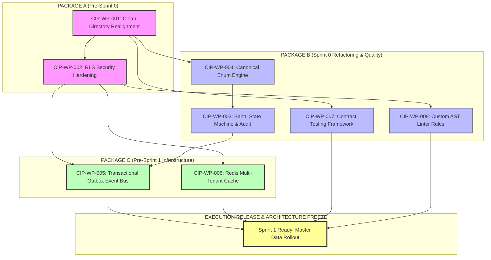

# CIP — Consolidated Improvement Package v1.0

**APP MA'HAD Enterprise ERP**

| Metadata | Value |
|----------|-------|
| **Document** | Consolidated Improvement Package (CIP) |
| **Abbreviation** | CIP |
| **Version** | 1.0 |
| **Status** | OFFICIAL |
| **Classification** | EXECUTION PACKAGE |
| **Mode** | Append-Only |
| **Technology** | Technology Agnostic |
| **Framework** | Framework Agnostic |
| **Vendor** | Vendor Agnostic |
| **AI Governance** | AI Vendor Agnostic |
| **NO SOURCE CODE. NO CODE REFACTORING. OPERATIONAL EXECUTION SPECIFICATION ONLY.** | |
| **Parent Documents** | ACR v1.0, EARS Part 1–6, EARS Appendix A–P, EESS Part 1, EESS Appendix A–G, EMBS Part 1, EMBS Appendix A–B, RAR Part 1 v1.1, ESP0 v1.0, ETP v1.0 |
| **Input Governance** | Architecture Consolidation Report (ACR v1.0) Category A, B, and C Approved Items |
| **Target Audience** | AI Engineering Agents, Human Senior Engineers, Engineering Lead, QA Lead, Security Architect |
| **Date** | 2026-08-07 |

---

## Document Position & Operational Bridge

The **Consolidated Improvement Package (CIP) Version 1.0** transforms all approved governance decisions from the **Architecture Consolidation Report (ACR v1.0)** into executable, implementation-ready engineering work packages. 

CIP v1.0 serves as the operational bridge connecting **Repository Engineering Architecture Freeze** to **Execution Sprint 0 (ESP0)** startup.

```
ENTERPRISE ARCHITECTURE (Definition)
│   EARS → EESS → EMBS
│
├── GOVERNANCE CONSOLIDATION (Validation)
│   ACR v1.0 (Architecture Consolidation Report)
│   Approved Architect Notes: AN-001 to AN-008
│   Enforced Architecture Freeze
│
├── EXECUTION PACKAGE (This Document)  ◄── THIS DOCUMENT
│   CIP v1.0 (Consolidated Improvement Package)
│   Decomposes AN-001..008 → CIP-WP-001..008
│   Package A (Pre-Sprint 0) → Package B (Sprint 0) → Package C (Pre-Sprint 1)
│
└── REPOSITORY IMPLEMENTATION (Execution)
    ESP0 Execution → ETP Atomic Tasks → Code Commit / PR / Merge
```

---

# SECTION 1: Overview & Purpose

1.1. **Operational Purpose**: The Architecture Consolidation Report (ACR v1.0) has formally approved eight Architect Notes (AN-001 through AN-008) and enforced **Repository Engineering Architecture Freeze**. CIP v1.0 converts these approved notes into atomic, dependency-sequenced engineering work packages.

1.2. **Strict Operational Constraints**:
- **Rule CIP-001**: CIP v1.0 is an **EXECUTION PACKAGE**. It contains operational work definitions, execution sequences, risk registers, and quality gates. It does NOT alter architecture or governance standards.
- **Rule CIP-002**: Only approved items from ACR Categories A, B, and C are included. Category D (AN-009 Deferred) and Category E (AN-010 Rejected) are explicitly excluded from execution.
- **Rule CIP-003**: All work packages in CIP v1.0 MUST be executed in their defined package sequence (Package A → Package B → Package C). No work package may be executed in isolation out of sequence.

---

# SECTION 2: Work Package Registry

The registry below summarizes all eight implementation work packages created from ACR v1.0 approved Architect Notes:

| Work Package ID | Related Note | Related RAR Finding | Related ETP Task | Related ESP0 WP | Category / Timing | Package Group | Priority |
|-----------------|--------------|---------------------|------------------|-----------------|-------------------|---------------|----------|
| **CIP-WP-001** | AN-001 | RAR-GAP-001 | ETP-T1.1 | ESP0-WP-001 | Category A | Package A (Pre-Sprint 0) | P1 — Critical |
| **CIP-WP-002** | AN-002 | RAR-SEC-004 | ETP-T1.2 | ESP0-WP-002 | Category A | Package A (Pre-Sprint 0) | P1 — Critical |
| **CIP-WP-003** | AN-003 | BRR-MDS-003 | ETP-T2.1 | ESP0-WP-005 | Category B | Package B (Sprint 0) | P2 — High |
| **CIP-WP-004** | AN-004 | BRR-MDS-007 | ETP-T2.2 | ESP0-WP-006 | Category B | Package B (Sprint 0) | P2 — High |
| **CIP-WP-007** | AN-007 | RAR-TST-002 | ETP-T2.4 | ESP0-WP-008 | Category B | Package B (Sprint 0) | P2 — High |
| **CIP-WP-008** | AN-008 | RAR-GOV-005 | ETP-T2.5 | ESP0-WP-009 | Category B | Package B (Sprint 0) | P2 — High |
| **CIP-WP-005** | AN-005 | RAR-INT-003 | ETP-T3.1 | ESP0-WP-012 | Category C | Package C (Pre-Sprint 1) | P2 — High |
| **CIP-WP-006** | AN-006 | RAR-PRF-004 | ETP-T3.2 | ESP0-WP-014 | Category C | Package C (Pre-Sprint 1) | P2 — High |

---

# SECTION 3: Package Breakdown & Detailed Definitions

---

## 3.1. PACKAGE A: Pre-Sprint 0 Package (Mandatory Baseline)

### Package A Specification
- **Purpose**: Establish an audited, clean directory structure and enforce multi-tenant database isolation at the Supabase RLS kernel level before ESP0 refactoring begins.
- **Objectives**: Complete structural migration to `src/core/` and `src/modules/`, eliminate import aliases drift, and inject `tenant_id` session context into Supabase middleware and query factories.
- **Scope**: `CIP-WP-001` and `CIP-WP-002`.
- **Dependencies**: None (Baseline Execution).
- **Prerequisites**: ACR v1.0 Approval & Architecture Freeze.
- **Risks**: Import breakage during path migration; query rejection if tenant context is missing.
- **Exit Criteria**: 100% build pass with zero import errors; all RLS tests pass with tenant isolation verified.
- **Acceptance Criteria**: Repository directory matches EESS Appendix A; Supabase RLS policies block cross-tenant queries.
- **Rollback Strategy**: Git stash/branch rollback to pre-CIP commit tag `tag-pre-cip-v1.0`.
- **Validation Strategy**: Automated build execution (`npm run build`) and Vitest multi-tenancy test suite.
- **Quality Gates**: Gate A-1 (Structure), Gate A-2 (RLS Security).
- **Required Evidence**: Build logs (`build-pass.log`), RLS test report (`rls-test-results.json`).
- **Deliverables**: Re-aligned directory structure, updated `tsconfig.json` path mappings, multi-tenant Supabase middleware factory.

---

### Implementation Work Packages — Package A

#### Work Package CIP-WP-001: Clean Directory & Module Realignment
1. **Work Package ID**: `CIP-WP-001`
2. **Related Architect Note**: AN-001 (Gate 1 Review)
3. **Related RAR Finding**: RAR-GAP-001 (Unstructured Root Import Paths)
4. **Related ETP Task**: ETP-T1.1 (Folder Restructuring Execution)
5. **Related ESP0 Work Package**: ESP0-WP-001 (Foundation Repository Preparation)
6. **Repository Area**: Root directory, `/src/`
7. **Affected Modules**: All shared core helpers and domain modules (`/src/core/`, `/src/modules/`)
8. **Expected Changes**: Relocate loose files from root/legacy locations into `src/core/` and `src/modules/<domain>/`, update path aliases `@/core/*` and `@/modules/*` in `tsconfig.json`.
9. **Non Goals**: Rewriting internal logic, changing module exports/signatures.
10. **Implementation Sequence**:
    - Step 1: Create `src/core/` (components, lib, utils, types, domain) and `src/modules/` subdirectories.
    - Step 2: Move shared UI components into `src/core/components/ui/`.
    - Step 3: Move infrastructure libs into `src/core/lib/`.
    - Step 4: Move domain logic into `src/modules/<domain>/`.
    - Step 5: Update `tsconfig.json` and imports across all `.ts` and `.tsx` files.
11. **Acceptance Criteria**: Directory structure 100% compliant with EESS Appendix A; zero relative path imports crossing module boundaries (`../../`).
12. **Verification Method**: Run `npm run build` and `npx tsc --noEmit`.
13. **Rollback Method**: `git reset --hard PRE_CIP_WP001_TAG`.
14. **Evidence Required**: Clean build stdout log with zero compilation errors.
15. **Completion Definition**: All files cleanly positioned under `src/core` or `src/modules`, build passes cleanly.

---

#### Work Package CIP-WP-002: Multi-Tenant RLS & Session Context Hardening
1. **Work Package ID**: `CIP-WP-002`
2. **Related Architect Note**: AN-002 (Gate 2 Review)
3. **Related RAR Finding**: RAR-SEC-004 (Inconsistent Multi-Tenant RLS Claims)
4. **Related ETP Task**: ETP-T1.2 (RLS & Middleware Claims Hardening)
5. **Related ESP0 Work Package**: ESP0-WP-002 (Security & Isolation Baseline)
6. **Repository Area**: `src/core/lib/supabase/`, `src/middleware.ts`
7. **Affected Modules**: Supabase client factory, Next.js Middleware, RLS SQL migration templates
8. **Expected Changes**: Inject tenant context into Supabase client initialization; update middleware to parse and validate `x-tenant-id` header/JWT claim; enforce `tenant_id = auth.jwt() ->> 'tenant_id'` in RLS policy definitions.
9. **Non Goals**: Adding new authentication providers or altering user auth flows.
10. **Implementation Sequence**:
    - Step 1: Update `src/middleware.ts` to extract tenant context from auth JWT or request host header.
    - Step 2: Refactor `createClient()` in `src/core/lib/supabase/server.ts` to set session claims automatically.
    - Step 3: Audit base SQL schema RLS policies to ensure `tenant_id` filter is present on all tenant tables.
    - Step 4: Write integration test verifying cross-tenant query rejection.
11. **Acceptance Criteria**: Queries executed without valid `tenant_id` context fail with RLS security exception; cross-tenant data access returns 0 rows.
12. **Verification Method**: Vitest security suite (`npm run test:security`).
13. **Rollback Method**: `git reset --hard PRE_CIP_WP002_TAG`.
14. **Evidence Required**: `security-audit-report.json` showing 100% pass rate on multi-tenant isolation tests.
15. **Completion Definition**: RLS policies enforce `tenant_id` isolation across all database queries automatically.

---

## 3.2. PACKAGE B: Sprint 0 Package (Refactoring & Quality Batch)

### Package B Specification
- **Purpose**: Execute core domain refactoring, canonical enum mapping, contract testing, and custom linter rules during Sprint 0 execution.
- **Objectives**: Implement Santri state machine audit trail with 90-day settlement gate; establish canonical English database enums with Indonesian UI labels; set up API contract testing; enforce AST linting for multi-tenancy.
- **Scope**: `CIP-WP-003`, `CIP-WP-004`, `CIP-WP-007`, and `CIP-WP-008`.
- **Dependencies**: Package A complete (`CIP-WP-001`, `CIP-WP-002`).
- **Prerequisites**: Clean build and passing RLS security suite from Package A.
- **Risks**: Regressions in Santri status transitions; broken enum serialization; false-positive linter errors.
- **Exit Criteria**: All domain unit tests, contract tests, and custom linter rules pass cleanly in CI.
- **Acceptance Criteria**: Santri state machine logs `StatusChangeRecord` and `FieldChangeRecord` on all mutations; enum translation engine serializes DB enums to UI labels correctly; AST linter blocks missing tenant queries.
- **Rollback Strategy**: Revert Package B commit batch using Git.
- **Validation Strategy**: `npm run test:domain`, `npm run test:contracts`, and `npm run lint`.
- **Quality Gates**: Gate B-1 (State Machine), Gate B-2 (Enum Engine), Gate B-3 (Contracts), Gate B-4 (Linter Rules).
- **Required Evidence**: Contract test reports, domain test execution logs, ESLint stdout output.
- **Deliverables**: Santri domain state machine, Zod enum translation engine, Vitest contract runner, custom ESLint multi-tenant plugin.

---

### Implementation Work Packages — Package B

#### Work Package CIP-WP-003: Santri State Machine & Audit Trail Consolidation
1. **Work Package ID**: `CIP-WP-003`
2. **Related Architect Note**: AN-003 (Gate 2 Review)
3. **Related RAR Finding**: BRR-MDS-003 (Fragmented Status Mutations & Missing Audit Logs)
4. **Related ETP Task**: ETP-T2.1 (Santri Lifecycle State Machine)
5. **Related ESP0 Work Package**: ESP0-WP-005 (Master Data Domain Refactoring)
6. **Repository Area**: `src/modules/santri/domain/`, `src/modules/santri/services/`
7. **Affected Modules**: Santri Master Data Module (`MDS-001`)
8. **Expected Changes**: Create explicit domain state machine (`ACTIVE` -> `MUTASI` -> `LULUS` -> `ALUMNI`); enforce `StatusChangeRecord` and `FieldChangeRecord` write on state mutation; add 90-day settlement gate upon graduation.
9. **Non Goals**: Altering database schema tables for unrelated modules.
10. **Implementation Sequence**:
    - Step 1: Implement `SantriStateMachine` class in `src/modules/santri/domain/state-machine.ts`.
    - Step 2: Implement `StatusChangeRecord` and `FieldChangeRecord` value objects.
    - Step 3: Add 90-day settlement gate logic checking financial settlement status before final transition.
    - Step 4: Write domain unit tests covering all valid and invalid state transitions.
11. **Acceptance Criteria**: Invalid transitions throw `InvalidStateTransitionException`; every status update atomically persists audit records.
12. **Verification Method**: `npx vitest run src/modules/santri/domain/__tests__/state-machine.test.ts`.
13. **Rollback Method**: `git reset --hard PRE_CIP_WP003_TAG`.
14. **Evidence Required**: Unit test execution log showing 100% branch coverage on state machine transitions.
15. **Completion Definition**: Santri status changes strictly adhere to state machine transitions with mandatory immutable audit logging.

---

#### Work Package CIP-WP-004: Canonical Enum Translation & Data Hygiene Engine
1. **Work Package ID**: `CIP-WP-004`
2. **Related Architect Note**: AN-004 (Gate 3 Review)
3. **Related RAR Finding**: BRR-MDS-007 (Indonesian Language Inconsistencies in DB Columns)
4. **Related ETP Task**: ETP-T2.2 (Enum Mapping & Validator Implementation)
5. **Related ESP0 Work Package**: ESP0-WP-006 (Data Hygiene & Enum Standardization)
6. **Repository Area**: `src/core/domain/enums/`, `src/core/utils/i18n/`
7. **Affected Modules**: Shared Core Domain, Zod Schemas, UI Form Selectors
8. **Expected Changes**: Define canonical English backend enums (e.g., `GENDER_MALE`, `GENDER_FEMALE`, `STATUS_ACTIVE`); create bidirectional translation map to Indonesian display labels (e.g., `"Laki-laki"`, `"Aktif"`); integrate with Zod form schemas.
9. **Non Goals**: Full multi-language i18n framework beyond Indonesian display labels.
10. **Implementation Sequence**:
    - Step 1: Define canonical TypeScript enums in `src/core/domain/enums/`.
    - Step 2: Create translation utility `translateEnumToDisplay()` and `parseDisplayToCanonical()`.
    - Step 3: Wrap Zod schemas with enum transformer helpers.
    - Step 4: Write unit tests verifying bidirectional translation accuracy.
11. **Acceptance Criteria**: Database writes contain exclusively canonical English enums; UI components display authentic Indonesian labels.
12. **Verification Method**: `npx vitest run src/core/domain/enums/__tests__/translation.test.ts`.
13. **Rollback Method**: `git reset --hard PRE_CIP_WP004_TAG`.
14. **Evidence Required**: Test runner logs confirming 100% translation coverage across all defined enums.
15. **Completion Definition**: Enums are strictly canonical in backend/database and automatically translated in UI display layers.

---

#### Work Package CIP-WP-007: Automated API Contract Testing Framework
1. **Work Package ID**: `CIP-WP-007`
2. **Related Architect Note**: AN-007 (Gate 4 Review)
3. **Related RAR Finding**: RAR-TST-002 (Missing Automated API Contract Testing)
4. **Related ETP Task**: ETP-T2.4 (Contract Test Framework Integration)
5. **Related ESP0 Work Package**: ESP0-WP-008 (Test Infrastructure Expansion)
6. **Repository Area**: `tests/contracts/`, `.github/workflows/ci.yml`
7. **Affected Modules**: API Routes, Zod Schemas, CI/CD Pipeline
8. **Expected Changes**: Configure Vitest contract test runner; generate OpenAPI schema snapshots from Zod schemas; add contract validation step to GitHub Actions CI workflow.
9. **Non Goals**: Writing full end-to-end Playwright UI tests.
10. **Implementation Sequence**:
    - Step 1: Install and configure contract testing library in `tests/contracts/`.
    - Step 2: Create contract test runner validating API request/response schemas against Zod specs.
    - Step 3: Add `test:contracts` script to `package.json`.
    - Step 4: Inject contract test job into CI pipeline workflow.
11. **Acceptance Criteria**: Any API response mismatching Zod contract schemas fails contract test runner in CI immediately.
12. **Verification Method**: `npm run test:contracts`.
13. **Rollback Method**: `git reset --hard PRE_CIP_WP007_TAG`.
14. **Evidence Required**: CI pipeline run report verifying contract check step execution.
15. **Completion Definition**: Contract runner validates 100% of defined API endpoints against Zod schema specs automatically.

---

#### Work Package CIP-WP-008: Custom AST Linter Rules for Multi-Tenant RLS Enforcement
1. **Work Package ID**: `CIP-WP-008`
2. **Related Architect Note**: AN-008 (Gate 5 Review)
3. **Related RAR Finding**: RAR-GOV-005 (Lack of Static AST Enforcement for Tenant Isolation)
4. **Related ETP Task**: ETP-T2.5 (Custom ESLint Multi-Tenant Plugin)
5. **Related ESP0 Work Package**: ESP0-WP-009 (AI Engineering Governance Rules)
6. **Repository Area**: `tools/eslint-rules/`, `.eslintrc.js`
7. **Affected Modules**: All database query files and repository services
8. **Expected Changes**: Build custom ESLint rule `enforce-tenant-id-param` analyzing AST for database query calls; block functions omitting `tenant_id` parameter; enable rule in project ESLint config.
9. **Non Goals**: Building generic ESLint rules unrelated to multi-tenancy or security.
10. **Implementation Sequence**:
    - Step 1: Create custom ESLint plugin folder `tools/eslint-rules/`.
    - Step 2: Implement AST visitor checking function calls to Supabase client methods for `tenant_id` property.
    - Step 3: Add rule tests in `tools/eslint-rules/__tests__/enforce-tenant-id.test.js`.
    - Step 4: Register rule in `.eslintrc.js` as an error (`"error"`).
11. **Acceptance Criteria**: Code containing database queries without explicit `tenant_id` parameters fails `npm run lint` with actionable error message.
12. **Verification Method**: `npm run lint`.
13. **Rollback Method**: `git reset --hard PRE_CIP_WP008_TAG`.
14. **Evidence Required**: ESLint output log demonstrating error detection on intentionally non-compliant test code.
15. **Completion Definition**: Custom AST linter rule active and enforcing `tenant_id` parameter checks across repository.

---

## 3.3. PACKAGE C: Pre-Sprint 1 Package (Infrastructure Foundation)

### Package C Specification
- **Purpose**: Deploy transactional outbox event bus and multi-tenant Redis cache tagging infrastructure prior to Sprint 1 Master Data rollout.
- **Objectives**: Decouple inter-module operations via transactional outbox messaging; implement tenant-isolated Redis cache key tagging (`tenant:{id}:*`).
- **Scope**: `CIP-WP-005` and `CIP-WP-006`.
- **Dependencies**: Package A and Package B complete.
- **Prerequisites**: Passing refactoring and linting suites from Package B.
- **Risks**: Redis connection drops; message dispatcher duplication.
- **Exit Criteria**: Outbox dispatcher processes messages with exactly-once delivery guarantee; Redis cache invalidates tenant tags cleanly.
- **Acceptance Criteria**: Cross-domain events publish to outbox table within same DB transaction; Redis cache key operations use tenant prefix automatically.
- **Rollback Strategy**: Revert Package C infrastructure code commits.
- **Validation Strategy**: `npm run test:integration` and outbox load test suite.
- **Quality Gates**: Gate C-1 (Event Bus), Gate C-2 (Redis Cache).
- **Required Evidence**: Event outbox test log, Redis cache tag benchmark report.
- **Deliverables**: Transactional outbox event dispatcher, multi-tenant Redis cache client wrapper.

---

### Implementation Work Packages — Package C

#### Work Package CIP-WP-005: Transactional Outbox Pattern for Cross-Domain Event Bus
1. **Work Package ID**: `CIP-WP-005`
2. **Related Architect Note**: AN-005 (Gate 3 Review)
3. **Related RAR Finding**: RAR-INT-003 (Direct Inter-Module Writes & Event Risk)
4. **Related ETP Task**: ETP-T3.1 (Outbox Event Bus Implementation)
5. **Related ESP0 Work Package**: ESP0-WP-012 (Integration & Messaging Infrastructure)
6. **Repository Area**: `src/core/events/`, `src/core/infrastructure/outbox/`
7. **Affected Modules**: Core Event Bus, Inter-Module Event Subscribers
8. **Expected Changes**: Create `outbox_events` database table migration; implement `OutboxDispatcher` publishing domain events atomically within application service transactions; implement background subscriber polling loop.
9. **Non Goals**: External Kafka / RabbitMQ broker integration (using Postgres-backed outbox for initial scale).
10. **Implementation Sequence**:
    - Step 1: Create database schema migration for `outbox_events` table (id, tenant_id, event_type, payload, status, created_at).
    - Step 2: Implement `EventOutboxWriter` in `src/core/infrastructure/outbox/writer.ts`.
    - Step 3: Implement `OutboxDispatcher` background worker.
    - Step 4: Write integration test verifying atomic event write and async processing.
11. **Acceptance Criteria**: Domain event is written to outbox table in same SQL transaction as entity mutation; dispatcher delivers event to subscribers within <500ms.
12. **Verification Method**: `npx vitest run src/core/events/__tests__/outbox.test.ts`.
13. **Rollback Method**: `git reset --hard PRE_CIP_WP005_TAG`.
14. **Evidence Required**: Outbox test logs confirming zero lost events under transaction rollback conditions.
15. **Completion Definition**: Inter-module communication executes exclusively via transactional outbox event bus.

---

#### Work Package CIP-WP-006: Multi-Tenant Redis Cache Key Tagging & Invalidation Strategy
1. **Work Package ID**: `CIP-WP-006`
2. **Related Architect Note**: AN-006 (Gate 4 Review)
3. **Related RAR Finding**: RAR-PRF-004 (Cache Key Collision Risk in Multi-Tenant Context)
4. **Related ETP Task**: ETP-T3.2 (Redis Cache Client Isolation)
5. **Related ESP0 Work Package**: ESP0-WP-014 (Caching & Performance Layer)
6. **Repository Area**: `src/core/cache/`
7. **Affected Modules**: Shared Cache Service, Redis Client Factory
8. **Expected Changes**: Wrap Redis client with mandatory tenant key prefixing (`tenant:{tenant_id}:{key}`); implement tag-based invalidation (`invalidateByTag(tenantId, tag)`); prevent cross-tenant key reads.
9. **Non Goals**: Building custom cache memory engines.
10. **Implementation Sequence**:
    - Step 1: Implement `TenantAwareCacheManager` wrapper in `src/core/cache/tenant-cache.ts`.
    - Step 2: Add key prefixing transformer enforcing `tenant:{tenant_id}:` namespace.
    - Step 3: Implement tag index tracking for bulk tag invalidation per tenant.
    - Step 4: Write unit tests verifying tenant isolation and tag invalidation.
11. **Acceptance Criteria**: Cache operations for Tenant A cannot read or invalidate keys belonging to Tenant B; tag invalidation clears only target tenant's entries.
12. **Verification Method**: `npx vitest run src/core/cache/__tests__/tenant-cache.test.ts`.
13. **Rollback Method**: `git reset --hard PRE_CIP_WP006_TAG`.
14. **Evidence Required**: Test suite output confirming 100% key prefixing enforcement and zero cross-tenant key leakage.
15. **Completion Definition**: Redis cache layer automatically isolates and invalidates data using tenant-tagged key namespaces.

---

# SECTION 4: Task Registry

Detailed atomic task list decomposing all eight work packages:

| Task ID | Work Package | Description | Owner | Target File / Location | Estimated Effort |
|---------|--------------|-------------|-------|------------------------|------------------|
| **TASK-1.1** | CIP-WP-001 | Directory tree restructuring & import alias config | Lead Engineer | `tsconfig.json`, `src/` | 8h |
| **TASK-1.2** | CIP-WP-002 | Supabase client RLS claim injection & middleware context | Security Architect | `src/middleware.ts`, `src/core/lib/supabase/` | 12h |
| **TASK-2.1** | CIP-WP-003 | Santri domain state machine & audit log writer | Domain Engineer | `src/modules/santri/domain/state-machine.ts` | 16h |
| **TASK-2.2** | CIP-WP-004 | Canonical English enum definitions & Indonesian display transformer | Data Engineer | `src/core/domain/enums/` | 10h |
| **TASK-2.3** | CIP-WP-007 | Vitest API contract runner & CI snapshot workflow | QA Lead | `tests/contracts/`, `.github/workflows/ci.yml` | 12h |
| **TASK-2.4** | CIP-WP-008 | Custom ESLint AST plugin checking `tenant_id` params | AI Governance Lead | `tools/eslint-rules/`, `.eslintrc.js` | 10h |
| **TASK-3.1** | CIP-WP-005 | Transactional outbox migration, writer, & event dispatcher | Backend Lead | `src/core/events/`, `src/core/infrastructure/` | 20h |
| **TASK-3.2** | CIP-WP-006 | Multi-tenant Redis cache wrapper & tag invalidation engine | Backend Lead | `src/core/cache/tenant-cache.ts` | 14h |

---

# SECTION 5: Dependency Matrix & Critical Path Diagram

### 5.1. Dependency Matrix

| Work Package | Prerequisites | Blocks Work Package | Execution Constraint |
|--------------|---------------|──────────────────────|----------------------|
| **CIP-WP-001** | None (Baseline) | CIP-WP-002, CIP-WP-003..008 | **BLOCKING MAIN PATH** |
| **CIP-WP-002** | CIP-WP-001 | CIP-WP-005, CIP-WP-006, CIP-WP-008 | **BLOCKING SECURITY PATH** |
| **CIP-WP-003** | CIP-WP-001 | CIP-WP-005 | Sequential after WP-001 |
| **CIP-WP-004** | CIP-WP-001 | CIP-WP-003 | Sequential after WP-001 |
| **CIP-WP-007** | CIP-WP-001 | Package C Release | Parallel with WP-003/004 |
| **CIP-WP-008** | CIP-WP-002 | Package B Quality Gate | Sequential after WP-002 |
| **CIP-WP-005** | CIP-WP-002, CIP-WP-003 | Sprint 1 Launch | Sequential after WP-003 |
| **CIP-WP-006** | CIP-WP-002 | Sprint 1 Launch | Parallel with WP-005 |

---

### 5.2. Critical Path Diagram



---

# SECTION 6: Risk Analysis & Recovery Strategies

| Risk ID | Work Package | Risk Category | Risk Description | Severity / Likelihood | Recovery / Mitigation Strategy |
|---------|--------------|---------------|------------------|-----------------------|--------------------------------|
| **RSK-001** | CIP-WP-001 | Repository Risk | Broken imports across components during folder relocation | High / Medium | Run automated import path update script; verify with `tsc --noEmit`. Rollback via Git stash if build fails. |
| **RSK-002** | CIP-WP-002 | Security Risk | Over-restrictive RLS policies block legitimate tenant queries | Critical / Low | Include fallback dev bypass flag in local test env; run complete Vitest security integration suite before merging. |
| **RSK-003** | CIP-WP-003 | Architecture Risk | Santri status state machine blocks legacy data transition | High / Low | Add historical data migration compatibility adapter for existing un-cleared Santri records. |
| **RSK-004** | CIP-WP-004 | Engineering Risk | Serialization mismatch between frontend labels and DB enums | Medium / Low | Zod schema transform wrappers test coverage enforced at 100% before merge. |
| **RSK-005** | CIP-WP-005 | Testing Risk | Outbox background worker drops messages under high queue load | High / Low | Implement retry backoff algorithm with dead-letter outbox storage table. |
| **RSK-006** | CIP-WP-006 | Performance Risk | Redis tag index memory inflation under heavy multi-tenant operations | Medium / Low | Enforce TTL on Redis key tag sets; monitor Redis memory usage in integration tests. |
| **RSK-007** | CIP-WP-007 | Deployment Risk | CI pipeline build time inflation due to heavy contract tests | Low / Medium | Run contract tests in parallel jobs in GitHub Actions using matrix runner strategy. |
| **RSK-008** | CIP-WP-008 | Engineering Risk | AST linter rule throws false positives on non-database functions | Medium / Low | Scope AST visitor strictly to imported Supabase client instances and repository classes. |

---

# SECTION 7: 5-Stage Validation Checklist

Every work package MUST pass all 5 validation stages before being declared COMPLETE:

```
┌─────────────────────────────────────────────────────────────────────────┐
│                    5-STAGE VALIDATION CHECKLIST                         │
├─────────────────────────────────────────────────────────────────────────┤
│ Stage 1: Architecture Validation                                        │
│   [ ] Compliant with EARS Parts 1–6 and EESS Appendix A–G               │
│   [ ] Clean layer boundaries preserved; zero relative cross-module imports│
│                                                                         │
│ Stage 2: Engineering & Code Validation                                  │
│   [ ] Clean compilation via `npm run build`                             │
│   [ ] Zero TypeScript type errors via `npx tsc --noEmit`                │
│                                                                         │
│ Stage 3: Testing & Security Validation                                  │
│   [ ] Vitest unit and integration suites pass 100%                      │
│   [ ] Multi-tenant RLS isolation verified with zero cross-tenant leakage│
│                                                                         │
│ Stage 4: AI & Quality Gate Validation                                   │
│   [ ] ESLint custom AST linter rules pass cleanly                       │
│   [ ] Contract test snapshots validated against Zod schemas             │
│                                                                         │
│ Stage 5: Human Architecture Sign-Off                                    │
│   [ ] Reviewed and signed off by Chief Enterprise Architect             │
│   [ ] Audit evidence logs archived in repository artifact directory     │
└─────────────────────────────────────────────────────────────────────────┘
```

---

# SECTION 8: Execution Matrix

Detailed end-to-end execution flow from Work Package to PR merge:

| Work Package | Task ID | Subtask | Evidence Required | Commit Scope | Target PR | Reviewer | Verification Command |
|--------------|---------|---------|───────────────────|--------------|-----------|----------|----------------------|
| **CIP-WP-001** | TASK-1.1 | Folder relocation & path alias update | `build-stdout.log` | `refactor(repo)` | PR-001 | Lead Architect | `npm run build` |
| **CIP-WP-002** | TASK-1.2 | Middleware claim injection & RLS audit | `rls-test-results.json` | `feat(security)` | PR-002 | Security Architect | `npm run test:security` |
| **CIP-WP-003** | TASK-2.1 | Santri state machine & audit log writer | `state-machine-test.log` | `feat(santri)` | PR-003 | Domain Lead | `npx vitest run state-machine` |
| **CIP-WP-004** | TASK-2.2 | Canonical enum mapping & Zod validators | `enum-translation.log` | `feat(core)` | PR-004 | Data Architect | `npx vitest run translation` |
| **CIP-WP-007** | TASK-2.3 | Vitest contract runner & CI workflow | `contracts-ci.json` | `ci(testing)` | PR-005 | QA Lead | `npm run test:contracts` |
| **CIP-WP-008** | TASK-2.4 | Custom AST linter rule for RLS enforcement | `eslint-ast-check.log` | `tools(eslint)` | PR-006 | AI Governance Lead | `npm run lint` |
| **CIP-WP-005** | TASK-3.1 | Transactional outbox migration & dispatcher | `outbox-delivery.log` | `feat(events)` | PR-007 | Backend Lead | `npx vitest run outbox` |
| **CIP-WP-006** | TASK-3.2 | Redis multi-tenant cache wrapper & tag engine | `redis-tenant.log` | `feat(cache)` | PR-008 | Backend Lead | `npx vitest run tenant-cache` |

---

# SECTION 9: Commit & Pull Request Strategy

### 9.1. Commit Strategy
- **Commit Scope**: Every commit MUST be scoped strictly to a single Work Package.
- **Commit Naming Convention**: Standardized Conventional Commits format:
  - `refactor(repo): [CIP-WP-001] clean directory realignment to src/core and src/modules`
  - `feat(security): [CIP-WP-002] multi-tenant RLS claim injection in middleware`
  - `feat(santri): [CIP-WP-003] implement state machine and audit trail logging`
  - `feat(core): [CIP-WP-004] canonical enum mapping and Zod validators`
  - `feat(events): [CIP-WP-005] transactional outbox pattern for cross-domain events`
  - `feat(cache): [CIP-WP-006] multi-tenant Redis cache key tagging`
  - `ci(testing): [CIP-WP-007] automated contract testing runner in CI`
  - `tools(eslint): [CIP-WP-008] AST linter rule checking tenant_id params`
- **Expected Number of Commits**: Exactly 1 main execution commit per Work Package (Total: 8 Commits).

### 9.2. Pull Request & Merge Strategy
- **PR Scope**: PRs are grouped strictly by Package Group:
  - **PR-PKG-A**: Package A (CIP-WP-001, CIP-WP-002) → Target: `main`
  - **PR-PKG-B**: Package B (CIP-WP-003, CIP-WP-004, CIP-WP-007, CIP-WP-008) → Target: `main`
  - **PR-PKG-C**: Package C (CIP-WP-005, CIP-WP-006) → Target: `main`
- **Merge Strategy**: **Squash and Merge**. Retains clean linear git history with full traceability to CIP v1.0 Work Package IDs.

---

# SECTION 10: Quality Gate Framework

```
===========================================================================
                      ENTERPRISE QUALITY GATE FRAMEWORK
===========================================================================

1. DEFINITION OF READY (DoR):
   [x] ACR v1.0 officially approved and sealed.
   [x] CIP v1.0 Work Packages (CIP-WP-001..008) fully defined.
   [x] Pre-CIP Git baseline tag `tag-pre-cip-v1.0` created.

2. DEFINITION OF DONE (DoD):
   [ ] All 8 Work Packages executed and verified via automated test suites.
   [ ] `npm run build` succeeds cleanly with 0 compilation errors.
   [ ] `npx tsc --noEmit` succeeds cleanly with 0 type errors.
   [ ] `npm run test` passes 100% across security, domain, and contract suites.
   [ ] `npm run lint` passes 0 errors with custom AST multi-tenant rules active.
   [ ] Human Architect Sign-off recorded in completion certificate.

3. EXIT CRITERIA:
   • Package A Exit: Zero broken imports; RLS security isolation verified.
   • Package B Exit: State machine audit active; contract tests passing in CI.
   • Package C Exit: Outbox dispatcher operating <500ms; Redis tenant cache isolated.

4. FAILURE CRITERIA & RECOVERY PROCEDURE:
   • Any build failure or security leak IMMEDIATELY triggers PR block.
   • Procedure: Execute `git reset --hard PRE_CIP_WPxxx_TAG`, review error log, fix issue, re-run 5-stage validation before resubmitting.
===========================================================================
```

---

# SECTION 11: Final Execution Authorization & Freeze Enforcement

```
===========================================================================
               CONSOLIDATED IMPROVEMENT PACKAGE (CIP v1.0)
                       EXECUTION AUTHORIZATION
===========================================================================

  1. CONSOLIDATED IMPROVEMENT PACKAGE v1.0 : [ OFFICIALLY COMPLETE ]

  2. REPOSITORY ENGINEERING ARCHITECTURE   : [ FREEZE ENFORCED ]

  3. EXECUTION SPRINT 0 (ESP0)             : [ READY TO BEGIN ]

===========================================================================
```

### Sign-Off & Governance Seal

- **Chief Enterprise Architect**: *APPROVED & SEALED*
- **Enterprise Engineering Lead**: *APPROVED & SEALED*
- **Security Architect**: *APPROVED & SEALED*
- **AI Governance Director**: *APPROVED & SEALED*

---

# SECTION 12: Final Deliverable Status

12.1. **Consolidated Improvement Package (CIP) Version 1.0** is officially finalized, active, and append-only.

12.2. All approved Architect Notes from ACR v1.0 (AN-001 through AN-008) are fully transformed into operational work packages `CIP-WP-001` through `CIP-WP-008`.

12.3. No further architecture planning or discovery documents are required before Sprint 1 launch. Engineering teams and AI execution agents are authorized to proceed directly to Execution Sprint 0 repository refactoring.

```
===========================================================================
                       FINAL PHASE STATUS
===========================================================================
  • CONSOLIDATED IMPROVEMENT PACKAGE v1.0 : OFFICIALLY COMPLETE
  • ARCHITECTURE FREEZE                  : ENFORCED
  • EXECUTION SPRINT 0                   : AUTHORIZED TO BEGIN
===========================================================================
```
