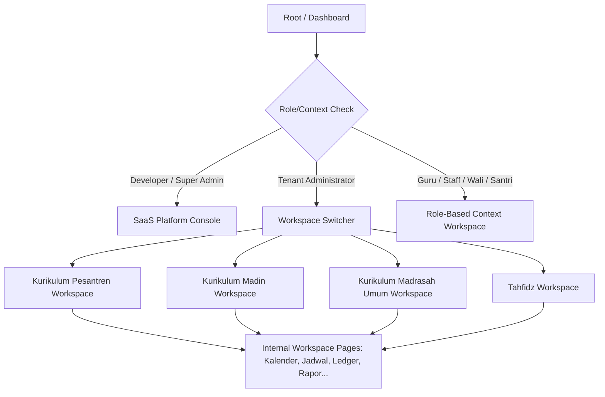

# Engineering Report: Sprint 7 - Epic 1
# Academic Navigation & Multi-Curriculum Workspace

**Status**: PRE-IMPLEMENTATION (LOCKED ARCHITECTURE v1.0)
**Authors**: Antigravity (Senior Principal Systems Architect)
**Date**: 2026-08-04

---

## 1. Executive Summary

This document details the engineering and architectural plan for **Sprint 7 - Epic 1: Academic Navigation Experience**. In order to support a multi-tenant enterprise system designed for 100+ Pesantren/Tenants over the next 10 years, we are establishing a unified, metadata-driven **Academic Navigation Architecture**. 

Instead of creating separate frontends or duplicating code for each user persona (Administrator, Guru, Wali, Santri, etc.) or curriculum workspace (Pesantren, Madrasah Diniyah, Madrasah Umum, Tahfidz), we are implementing a **"One Architecture, Multiple Workspaces"** model. The entire navigation ecosystem is driven by a centralized config, filtered dynamically by role, permissions, and workspace context.

---

## 2. Business Objective

* **Consolidated User Experience**: Provide a consistent and beautiful sidebar/header navigation layout that dynamically changes its structure, options, and actions based on the active role and selected curriculum workspace.
* **RBAC & Data Isolation Enforcement**: Ensure menu items are strictly rendered according to Supabase RBAC permissions and Tenant/Workspace scopes, preventing unauthorized page transitions.
* **Scalable Workspace Switcher**: Enable administrators and developers to switch between different curriculum workspaces (Pesantren, Madin, Madrasah Umum, Tahfidz) or impersonate roles smoothly.
* **UX Delight**: Eliminate confusion through clear breadcrumbs, explicit loading/empty states, visual indicators (badges), context headers, and responsive mobile drawers.

---

## 3. Information Architecture

The navigation is divided into three distinct levels of context:
1. **Global Context (Platform & Tenant Level)**:
   * SaaS Platform Console (Developer/Super Admin).
   * Global Tenant Settings & General Administration.
2. **Workspace Context (Curriculum & Department Level)**:
   * Dynamic switches between Kurikulum Pesantren, Madrasah Diniyah, Madrasah Umum, and Tahfidz.
3. **Operational Context (Individual / Actionable Level)**:
   * Class schedule, assessments, journal, grades, health records, and attendance.



---

## 4. Navigation Tree Blueprint

### 4.1. SaaS Platform Console (Developer & Super Admin)
* **Dasbor Utama (Helicopter View)** (`/dashboard`)
* **Manajemen Tenant & Impersonation** (`/dashboard/saas/tenants`)
* **Manajemen Modul & Feature Flags** (`/dashboard/saas/modul-fitur`)
* **Paket & Penagihan (Billing)** (`/dashboard/saas/paket-billing`)
* **Infrastruktur & Log Pemantauan** (`/dashboard/saas/infrastruktur-log`)
* **Pengaturan Global & Broadcast** (`/dashboard/saas/pengaturan-global`)

### 4.2. Academic & Curriculum Workspaces (Admin & Guru)
* **Workspace Selector / Landing Page** (`/dashboard/kurikulum`)
* **Kurikulum Workspace Dashboard** (`/dashboard/kurikulum/program/:id`)
  * **Struktur Kurikulum** (`/dashboard/struktur-akademik?prog=:id`)
  * **Mata Pelajaran & SKM** (`/dashboard/mapel?prog=:id`)
  * **Kalender Akademik** (`/dashboard/kalender-akademik?prog=:id`)
  * **Jadwal & Distribusi Guru** (`/dashboard/distribusi-guru?prog=:id`)
  * **Operasional KBM & Jurnal** (`/dashboard/operasional?prog=:id`)
  * **Sistem Penilaian** (`/dashboard/penilaian?prog=:id`)
  * **Academic Ledger Engine** (`/dashboard/ledger?prog=:id`)
  * **Transcript & Report Card** (`/dashboard/raport?prog=:id`)

### 4.3. Kesiswaan & Kedisiplinan Workspace (Musyrif, Wali, Santri)
* **E-Tatib & Point Pelanggaran** (`/dashboard/pelanggaran`)
* **Asrama & Kamar Santri** (`/dashboard/asrama`)
* **Quest & Pemutihan Poin** (`/dashboard/quest`)

---

## 5. Workspace Architecture & Context Switcher

A React Context and Zustand store (`useWorkspaceStore`) will track the active workspace state. 

```typescript
export interface WorkspaceState {
  activeWorkspaceId: string | null; // e.g., 'prog-pesantren', 'prog-madin'
  activeWorkspaceType: 'formal' | 'pesantren' | 'quran' | 'platform' | null;
  workspaces: Array<{ id: string; name: string; type: string }>;
  setWorkspace: (id: string) => void;
}
```

The **Workspace Switcher** component in the sidebar will allow users with access to multiple workspaces to dynamically switch context. Changing the workspace automatically:
1. Reloads menu items matching the workspace type.
2. Updates query parameters or route state to filter data properly.
3. Updates the **Context Header** (visual badge in the top sidebar or main area showing current workspace).

---

## 6. RBAC Navigation Strategy

Navigation elements must not be hardcoded or bypass security rules. We define an RBAC mapping matrix:

| Role | SaaS Console | General Admin | Curriculum Workspace | Guru KBM | Wali Santri | Santri Portal |
| :--- | :---: | :---: | :---: | :---: | :---: | :---: |
| **Developer** | ✅ | ❌ | ❌ | ❌ | ❌ | ❌ |
| **Super Admin**| ✅ | ❌ | ❌ | ❌ | ❌ | ❌ |
| **Admin** | ❌ | ✅ | ✅ (All) | ✅ (All) | ❌ | ❌ |
| **Admin Madin**| ❌ | ✅ (Limited) | ✅ (Madin Only)| ✅ (Madin Only)| ❌ | ❌ |
| **Guru** | ❌ | ❌ | ✅ (Assigned) | ✅ (Personal) | ❌ | ❌ |
| **Wali** | ❌ | ❌ | ❌ | ❌ | ✅ (Children) | ❌ |
| **Santri** | ❌ | ❌ | ❌ | ❌ | ❌ | ✅ (Personal) |

---

## 7. Frontend Component Breakdown

We will modify or create the following UI components within `src/components/layout/` and `src/components/shared/`:

1. **`WorkspaceSwitcher`**: Dropdown menu placed at the top of the sidebar allowing rapid workspace switching.
2. **`Sidebar`**: Consolidated sidebar component incorporating dynamic accordion groups and responsive menus.
3. **`Topbar` / `ContextHeader`**: Displays current system time, active user role, selected workspace context, and Bismillah badge.
4. **`Breadcrumb`**: Fully dynamic path navigator parsing active paths and appending workspace context labels.
5. **`QuickAction`**: Global command palette (or floating panel) for rapid actions (e.g., search student, log violation).
6. **`RecentActivity`**: Small layout block on the landing page showing recently accessed academic paths.
7. **`WorkspaceLandingPage`**: A dashboard wrapper that acts as the entry page when a user selects a workspace.

---

## 8. State Management Strategy

All states related to navigation and active context will be handled via **Zustand stores** to avoid prop-drilling:

* **`useSidebarStore`**:
  * Tracks collapsed/expanded state.
  * Tracks mobile drawer toggle.
* **`useWorkspaceStore`**:
  * Tracks active curriculum workspace (`activeWorkspaceId`, `activeWorkspaceType`).
  * Lists available workspaces computed from user permissions.
* **`useAuthStore`**:
  * User roles, active session, and permissions.

---

## 9. Implementation Roadmap

### Phase 1: Context & Configuration foundation
* Enhance `src/config/navigation.ts` to fully support workspace structures, permissions, and badges.
* Implement `useWorkspaceStore` Zustand store.

### Phase 2: Shell & Sidebar Integration
* Update `src/components/layout/sidebar.tsx` with the new **Workspace Switcher** and **Context Header**.
* Integrate the updated navigation configuration.

### Phase 3: Header, Breadcrumbs & Polish
* Refactor `src/components/layout/topbar.tsx` and `src/components/layout/breadcrumb.tsx` to utilize the active workspace name and icons.
* Apply premium styling gradients, hover micro-animations, and CSS variables.

### Phase 4: Verification & Testing
* Run layout unit tests.
* Perform role-switching smoke tests across Developer, Admin, Guru, Wali, and Santri.

---

## 10. Definition of Ready (DoR)
* Sprint 6 features (Ledger, Transcripts, Rapor) successfully integrated and stable.
* Existing navigation blueprint understood and preserved where necessary.
* Permission matrix matching the Supabase roles configuration.

---

## 11. Definition of Done (DoD)
* One single navigation architecture successfully serves all workspaces and roles.
* Workspace context is preserved across page reloads (via stores/local storage/query params).
* No code duplication for sidebars/headers between different portals.
* Walkthrough documentation complete.
