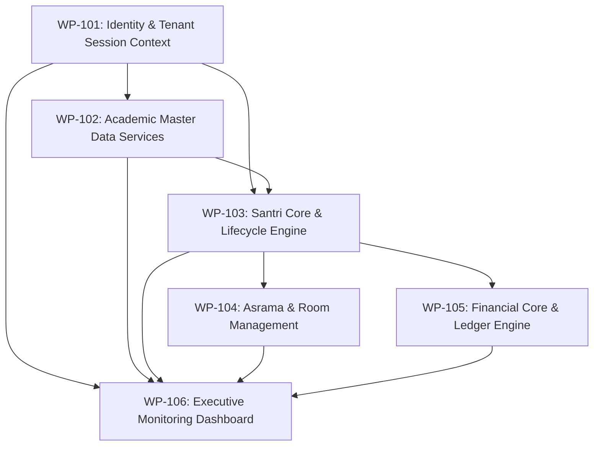

# Sprint 1 Dependency Matrix & Critical Path
**APP MA'HAD Enterprise SaaS ERP — Execution Dependency Graph**

---

## 1. Work Package Dependency Graph

---

## 2. Dependency Analysis Matrix

| Work Package ID | Title | Direct Dependencies | Blocks Following Packages | Execution Type |
|---|---|---|---|---|
| **WP-101** | Identity & Tenant Session Context | *None (Foundation)* | `WP-102`, `WP-103`, `WP-104`, `WP-105`, `WP-106` | **Critical Path Start** |
| **WP-102** | Academic Master Data Services | `WP-101` | `WP-103`, `WP-106` | **Critical Path Core** |
| **WP-103** | Santri Core & Lifecycle Engine | `WP-101`, `WP-102` | `WP-104`, `WP-105`, `WP-106` | **Critical Path Peak** |
| **WP-104** | Asrama & Room Management | `WP-101`, `WP-103` | `WP-106` | **Parallel Track A** |
| **WP-105** | Financial Core & Ledger Engine | `WP-101`, `WP-103` | `WP-106` | **Parallel Track B** |
| **WP-106** | Executive Monitoring Dashboard | `WP-101` through `WP-105` | *Sprint 1 Milestone Complete* | **Final Integration** |

---

## 3. Execution Tracks & Parallelization Strategy

1. **Critical Path (Serial Track)**:
   - `WP-101` (Tenant Session Context) $\rightarrow$ `WP-102` (Academic Master Data) $\rightarrow$ `WP-103` (Santri Core Engine).
2. **Parallel Track Phase**:
   - Once `WP-103` completes, development splits into two independent parallel tracks:
     - **Track A**: `WP-104` (Asrama & Dormitory Management).
     - **Track B**: `WP-105` (Financial Core & General Ledger).
3. **Milestone Integration Phase**:
   - `WP-106` aggregates operational metrics and audit logs from `WP-101` through `WP-105` to deliver executive dashboards.
